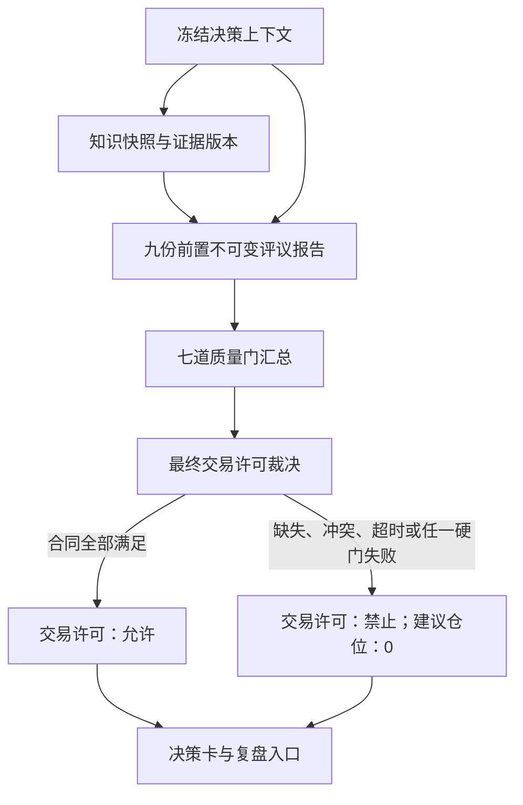

# 《知势交易许可协议》V1.0

<!-- markdownlint-disable MD013 -->

> 交易许可不是预测结论，也不是持续交易权利；它是七道质量门共同约束下，对一个冻结决策上下文作出的不可变最终裁决。

- 文档性质：最终交易许可输出与消费协议
- 适用范围：BTC、ETH；4小时、8小时、24小时、48小时
- 当前阶段：理论协议；不表示数据、运行时、模拟交易或执行接口已经实现
- 最终状态：`允许`或`禁止`
- 默认结果：`禁止`，建议仓位为0
- 真实资金状态：关闭

## 一、目标与边界

### 1.1 目标

本协议把市场状态、资金状态、证据状态、成本、风险和执行条件统一转换为唯一、
可审计、可重放的交易许可记录，解决以下问题：

1. 不同模块不能分别输出相互冲突的交易结论；
2. 支持证据不能绕过任一硬质量门；
3. 许可必须定位到当时可见的数据、知识、证据、规则和评议版本；
4. 信息不足、版本冲突或运行异常必须安全降级为禁止；
5. 模拟交易、历史重放和复盘必须消费同一份不可变许可记录；
6. 后续版本变化不得改写历史许可。

该协议通过阻止未证明、不可执行或风险不可控的机会进入执行链路，减少无证据交易、
旧许可复用、跨时间尺度拼接和风险边界漂移。它本身不证明市场优势，也不产生胜率或收益。

### 1.2 不在范围

本协议不：

- 创建交易策略、预测模型或研究结论；
- 访问服务器、市场数据、数据库或真实交易账户；
- 实现下单、撤单、成交、资金管理或交易所接口；
- 定义数据库、编程语言、框架、消息系统或部署方案；
- 允许人工叙事、综合评分或多数票覆盖硬否决；
- 把确定性、评分、证据完整度或模型置信度写成预测胜率；
- 把待验证假设或相关观察写成已验证关系；
- 因为需要输出结果而补写缺失字段或沿用旧许可。

### 1.3 与既有合同的职责边界

| 合同 | 负责 | 不负责 |
| --- | --- | --- |
| 《知势决策标准》 | 定义七道质量门和交易准入原则 | 生成具体许可记录 |
| 《知势决策委员会》 | 定义十个评议单元、报告和最终裁决职责 | 直接执行交易 |
| 《知势知识图谱》 | 约束概念、关系、证据状态与决策映射 | 用图连接替代研究证据 |
| 《知识图谱运行时设计》 | 定义知识版本、快照、血缘和回滚合同 | 授予交易许可 |
| 《风险预算规范》 | 推导最大允许损失与仓位上限 | 用杠杆表达信心 |
| 《决策卡模板》 | 展示并保存决策、许可与复盘字段 | 自行改变许可结果 |
| 本协议 | 冻结最终许可输入、裁决条件、输出和消费边界 | 重新评议上游结论 |

任何文档冲突按资金与数据安全、宣言和风险纪律、任务合同、可追溯性及硬门优先级处理。
本协议不能降低上游门槛。

### 1.4 与研究准入和真实交易准入的独立关系

本协议只裁决一个冻结决策上下文的单次交易许可，不裁决研究生命周期，也不负责授予
系统级真实交易能力。三者关系固定如下：

| 对象 | 输出 | 是否能生成下一个对象 |
| --- | --- | --- |
| 研究准入 | 研究状态与允许研究范围 | 不能直接生成交易许可 |
| 本协议交易许可 | `允许`或`禁止`的单次不可变许可 | 不能生成真实交易准入 |
| 真实交易准入 | 系统级`关闭/申请中/已批准/暂停/撤销` | 不能生成具体交易许可 |

阶段1数据证据门只提供研究准入的必要输入，也可能成为交易许可的数据门输入；它不
能替代研究准入或真实交易准入。研究`已纳入`、交易许可`允许`和模拟/影子结果都不能
自动把真实交易准入改为`已批准`。

## 二、核心不变量

未来实现必须始终满足：

1. **单一裁决：** 每个决策编号只能有一份当前裁决记录，最终状态只有允许或禁止。
2. **默认禁止：** 缺失、异常、超时、冲突、过期、越界或无法判定时一律禁止。
3. **版本冻结：** 许可引用确切版本，禁止使用“最新版本”或运行时自动替换。
4. **上下文唯一：** 所有输入、报告和输出必须属于同一决策编号与冻结上下文。
5. **硬门优先：** 任一质量门失败或无法判定，最终状态必须为禁止。
6. **字段完整：** 允许状态缺少任一必需字段时必须降级为禁止，不能补默认允许值。
7. **作用域一致：** 标的、方向、主时间尺度、市场状态和证据适用范围必须共同匹配。
8. **时间可见：** 只允许引用数据截止时间之前已经到达的信息。
9. **仓位受控：** 禁止状态仓位为0；允许状态仓位只能由风险预算合同推导并受上限约束。
10. **许可不可变：** 裁决后不得原地修改；条件变化必须生成新决策编号和新记录。
11. **历史不漂移：** 后续知识升级、证据降级或回滚不改写历史许可。
12. **执行无放宽权：** 下游只能拒绝或少执行，不能扩大标的、方向、期限、价格或仓位。
13. **真实资金关闭：** 本协议完成不代表允许真实资金交易。

真实交易准入作为独立系统级硬门：其状态不是本协议的输出字段，但必须作为下游消费
前的独立输入。真实交易准入不是`已批准`时，真实资金消费一律禁止；本阶段固定为
`关闭`，缺失、冲突、过期或无法判定也一律按`关闭`处理。

## 三、协议对象与数据流

### 3.1 核心对象

| 对象 | 说明 | 身份要求 |
| --- | --- | --- |
| 冻结决策上下文 | 固定决策编号、时刻、数据截止时间、标的范围和主时间尺度 | 决策编号唯一 |
| 知识快照 | 固定本次可见的节点、关系、证据和激活清单版本 | 精确知识快照版本 |
| 前置评议报告集合 | 数据到纪律九个评议单元的不可变报告 | 九份报告与上下文一致 |
| 质量门结果集合 | 数据、样本、优势、成本、风险、执行、频率与纪律七道门 | 每道门恰好一个结果 |
| 最终裁决报告 | 最终交易许可裁决单元对完整性与硬门的审查结果 | 与许可记录同时生成 |
| 交易许可记录 | 本协议定义的最终不可变输出 | 许可编号与决策编号绑定 |
| 复盘引用 | 连接过程、执行、结果和后续研究问题 | 不修改原许可 |

### 3.2 决策数据流



图中“允许”不是某个评议单元的投票结果。最终裁决单元只忠实应用完整性、版本和硬门
规则，没有补算、放宽或覆盖上游否决的权力。

### 3.3 生成顺序

1. 创建唯一决策编号并冻结决策上下文；
2. 解析当前作用域唯一激活清单，冻结知识快照与证据版本；
3. 九个前置评议单元在相同上下文中产生不可变报告；
4. 汇总七道质量门，保留全部失败与无法判定原因；
5. 最终裁决单元校验报告数量、版本、作用域、时效和字段完整性；
6. 最终裁决报告与交易许可记录作为同一裁决结果生成；
7. 决策卡引用许可记录，允许、禁止、空仓和未执行均进入复盘。

任何步骤失败都不能跳到后续步骤并沿用旧结果。

## 四、输入合同

### 4.1 冻结决策上下文

| 字段 | 中文定义 | 必需 | 约束 |
| --- | --- | --- | --- |
| 决策编号 | 本次完整评议的唯一身份 | 是 | 重新入场、加仓或上下文变化必须使用新编号 |
| 决策时间 | 裁决发生时间 | 是 | 含时区且不早于数据截止时间 |
| 数据截止时间 | 本次允许使用数据的时间上界 | 是 | 到达时间不得晚于该时间 |
| 候选标的范围 | 本次参与比较的BTC、ETH集合 | 是 | 第一阶段不得静默缺少应比较标的 |
| 主时间尺度 | 4小时、8小时、24小时或48小时 | 是 | 只能有一个主尺度 |
| 数据版本 | 冻结数据快照版本 | 是 | 所有评议单元必须一致 |
| 规则版本 | 质量门、阈值和裁决规则版本 | 是 | 能定位确切规则集合 |
| 模型版本集合 | 本次实际使用的模型版本 | 条件必需 | 未使用模型时为空集合，不得写未知 |
| 输入引用集合 | 当时可见的输入快照引用 | 是 | 禁止事后补采数据进入旧上下文 |

### 4.2 状态与证据输入

| 输入域 | 最小输入 | 来源 | 缺失或冲突结果 |
| --- | --- | --- | --- |
| 市场状态 | 状态类别、波动环境、适用尺度、状态版本、失效条件 | 市场状态评议报告 | 样本门无法判定或否决 |
| 资金状态 | 资金行为、主要支持、主要反证、适用范围、证据状态 | 资金行为评议报告 | 优势门无法判定或否决 |
| 相关状态 | 标的联动、共同因子风险、结构变化与版本 | 相关状态评议报告 | 风险降级；必需时否决 |
| 标的比较 | 双标的同口径排序、差异与唯一首选 | 标的比较评议报告 | 无唯一首选则禁止 |
| 证据状态 | 规范约束、派生定义、待验证假设、相关观察或已验证关系 | 知识快照与证据引用 | 预测性关系未验证则不得支持允许 |
| 成本状态 | 手续费、滑点、资金费率、执行延迟和安全余量 | 机会与成本评议报告 | 成本不全或净期望不足则禁止 |
| 风险状态 | 风险预算、止损、组合风险、仓位上限和压力损失 | 风险评议报告 | 不可计算或超限则禁止、仓位0 |
| 执行条件 | 深度、冲击、精度、价格偏离、可退出性和有效窗口 | 执行条件评议报告 | 不可执行则禁止 |
| 纪律状态 | 次数、暂停、累计风险、敞口和重新入场合规 | 纪律评议报告 | 违规、缺失或暂停则禁止 |

### 4.3 知识与证据版本引用

每次裁决必须保存：

- 激活清单版本；
- 知识快照版本；
- 节点与关系版本集合；
- 支持证据版本集合；
- 主要反证版本集合；
- 数据、特征、规则、模型、风险参数和委员会版本；
- 前置评议报告版本；
- 血缘完整性结论；
- 适用标的、时间尺度、市场状态和有效时间。

引用必须指向确切版本。名称、摘要、页面链接或“当前版本”不能替代版本身份。

### 4.4 证据状态使用规则

| 证据状态 | 在许可中的用途 | 禁止用法 |
| --- | --- | --- |
| 规范约束 | 形成硬门、风险和纪律约束 | 证明市场优势 |
| 派生定义 | 提供可复算输入 | 证明预测关系稳定 |
| 待验证假设 | 记录研究背景和不确定性 | 支持允许交易 |
| 相关观察 | 记录限定样本中的观察 | 宣称因果或直接授予许可 |
| 已验证关系 | 在版本、作用域和时效一致时作为优势证据 | 跨标的、跨尺度或跨状态外推 |

当前数据审计任务已经交付，但阶段1证据门尚未通过，因此本协议不登记任何预测性的
已验证关系实例，也不产生实际允许交易示例。

## 五、七道质量门合同

### 5.1 质量门结果

每道质量门必须记录：

```text
质量门名称
结果：通过 / 否决 / 无法判定
否决代码集合
中文原因集合
支持证据版本
主要反证版本
恢复条件
评议报告版本
```

“不适用”不能用于跳过七道必需质量门。多个失败必须全部保留，不只记录第一个。

### 5.2 七道质量门

| 质量门 | 允许所需条件 | 必须禁止的情况 |
| --- | --- | --- |
| 数据门 | 数据来源、三类时间、质量与可重放性通过 | 缺失、延迟、异常、版本冲突、未来数据风险 |
| 样本门 | 研究样本、样本外、适用状态和尺度满足合同 | 样本不足、随机打乱替代前推、范围外使用 |
| 优势门 | 唯一标的与方向、成本后优势、反证可接受 | 无唯一首选、仅假设或观察、优势不稳定 |
| 成本门 | 全部成本与安全余量已计入且净期望保留边际 | 成本缺失、压力后优势消失 |
| 风险门 | 最大损失、止损、组合风险和仓位可复算且未超限 | 风险字段缺失、组合超限、仓位不可算 |
| 执行门 | 市场可成交、可退出且执行窗口有效 | 深度不足、冲击过大、价格偏离或规则不明 |
| 频率与纪律门 | 次数、累计风险、暂停和重新入场规则合规 | 超频、暂停、报复性交易或日志不完整 |

全部七道门都通过只是允许交易的必要条件。还必须满足报告完整、版本一致、唯一标的、
唯一方向、主时间尺度、失效条件和许可有效窗口等协议条件。

## 六、最终裁决规则

### 6.1 允许条件

只有同时满足以下全部条件，最终状态才可为`允许`：

1. 冻结决策上下文字段完整且内部一致；
2. 九份前置评议报告齐全、未超时且属于同一上下文；
3. 七道质量门全部为通过；
4. 知识、证据、数据、规则、模型和风险参数版本一致；
5. 血缘完整，无未解决断点或循环；
6. 预测性优势只引用作用域匹配的已验证关系；
7. BTC、ETH比较完整并产生唯一首选，或任务合同明确允许的范围完整；
8. 方向唯一且只能为做多或做空；
9. 主时间尺度唯一；
10. 主要反证已评估且没有未解决硬冲突；
11. 逻辑失效、价格止损、退出和最长持有时间完整；
12. 仓位由风险预算推导，未超过流动性、交易所和组合风险上限；
13. 执行条件和许可有效窗口明确；
14. 最终裁决记录可重放、可审计且真实资金开关不被改变。

允许条件使用逻辑“并且”，不得使用多数票、加权平均或综合分替代。

### 6.2 禁止条件

以下任一情况必须输出`禁止`且建议仓位为0：

- 任一质量门否决或无法判定；
- 任一必需报告缺失、超时、异常或不属于当前上下文；
- 数据、知识、证据、规则、模型或风险参数版本冲突；
- 使用数据截止时间后才到达的信息；
- 预测性证据仅为待验证假设或相关观察；
- 没有唯一标的、唯一方向或唯一主时间尺度；
- 成本不完整、净期望无法证明或安全边际不足；
- 主要反证冲突无法解释；
- 失效、止损、退出、风险预算或仓位不可计算；
- 执行窗口失效、价格偏离、流动性或退出条件不满足；
- 频率、暂停、累计风险或重新入场纪律不合规；
- 许可记录本身缺少必需字段；
- 真实资金能力被请求但未通过独立启用流程；
- 未知错误或任何无法证明安全的情况。

禁止不是系统失败或空值，而是带原因、恢复条件、证据和复盘要求的正式决策。

### 6.3 否决优先级

冲突处理优先级固定为：

```text
数据与版本有效性
    高于硬质量门结论
    高于字段完整性
    高于研究适用范围
    高于证据冲突
    高于评分与排序
```

低优先级结论不能覆盖高优先级失败。所有否决原因仍须完整保存。

## 七、输出合同

### 7.1 输出信封

每份交易许可记录至少包含：

```text
许可编号
协议版本
决策编号
决策时间
数据截止时间
裁决时间
交易许可：允许 / 禁止
标的：BTC / ETH / 无
主时间尺度：4小时 / 8小时 / 24小时 / 48小时 / 无
方向：做多 / 做空 / 无
建议仓位
名义仓位上限
单笔最大允许损失
组合风险上限
证据引用集合
主要反证集合
七道质量门结果
否决代码与中文原因
风险约束
逻辑失效条件
价格止损条件
退出条件
许可有效窗口
执行条件
恢复或重新申请条件
复盘要求
知识快照版本
证据版本集合
数据、特征、规则、模型、风险参数和委员会版本
九份前置评议报告版本
最终裁决报告版本
完整性指纹
```

字段出现不等于可以填写猜测值。禁止状态下如果没有唯一标的、尺度或方向，对应字段
必须明确写`无`并记录原因，不能留空或选取排名第一者补齐。

### 7.2 允许记录约束

允许记录还必须满足：

- 标的只能是BTC或ETH之一；
- 时间尺度只能是4小时、8小时、24小时或48小时之一；
- 方向只能是做多或做空；
- 建议仓位大于0且不超过全部上限的最小值；
- 许可有效窗口、入场边界、失效和退出条件可观察；
- 所有版本引用存在且适用范围一致；
- 没有任何否决代码；
- 主要反证即使已处理也必须保留。

允许记录只针对一个拟议新方向仓位。加仓、平仓后重新入场、方向反转、标的变化或主
时间尺度变化都需要新决策编号，不得复制旧许可。

### 7.3 禁止记录约束

禁止记录必须满足：

- 建议仓位与名义仓位上限均为0；
- 保存全部否决质量门、代码和中文原因；
- 保存当时已经获得的支持证据与主要反证；
- 明确恢复条件或写明当前不可恢复；
- 标明是否需要补数据、重新研究、重新评议或等待风险解除；
- 进入复盘，不能因未交易而省略记录。

### 7.4 推荐否决代码

| 否决代码 | 中文含义 | 恢复方向 |
| --- | --- | --- |
| `数据不可用` | 数据缺失、异常、时间不可见或不可重放 | 修复数据门并生成新决策 |
| `版本冲突` | 上下文、知识、证据、规则或报告版本不一致 | 重新冻结一致版本 |
| `证据不足` | 预测性关系未达到准入状态 | 完成研究准入，不得人工豁免 |
| `样本不适用` | 标的、尺度或市场状态超出验证范围 | 使用适用研究或停止 |
| `无唯一机会` | 标的、方向或尺度不唯一 | 保持空仓并等待新上下文 |
| `成本不覆盖` | 全部成本后优势不足 | 新数据与新研究重新评议 |
| `风险不可算` | 最大损失、止损、组合风险或仓位不可复算 | 补齐可验证风险输入 |
| `风险超限` | 单笔、单日或组合风险超过上限 | 风险解除后重新申请 |
| `执行不可行` | 深度、冲击、精度、价格或退出不满足 | 执行条件改善后新决策 |
| `纪律禁止` | 频率、暂停、累计风险或重新入场违规 | 满足纪律恢复条件 |
| `许可已失效` | 有效窗口、价格边界或逻辑条件已失效 | 生成新决策，不得复活旧许可 |
| `合同不完整` | 必需字段或报告不完整 | 补齐来源后重新走全流程 |
| `未知异常` | 无法分类但不能证明安全 | 停止并人工诊断 |

代码可以扩展，但不得改变已有代码含义，也不得用一个宽泛代码隐藏多个独立否决。

## 八、许可有效性与不可变性

### 8.1 有限许可

允许状态是有限许可，不是持续权利。它同时绑定：

- 决策编号；
- 标的、方向和主时间尺度；
- 知识、证据、数据和规则版本；
- 许可有效窗口；
- 允许的入场价格或偏离边界；
- 风险预算和仓位上限；
- 失效、止损和退出条件；
- 当前执行与纪律状态。

任一绑定条件变化后，旧记录仍保留其历史裁决，但不能继续授权新动作。系统必须生成
新决策编号，并重新取得全部评议报告和许可。

### 8.2 失效触发

以下情况使允许记录不能再被消费：

- 当前时间超过许可有效窗口；
- 市场价格超出已批准偏离边界；
- 逻辑失效条件触发或主要反证增强；
- 知识、证据、数据、规则或风险参数版本变化；
- 数据质量、执行条件或纪律状态恶化；
- 计划仓位、标的、方向或尺度发生变化；
- 已经完成、取消或拒绝本次拟议动作；
- 风险预算被其他敞口占用或组合风险上升。

“不能再被消费”不是第三种最终许可状态。历史记录仍是当时的允许或禁止；新的当前
结论只能通过新决策输出允许或禁止。

### 8.3 禁止复活与覆盖

- 禁止修改旧记录的裁决、字段或版本；
- 禁止延长旧许可期限；
- 禁止用新证据补写旧记录；
- 禁止把禁止记录改成允许；
- 禁止在知识回滚后自动恢复旧许可；
- 禁止把缓存的允许记录作为错误降级结果。

## 九、下游消费合同

### 9.1 消费前检查

未来模拟交易、历史重放或执行适配器在消费许可前必须检查：

1. 许可记录完整性指纹匹配；
2. 最终状态为允许；
3. 决策编号尚未被本次拟议动作消费；
4. 当前时间与价格仍在许可边界内；
5. 标的、方向、尺度和仓位不超过许可；
6. 数据、规则、风险和执行版本仍满足绑定条件；
7. 真实资金能力具有独立启用证据。

本阶段第7项固定不满足，因此不得接入真实资金。

### 9.2 下游权限

下游允许：

- 因更保守的风险或执行判断拒绝消费；
- 将仓位减少到不高于许可上限；
- 记录模拟、重放或未执行结果；
- 触发新决策请求。

下游禁止：

- 把禁止改为允许；
- 增加仓位、延长期限或扩大价格边界；
- 更换标的、方向或时间尺度；
- 忽略否决、失效、止损或退出条件；
- 在记录缺失时使用上一份许可；
- 直接写入真实交易账户。

## 十、历史重放、模拟交易与复盘

### 10.1 历史重放

重放必须只使用历史决策时刻之前已经到达的信息，并加载原决策绑定的数据、知识、证据、
规则和报告版本。重放结果至少比较：

- 输入引用是否一致；
- 七道质量门结果是否一致；
- 最终允许或禁止是否一致；
- 否决代码和仓位上限是否一致；
- 完整性指纹是否一致。

使用事后修订数据或当前“最新版本”得出相同结论，不能证明历史可重放。

### 10.2 模拟交易

未来模拟交易只能消费满足本协议的允许记录，并明确标记为模拟。模拟成交、滑点、成本
和退出结果不得写回原许可，只能形成独立执行记录和复盘证据。

### 10.3 复盘

允许、禁止、空仓、已消费、未消费和执行失败都必须进入复盘。复盘分别评价：

- 决策过程是否合规；
- 许可是否使用了当时可见且版本一致的信息；
- 硬门、反证、风险和执行约束是否正确应用；
- 执行是否超出许可；
- 结果好坏与过程质量是否一致；
- 是否形成需要独立任务和研究准入的新问题。

单次盈利不能证明错误许可正确，单次亏损也不能自动推翻合规许可。复盘只能提出新证据
或变更候选，不能原地修改历史记录。

## 十一、错误处理与安全降级

| 错误类型 | 协议处理 | 最终结果 |
| --- | --- | --- |
| 必需字段缺失 | 记录字段路径与来源，不猜测补齐 | 禁止、仓位0 |
| 报告超时或缺失 | 保留已收到报告，标记完整性失败 | 禁止、仓位0 |
| 版本或作用域冲突 | 列出全部冲突版本并停止裁决 | 禁止、仓位0 |
| 证据血缘断点 | 标明受影响关系和质量门 | 禁止、仓位0 |
| 风险计算异常 | 不使用历史仓位或默认风险档 | 禁止、仓位0 |
| 执行条件变化 | 旧许可停止被消费，申请新决策 | 新决策前禁止 |
| 未知异常 | 记录审计事件并停止 | 禁止、仓位0 |

所有错误都必须产生明确、可检索的审计记录。日志不得包含密钥、密码、令牌、账户凭据
或不必要的个人信息。

## 十二、协议版本与变更

### 12.1 何时升级协议版本

以下变化必须形成新协议版本：

- 必需输入或输出字段变化；
- 允许或禁止裁决条件变化；
- 质量门、否决优先级或代码语义变化；
- 许可有效窗口、消费边界或重放规则变化；
- 风险、执行或复盘合同变化。

新协议版本只影响新决策。历史许可继续引用原协议版本。

### 12.2 兼容性

- 新增可选审计字段不能改变旧裁决含义；
- 新增必需字段时，旧版本记录不能冒充新版本完整记录；
- 删除或重解释否决代码需要迁移评审，但不得覆盖历史；
- 无法证明兼容时，新旧协议并存并按决策编号精确解析；
- 禁止运行时自动把旧记录升级为新协议。

## 十三、验收场景

未来实现至少覆盖：

1. 九份前置报告、七道门和所有字段完整时可生成允许记录；
2. 任一硬门否决时，即使其余报告通过也必须禁止；
3. 任一质量门无法判定时必须禁止；
4. 报告缺失、超时或属于其他决策编号时必须禁止；
5. 知识、证据、数据或规则版本冲突时必须禁止；
6. 待验证假设或相关观察不能支持允许；
7. 无唯一标的、方向或尺度时对应字段为无且必须禁止；
8. 成本缺失、风险不可算或执行不可行时仓位为0；
9. 允许记录缺少失效、退出或有效窗口时降级为禁止；
10. 下游可以减少仓位或拒绝，但不能扩大许可；
11. 许可超时或价格越界后不能继续消费；
12. 加仓、重新入场和方向反转必须生成新决策编号；
13. 后续知识升级、降级或回滚不改写历史许可；
14. 历史重放拒绝使用数据截止时间后才到达的信息；
15. 允许、禁止、空仓和未执行均有复盘入口；
16. 未知异常不沿用上一份允许记录；
17. 全部输出中不存在允许、禁止之外的第三种最终状态；
18. 真实资金关闭时，任何允许记录都不能触发真实账户写入。

## 十四、当前阶段限制

- 数据资产审计和最小数据闭环合同已经交付，但阶段1能力门尚未通过；
- 本文没有登记市场数据、阈值、胜率、收益或预测性的已验证关系；
- 本文不证明当前存在可生成允许记录的真实机会；
- 模拟交易、历史重放与执行适配器尚未由本任务实现；
- 真实资金交易保持关闭；
- 未来工程实现必须由独立任务文件、验证和架构评审授权。

## 十五、协议自检

- [x] 市场、资金、风险、证据、成本和执行输入均已定义；
- [x] 知识版本与证据版本引用均为必需追溯内容；
- [x] 最终状态严格限定为允许和禁止；
- [x] 标的、尺度、方向、证据、反证、风险、失效、仓位和复盘输出均已覆盖；
- [x] 九份前置报告、最终裁决和七道质量门职责清晰；
- [x] 信息不足、版本冲突和任一硬门失败均默认禁止；
- [x] 禁止状态仓位为0，允许状态仓位由风险合同约束；
- [x] 历史重放、模拟交易和复盘消费同一不可变许可记录；
- [x] 未引入简单多数票、拟人化代理或第三种最终状态；
- [x] 未实现交易代码、市场数据接入或真实资金能力。

## 十六、最终判断

《知势交易许可协议》的价值不在于让系统更容易输出“允许”，而在于使任何允许都必须
同时证明数据可用、样本适用、优势存在、成本覆盖、风险可控、执行可行和纪律合规。

只要一个必需事实无法追溯、一个版本发生冲突、一项主要反证无法解释或一道硬门未通过，
正确结果就是禁止交易并保持仓位0。宁可错过，也不得用猜测、旧许可或降低门槛换取行动。
