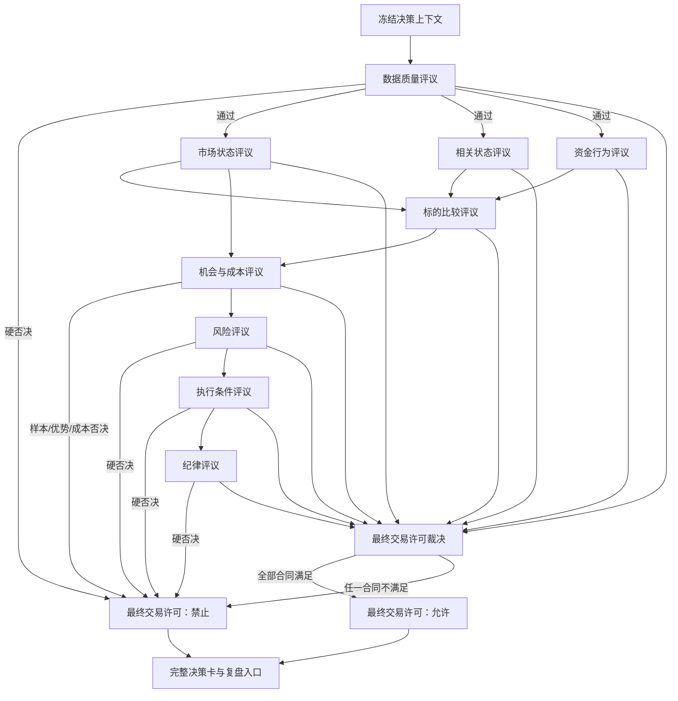

# 《知势决策委员会》V1.0

> 委员会是逻辑职责体系，不是拟人化投票，也不默认由多个模型或代理实现。

- 文档性质：交易许可评议职责与接口合同
- 适用阶段：第一阶段及其后续兼容实现
- 第一阶段范围：BTC、ETH；4小时、8小时、24小时、48小时
- 默认结果：信息不完整、结论冲突无法解决或任一硬门失败时禁止交易
- 真实资金状态：关闭

## 一、目标与边界

本委员会把《知势决策标准》的七道交易许可质量门，落实为十个边界清晰、可独立测试、
可追溯的评议单元。每个单元只回答自己的决策问题，不代替上下游，也不通过投票决定交易。

委员会不要求使用大模型。第一阶段应优先使用可解释规则、统计方法和经过研究准入的简单模型。
任何实现都必须保持本文定义的输入、输出、否决、降级和追溯语义。

委员会不负责训练模型、发现数据源、执行真实下单或放宽风险门槛。
它只消费已经声明来源和版本的输入，输出评议报告与最终交易许可。

它减少的主要错误是：

- 用缺失、迟到或未来数据形成交易结论；
- 把市场状态评分、确定性或模型分数冒充预测胜率；
- 用简单多数票越过数据门、风险门或执行门；
- 在标的优势不唯一、成本不足或样本不适用时强行交易；
- 因模块超时、异常或结论冲突而静默沿用旧许可；
- 在做多、做空与空仓之间输出含糊建议。

## 二、不可变设计原则

1. **职责分离：** 每个评议单元只处理明确问题，不能替上游补造输入。
2. **事实冻结：** 同一决策编号只使用同一决策时刻、数据截止时间和版本集合。
3. **硬门优先：** 数据门、风险门、执行门及其他合同指定硬门拥有否决权。
4. **禁止多数票：** 任何票数、平均分或综合分都不能覆盖硬否决。
5. **缺失即降级：** 必需输入缺失、超时、异常或版本不一致时，不猜测补齐。
6. **证据双向：** 每个方向结论同时记录支持证据与主要反证。
7. **概率隔离：** 只有经过校准的研究输出才能填写预测胜率；评分和确定性不得转换为概率。
8. **唯一裁决：** 最终交易许可只有“允许”或“禁止”，并且只允许一个主时间尺度、
   一个首选标的和一个方向。
9. **默认空仓：** 无唯一优势、无完整退出方案或任一必要报告不可用时，建议仓位为0。
10. **完整追溯：** 每项输入、证据、反证、规则、模型、阈值和评议结果都记录版本与引用。

## 三、总体流程



流程图中的并行箭头表示逻辑上可以独立计算，不表示必须并发运行。
最终裁决必须等待所有必要评议报告完成，不得用先到结果替代超时单元。

## 四、统一评议合同

### 4.1 决策上下文

每个单元接收同一份冻结上下文。机器字段可使用英文标识符，业务含义与用户输出必须使用中文。

| 字段 | 中文含义 | 必需 | 约束 |
| --- | --- | --- | --- |
| `decision_id` | 决策编号 | 是 | 全链路唯一且不可复用 |
| `decision_time` | 决策时间 | 是 | 包含时区 |
| `data_cutoff_time` | 数据截止时间 | 是 | 不晚于决策时间 |
| `timezone` | 决策时区 | 是 | 第一阶段统一配置并显式保存 |
| `horizon` | 目标时间尺度 | 是 | 4小时、8小时、24小时或48小时 |
| `asset_scope` | 标的范围 | 是 | 第一阶段固定为BTC、ETH |
| `data_version` | 数据版本 | 是 | 所有单元必须一致 |
| `rule_version` | 规则版本 | 是 | 能定位具体规则集合 |
| `model_versions` | 模型版本集合 | 条件必需 | 未使用模型时为空集合，不得写未知 |
| `research_refs` | 研究证据引用 | 条件必需 | 使用特征、概率或阈值时必须提供 |
| `input_refs` | 输入快照引用 | 是 | 只能引用决策时刻已到达的数据 |
| `deadline` | 评议截止时间 | 是 | 超时后按本文降级，不沿用旧结果 |

### 4.2 统一输出信封

每个单元输出不可变评议报告：

```text
评议编号：
决策编号：
评议单元：
对应质量门：
评议状态：通过 / 未通过 / 无法判定 / 不适用
一票否决：是 / 否
否决代码：
否决原因：
评分：
确定性：
预测胜率：
证据完整度：
业务输出：
支持证据引用：
主要反证引用：
缺失字段：
冲突说明：
降级动作：
输入版本：
规则与模型版本：
开始时间：
完成时间：
```

统一字段规则：

- `评议状态`描述本单元合同是否满足，不等同于交易许可。
- `一票否决`为事实字段。只要为“是”，最终许可必须禁止。
- `评分`仅在已有中文定义、范围、方向和版本时填写；第一阶段统一为0～100。
- `确定性`表示证据一致性、完整度与冲突程度，不是历史成功概率。
- `预测胜率`默认留空。只有机会与成本评议可引用已校准研究结果填写，
  并同时提供样本量、区间、适用状态、校准日期与误差。
- `证据完整度`衡量必要输入、检查和反证是否齐全，不表示方向正确。
- `不适用`只能用于合同明确声明的可选检查，不能用于跳过必需质量门。
- 所有时间均包含时区；所有金额、价格、数量、比例和评分均包含单位或口径。

### 4.3 证据引用

每条支持证据和反证至少保存：证据编号、来源、事件时间、到达时间、数据版本、
计算或规则版本、适用时间尺度和内容摘要。摘要不替代原始引用。

多个单元可以引用同一证据，但不得复制后改写成互相矛盾的事实。
若来源共享同一上游，应记录依赖关系，不能把重复来源误认为独立证据。

## 五、职责与质量门矩阵

| 评议单元 | 主要决策问题 | 对应质量门 | 否决权 | 核心输出 |
| --- | --- | --- | --- | --- |
| 数据质量评议 | 当时可见的数据是否可信且可重放 | 数据门 | 硬否决 | 数据门状态、数据健康、可重放结论 |
| 市场状态评议 | 当前状态是什么且是否在验证范围 | 样本门 | 条件硬否决 | 市场状态、适用范围、确定性 |
| 相关状态评议 | 双标的联动如何且是否变化 | 样本门、风险门 | 条件硬否决 | 相关状态、变化方向、共同因子提示 |
| 资金行为评议 | 新增资金偏向哪里且证据是否一致 | 优势门 | 无独立硬否决 | 资金之势、持续性、扩散程度、反证 |
| 标的比较评议 | 是否存在唯一且显著的首选标的 | 优势门 | 优势硬否决 | 标的排名、唯一首选、差异充分性 |
| 机会与成本评议 | 方向优势是否在成本后有正净期望 | 样本门、优势门、成本门 | 硬否决 | 方向、胜率区间、净赔率、净期望 |
| 风险评议 | 最大损失和组合风险是否可接受 | 风险门 | 硬否决 | 风险预算、仓位上限、失效与止损 |
| 执行条件评议 | 当前市场是否能按计划安全执行 | 执行门 | 硬否决 | 可执行性、冲击、订单与退出条件 |
| 纪律评议 | 频率、风险占用和动机是否合规 | 频率与纪律门 | 硬否决 | 频率状态、暂停状态、敞口冲突 |
| 最终交易许可裁决 | 所有合同是否共同允许唯一交易 | 全部质量门 | 最终裁决 | 允许/禁止、决策卡、否决原因 |

“条件硬否决”表示：只有当该输入是当前研究或风险合同的必需项时，缺失或超范围才否决。
条件是否成立必须由版本化合同决定，不允许运行时临时选择。

## 六、评议单元定义

### 6.1 数据质量评议

**职责：** 证明或否定决策时刻的数据是否齐全、及时、无无法解释异常，且能只使用当时已到达数据重放。

**明确不负责：** 不判断市场方向，不修复或覆盖原始数据，不为缺失数据生成估计值，不评价交易收益。

**输入字段及来源：**

- 决策上下文中的时间、数据版本和输入快照引用；
- 数据源清单中的来源、字段、时间语义和服务等级；
- 缺失、延迟、乱序、重复、断档和异常值审计结果；
- 事件时间、到达时间、采集时间及历史重放验证结果。

**输出字段、取值和缺失处理：**

- 数据门：`通过 / 未通过 / 无法判定`；
- 可重放：`是 / 否 / 未证明`；
- 数据源状态：`正常 / 降级 / 中断 / 未知`；
- 各健康指标、证据完整度、缺失字段和异常列表；
- 关键字段缺失、时间语义不明、未来数据嫌疑或可重放未证明时，输出硬否决。

**支持证据与主要反证：** 支持证据包括审计通过记录、延迟在验证范围内、重放哈希一致。
主要反证包括迟到数据被提前使用、来源断档、时间戳歧义、重复聚合或无法解释跳变。

**一票否决权：** 有。数据门未通过、无法判定或报告超时，最终许可必须禁止。

**上下游依赖：** 依赖冻结快照与数据审计；向其余九个单元提供可信输入边界。

**冲突处理与降级：** 健康指标冲突时采用更保守结论并记录来源；非关键字段仅能按预先验证方案降级。
任何旧快照、缓存或事后补采数据都不能替代本次必需输入。

**可测试验收场景：**

1. 完整且可重放的同版本快照应输出“通过”，否决为“否”。
2. 注入决策时刻之后到达的数据应输出“未通过”，否决代码指向未来数据。
3. 延迟审计超时或关键字段时间语义缺失应输出“无法判定”，并禁止交易。

### 6.2 市场状态评议

**职责：** 在指定时间尺度上识别市场状态，并判断当前状态是否位于相关研究的验证范围。

**明确不负责：** 不直接产生买卖方向，不计算仓位，不把状态评分解释为预测胜率。

**输入字段及来源：** 数据门通过报告；价格、波动率、流动性和成交特征；
版本化市场状态规则或模型；研究适用范围与失效条件。

**输出字段、取值和缺失处理：**

- 市场状态：`趋势上行 / 趋势下行 / 区间震荡 / 高波动混沌 / 流动性收缩 / 未识别`；
- 风险偏好：`扩张 / 收缩 / 中性 / 无法判定`；
- 状态是否在验证范围：`是 / 否 / 未证明`；
- 状态确定性、支持证据、反证和冲突；
- 必需特征缺失或状态超出范围时，样本门不得通过。

**支持证据与主要反证：** 支持证据是多个已准入状态特征的一致输出。
反证包括状态边界附近反复切换、波动与流动性结论冲突、当前状态无样本外覆盖。

**一票否决权：** 条件有。当前机会研究要求特定状态，而该状态未识别、未覆盖或报告超时时，否决样本门。

**上下游依赖：** 依赖数据质量评议；供标的比较、机会与成本、风险和最终裁决使用。

**冲突处理与降级：** 多个状态方法冲突时不做多数票。按已验证优先级与适用范围处理；
仍无法解释时输出“未识别”，不得强制选取最接近状态。

**可测试验收场景：**

1. 已验证趋势状态及完整证据应输出对应状态与“范围内”。
2. 状态边界冲突无法解决时应输出“未识别”，样本门否决。
3. 状态模型版本未通过研究准入时不得使用其分数，并应输出“未证明”。

### 6.3 相关状态评议

**职责：** 判断BTC、ETH之间的联动强弱、方向和变化，识别共同市场因子风险。

**明确不负责：** 不预设固定轮动顺序，不用相关性证明因果，不独立选择首选标的。

**输入字段及来源：** 数据门通过报告；同口径收益序列；版本化相关窗口与方法；
历史状态范围；当前与压力场景相关结构。

**输出字段、取值和缺失处理：**

- 相关状态：`高相关 / 中相关 / 低相关 / 无法判定`；
- 变化方向：`增强 / 衰减 / 稳定 / 剧烈切换 / 无法判定`；
- 共同因子提示、适用窗口、确定性、反证和风险引用；
- 序列不同步、样本不足或口径不一致时输出“无法判定”。

**支持证据与主要反证：** 支持证据包括多个窗口方向一致及样本外稳定性。
反证包括窗口敏感、结构突变、单个异常点主导和资产交易时段不对齐。

**一票否决权：** 条件有。相关状态是研究或组合风险的必需输入而无法判定时，否决对应样本门或风险门。

**上下游依赖：** 依赖数据质量评议；供标的比较、风险评议和最终裁决使用。

**冲突处理与降级：** 短窗与长窗冲突时同时保留并标记“剧烈切换”，不得简单平均。
没有经验证降级方案时，相关风险采用更保守估计。

**可测试验收场景：**

1. 双标的同步数据且多个窗口一致时应输出明确相关状态。
2. 刻意错位其中一个序列时应输出“无法判定”，不得继续计算伪相关。
3. 相关性突然由高转低时应输出“剧烈切换”及风险反证。

### 6.4 资金行为评议

**职责：** 判断新增资金更偏向BTC、ETH还是稳定币/空仓，并评估持续性、扩散程度与证据冲突。

**明确不负责：** 不把单一成交量、未平仓合约或资金费率等同于资金流向；
不宣称因果已证明；不独立授予交易许可。

**输入字段及来源：** 价格与成交、主动买卖、未平仓合约、资金费率、基差、流动性、
订单簿或已验证替代指标，以及相关研究的版本和适用范围。

**输出字段、取值和缺失处理：**

- 资金之势：`偏向BTC / 偏向ETH / 偏向稳定币或空仓 / 混合 / 无法判定`；
- 持续性、扩散程度、资金效率、承接能力、支持证据和主要反证；
- 必需输入缺失时输出“无法判定”，不得用单一代理字段补齐。

**支持证据与主要反证：** 支持证据需由价格、成交、持仓与资金成本等多类数据相互印证。
反证包括价格上涨但成交收缩、持仓增加伴随极端资金费率、订单簿承接恶化或信号快速反转。

**一票否决权：** 无独立硬否决。无法判定会使标的比较与优势门缺少必要证据，最终仍应禁止交易。

**上下游依赖：** 依赖数据、市场和相关状态；供标的比较与机会评估使用。

**冲突处理与降级：** 证据方向冲突时降低确定性并输出“混合”或“无法判定”。
订单簿缺失仅能使用经过研究准入的替代指标，并明确降级与适用范围。

**可测试验收场景：**

1. 多类独立证据一致偏向ETH时应输出“偏向ETH”并列出反证。
2. 仅提供成交量而缺少合同要求的持仓与成本输入时不得输出明确偏向。
3. 价格、持仓和资金费率严重冲突时应降低确定性并输出“混合”或“无法判定”。

### 6.5 标的比较评议

**职责：** 在同一时间尺度、同一方向口径下比较BTC、ETH，判断是否存在唯一且差异充分的首选标的。

**明确不负责：** 不固定永久权重，不在排名接近时强行选第一，不计算最终仓位。

**输入字段及来源：** 市场、相关与资金行为报告；经研究准入的相对强度、持续性、加速度、
成交扩张、资金效率、承接能力、持仓变化质量、资金费率健康度和反证。

**输出字段、取值和缺失处理：**

- 标的排名：BTC、ETH的完整有序结果或“无法排名”；
- 首选标的：`BTC / ETH / 无`；
- 差异充分性：`充分 / 不足 / 未验证`；
- 排名依据、差异指标、确定性、反证和适用状态；
- 任一标的关键输入缺失时不得做不对称比较，输出“无法排名”。

**支持证据与主要反证：** 支持证据是同口径横向比较后多个已准入特征指向同一标的。
反证包括第一与第二差异不足、结果依赖单一特征、参数轻微变化即换位或相关状态突变。

**一票否决权：** 对优势门有。无唯一首选、差异不足或未验证时，优势门未通过。

**上下游依赖：** 依赖市场、相关和资金行为评议；向机会与成本、最终裁决输出唯一候选。

**冲突处理与降级：** 权重或方法冲突时按研究版本分别展示敏感性；
无法证明稳定唯一排名时输出“无”，而不是平均分强排。

**可测试验收场景：**

1. 唯一首选且差异超过已验证门槛时应输出该标的与“充分”。
2. 第一与第二差异低于门槛时应输出首选“无”，优势门否决。
3. 删除BTC或ETH任一关键输入时应输出“无法排名”，不得用另一标的结果补齐排名。

### 6.6 机会与成本评议

**职责：** 对唯一候选评估做多、做空或不交易，验证样本、净赔率、净期望、成本覆盖和机会是否过度兑现。

**明确不负责：** 不由确定性推导预测胜率，不忽略执行延迟，不计算超出研究范围的概率。

**输入字段及来源：** 唯一候选与排名报告；市场状态；研究样本与样本外结果；
预测胜率点估计和区间；平均净盈利/亏损；手续费、滑点、资金费率、延迟和安全余量。

**输出字段、取值和缺失处理：**

- 方向：`做多 / 做空 / 无`；
- 样本门、优势门、成本门：分别`通过 / 未通过 / 无法判定`；
- 预测胜率、区间、样本量、校准状态与日期；
- 预期净赔率、盈亏平衡胜率、净期望、目标波动和成本明细；
- 任一核心概率、成本或样本字段无法证明时，相关硬门否决。

**支持证据与主要反证：** 支持证据是样本外、成本后、分状态结果和稳定的保守下界。
反证包括收益集中少数交易、参数敏感、校准失效、价格已过度兑现或成本压力下净期望转负。

**一票否决权：** 有。样本门、优势门或成本门任一未通过或无法判定，最终禁止交易。

**上下游依赖：** 依赖数据、市场状态、标的比较和研究证据；向风险、执行和最终裁决输出候选交易计划。

**冲突处理与降级：** 做多与做空证据同时成立但无法区分时输出方向“无”。
不同时间尺度必须独立评议，不能用长周期优势挽救短周期失败。

**可测试验收场景：**

1. 做多候选的胜率保守下界超过盈亏平衡胜率与已验证安全边际，且成本后净期望为正时通过。
2. 做空方向忽略资金费率后为正、计入后转负时，成本门必须否决。
3. 概率未校准或样本量不足时不得填写生产胜率，样本门输出未通过或无法判定。

### 6.7 风险评议

**职责：** 从账户权益、风险预算、失效条件、止损距离、成本和组合风险推导可承受仓位，并检查极端情景。

**明确不负责：** 不用高确定性突破绝对上限，不先定杠杆再反推风险，不把保证金占用等同于最大损失。

**输入字段及来源：** 候选交易计划；账户权益与可用资金；单笔、单日和组合风险配置；
止损、风险缓冲、现有敞口、相关状态、压力场景、流动性和交易所限制。

**输出字段、取值和缺失处理：**

- 风险门：`通过 / 未通过 / 无法判定`；
- 本笔可用风险、有效损失率、名义仓位上限、建议仓位和风险档位；
- 逻辑失效、价格止损、强平价格与缓冲、组合风险和压力损失；
- 核心字段缺失、风险预算不足、组合超限或强平不可计算时硬否决并输出仓位0。

**支持证据与主要反证：** 支持证据包括完整风险计算与通过的压力场景。
反证包括相关集中、跳价损失超预算、止损不可执行、浮盈加仓后风险超限或事件风险。

**一票否决权：** 有。风险门拥有不可覆盖的一票否决权。

**上下游依赖：** 依赖机会计划、相关状态、账户与风险配置；向执行和最终裁决输出仓位与风险边界。

**冲突处理与降级：** 多种风险估计取更保守结果；各仓位止损损失之和与压力组合损失取较大值。
任何计算异常都输出仓位0，不允许使用上次仓位。

**可测试验收场景：**

1. 完整输入且各项风险在限制内时输出可复算仓位与“通过”。
2. 双标的同方向敞口超过组合上限时必须否决，即使单笔风险均合格。
3. 强平价格无法可靠计算或失效条件为空时，输出仓位0和硬否决。

### 6.8 执行条件评议

**职责：** 验证候选交易在当前市场、订单精度、流动性、冲击、价格偏离和退出条件下能否安全执行。

**明确不负责：** 不实际下单，不放宽风险预算，不因信号强而忽略订单或市场限制。

**输入字段及来源：** 风险通过报告；目标市场状态；最新可交易价、标记价和指数价；
订单簿或替代流动性；精度、最小数量、保证金、预估冲击、入场、止损和退出计划。

**输出字段、取值和缺失处理：**

- 执行门：`通过 / 未通过 / 无法判定`；
- 可交易状态、计划订单类型、数量、价格约束、预估冲击与滑点；
- 信号价格偏离、止损可挂性、退出可行性和超时规则；
- 市场中断、数据过期、冲击超限、数量不合规或退出不可执行时硬否决。

**支持证据与主要反证：** 支持证据包括当前市场开放、深度足够、数量精度合规和压力滑点可承受。
反证包括快速跳价、价差扩大、深度消失、信号已过度兑现或止损订单不受支持。

**一票否决权：** 有。执行门拥有不可覆盖的一票否决权。

**上下游依赖：** 依赖风险报告与实时执行输入；向纪律和最终裁决提供可执行计划。

**冲突处理与降级：** 行情源与交易所状态冲突时按不可交易处理；
订单簿缺失只有存在经验证替代方案时才能降级，否则否决。

**可测试验收场景：**

1. 市场开放、数量合规、冲击和偏离在验证范围内时通过。
2. 信号生成后价格偏离超过允许范围时否决，不得追价。
3. 市场状态接口超时或止损订单能力未知时输出“无法判定”并禁止交易。

### 6.9 纪律评议

**职责：** 检查当日交易次数、累计风险、连续亏损、冷静期、现有敞口和交易动机是否符合规则。

**明确不负责：** 不判断方向，不因“机会看起来很好”解除暂停，不以盈利记录豁免违规。

**输入字段及来源：** 当日决策与执行日志；已用风险；现有敞口；连续亏损与暂停状态；
数据和模型健康暂停；候选交易动机与重新入场记录。

**输出字段、取值和缺失处理：**

- 频率与纪律门：`通过 / 未通过 / 无法判定`；
- 当日交易次数、当日已用风险、暂停/冷静期状态、敞口冲突和重新入场合法性；
- 日志缺失、暂停触发、频率超限、追回亏损/踏空或沿用旧许可时硬否决。

**支持证据与主要反证：** 支持证据包括完整审计日志、风险余量和新决策编号。
反证包括短时间重复入场、亏损后扩大风险、人工绕过暂停或与现有敞口冲突。

**一票否决权：** 有。频率与纪律门拥有不可覆盖的一票否决权。

**上下游依赖：** 依赖账户、决策、执行和暂停日志；向最终裁决输出纪律状态。

**冲突处理与降级：** 日志来源不一致时采用更高风险占用和更多交易次数；
无法确认是否处于暂停状态时按暂停处理。

**可测试验收场景：**

1. 当日次数、风险占用和敞口均在限制内且无暂停时通过。
2. 连续亏损已触发冷静期时，任何候选都必须否决。
3. 平仓后沿用旧决策编号重新入场时，纪律门必须否决。

### 6.10 最终交易许可裁决

**职责：** 验证所有必要评议报告同属一个冻结上下文，并按硬门和完整性规则输出唯一许可与完整决策卡。

**明确不负责：** 不重新评分，不补算缺失字段，不通过多数票、平均分或人工叙事覆盖否决。

**输入字段及来源：** 前九个单元的不可变报告、决策上下文、许可规则版本和决策卡字段合同。

**输出字段、取值和缺失处理：**

- 交易许可：`允许 / 禁止`；
- 建议仓位、唯一首选标的、唯一方向、主时间尺度；
- 完整决策卡、全部质量门状态、否决代码与原因、报告引用；
- 任一报告缺失、超时、版本不一致、硬否决、方向或标的不唯一时输出“禁止”和仓位0。

**支持证据与主要反证：** 支持证据是所有必要质量门通过、版本一致、字段完整且无未解决冲突。
主要反证是任一否决报告、缺失字段、旧报告、跨时间尺度拼接或风险/执行变化。

**一票否决权：** 本单元执行最终裁决，不拥有放宽权。它只能忠实应用各硬门与合同优先级。

**上下游依赖：** 依赖全部前置报告；输出决策卡、许可和复盘入口，不直接调用真实交易账户。

**冲突处理与降级：** 任一冲突不能由合同规则唯一解决时禁止交易。
裁决完成后发现新数据或市场变化，旧许可失效，必须以新决策编号重走全流程。

**可测试验收场景：**

1. 前九份报告版本一致、全部必需门通过且字段完整时，输出唯一“允许”与完整决策卡。
2. 八份通过、一份硬否决时必须输出“禁止”，不得按多数票允许。
3. 两个时间尺度分别支持相反方向且未选定唯一主尺度时，应输出“禁止”。
4. 任一报告超时、缺失或引用旧决策编号时，应输出“禁止”和仓位0。

## 七、冲突、缺失、超时与异常的统一规则

### 7.1 处理优先级

```text
数据与版本有效性
  > 硬否决
  > 必需字段完整性
  > 研究适用范围
  > 支持证据与反证冲突
  > 评分与排序
```

低优先级结论不能覆盖高优先级失败。例如，高标的评分不能覆盖数据版本不一致，
高确定性不能覆盖风险超限，较多支持单元不能覆盖执行门失败。

### 7.2 缺失

- 必需字段缺失：单元输出“无法判定”；若对应硬门或最终必需报告，则否决。
- 可选字段缺失：只有合同预先声明降级方案时可继续，并记录证据完整度变化。
- 下游不得用默认值、零值、均值、旧值或语言推断补齐上游缺失。

### 7.3 超时

- 截止时间前无报告视为超时，不延长决策时刻等待未来数据。
- 超时报告不能在许可生成后补写并使旧许可复活。
- 可以启动新决策编号重新评议，但必须重新冻结全部输入。

### 7.4 异常

- 计算错误、非有限数值、单位不一致、字段越界或未知枚举均视为异常。
- 异常输出不能进入评分、排序或仓位计算。
- 评议失败应记录错误代码和安全降级，不得只打印日志后继续。

### 7.5 单元冲突

- 事实冲突：返回数据质量评议，未解决前禁止交易。
- 适用范围冲突：样本门未通过。
- 方向冲突：机会方向输出“无”。
- 排名冲突：首选标的输出“无”。
- 风险与机会冲突：风险门优先并否决。
- 执行与理论机会冲突：执行门优先并否决。
- 多时间尺度冲突：分别保留报告，只允许选定一个完整通过的主时间尺度。

## 八、七道质量门的一一对应

| 质量门 | 主责单元 | 必须通过的关键结论 | 失败结果 |
| --- | --- | --- | --- |
| 数据门 | 数据质量评议 | 可重放、关键数据健康、时间语义明确 | 禁止交易，仓位0 |
| 样本门 | 市场状态、相关状态、机会与成本 | 当前状态在研究范围、样本外证据可用 | 禁止交易或仅保留影子记录 |
| 优势门 | 资金行为、标的比较、机会与成本 | 唯一首选、方向明确、成本后净期望为正 | 禁止交易，首选标的无 |
| 成本门 | 机会与成本评议 | 目标波动覆盖手续费、滑点、资金费率与余量 | 禁止交易 |
| 风险门 | 风险评议 | 失效、止损、单笔/单日/组合/强平风险合格 | 禁止交易，仓位0 |
| 执行门 | 执行条件评议 | 市场、冲击、价格、订单与退出均可执行 | 禁止交易，仓位0 |
| 频率与纪律门 | 纪律评议 | 次数、累计风险、暂停、敞口与动机合规 | 禁止交易，仓位0 |

最终裁决不得把“仅保留影子记录”输出为“允许交易”。影子记录仍对应交易许可“禁止”。

## 九、统一接口草案

以下结构用于指导后续接口和测试设计，不绑定具体编程语言：

```text
EvaluationRequest {
  context: DecisionContext
  unit: EvaluationUnit
  input_refs: EvidenceRef[]
}

EvaluationResult {
  evaluation_id: string
  decision_id: string
  unit: EvaluationUnit
  gates: QualityGate[]
  status: PASSED | FAILED | INDETERMINATE | NOT_APPLICABLE
  veto: boolean
  veto_codes: string[]
  score: number | null
  certainty: number | null
  win_probability: CalibratedProbability | null
  evidence_completeness: number
  output: UnitSpecificOutput
  supporting_evidence: EvidenceRef[]
  counter_evidence: EvidenceRef[]
  missing_fields: string[]
  conflicts: Conflict[]
  fallback_action: string
  versions: VersionSet
  started_at: timestamp
  completed_at: timestamp
}

TradePermissionDecision {
  decision_id: string
  permission: ALLOWED | FORBIDDEN
  selected_asset: BTC | ETH | NONE
  direction: LONG | SHORT | NONE
  horizon: H4 | H8 | H24 | H48 | NONE
  position: PositionPlan | ZERO
  gate_results: GateResult[7]
  evaluation_refs: string[10]
  veto_codes: string[]
  decision_card: DecisionCard
}
```

接口校验至少包含：枚举合法性、必需字段、时间顺序、单位、数值范围、同决策编号、
同数据版本、报告新鲜度、报告数量和硬否决一致性。

## 十、端到端验收场景

| 场景 | 关键输入 | 预期裁决 |
| --- | --- | --- |
| 合格做多 | 唯一标的做多优势、成本后正期望、全部硬门通过 | 允许；唯一标的、做多、主尺度与完整决策卡 |
| 合格做空 | 做空样本与成本独立验证、风险和执行通过 | 允许；唯一标的、做空、主尺度与完整决策卡 |
| 无唯一标的 | 第一与第二差异不足 | 禁止；首选标的无；优势门否决 |
| 做多做空冲突 | 同尺度两个方向均无稳定优势 | 禁止；方向无 |
| 数据未来注入 | 到达时间晚于决策时刻 | 禁止；数据门硬否决 |
| 状态未覆盖 | 当前市场状态不在研究范围 | 禁止；样本门否决 |
| 成本侵蚀 | 成本前为正、成本后净期望不为正 | 禁止；成本门否决 |
| 组合风险超限 | 单笔合格但共同因子压力损失超限 | 禁止；风险门硬否决；仓位0 |
| 市场不可执行 | 市场中断、冲击超限或止损不可执行 | 禁止；执行门硬否决；仓位0 |
| 纪律暂停 | 连续亏损或数据异常暂停已触发 | 禁止；纪律门硬否决；仓位0 |
| 单元超时 | 任一必需单元未按期返回 | 禁止；记录超时单元；不得沿用旧报告 |
| 版本冲突 | 单元使用不同数据或规则版本 | 禁止；返回事实与版本冲突 |

## 十一、可追溯与复盘

每次裁决必须保存冻结上下文、十份评议报告、所有证据与反证引用、质量门结果、
最终决策卡、建议与实际执行差异、最大有利/不利波动和复盘标签。

复盘分别评价：

- 数据是否可靠、当时是否真实可见；
- 每个单元是否遵守职责与适用范围；
- 硬否决是否被正确执行；
- 允许交易是否包含完整风险和退出计划；
- 禁止交易是否拦截了预期错误类型；
- 结果属于正确过程的随机损失，还是错误过程的偶然盈利；
- 哪个单元、规则或研究需要继续验证、降级或淘汰。

任何阈值、权重、评分或概率方法变更都必须走研究准入与版本评审，
不能依据单次盈亏直接修改委员会合同。

## 十二、实现准入清单

后续代码实现只有满足以下条件，才能声明符合本委员会V1.0：

- [ ] 十个评议单元均有独立接口和单元测试；
- [ ] 七道质量门与主责单元一一映射；
- [ ] 所有硬否决均有机器可读代码和中文原因；
- [ ] 评分、确定性、预测胜率、证据完整度和否决状态分别存储；
- [ ] 必需输入缺失、超时、异常和版本冲突均默认禁止；
- [ ] 做多、做空、空仓和多时间尺度冲突均有测试；
- [ ] 任何旧报告、未来数据和不一致版本都会被拒绝；
- [ ] 最终许可只含“允许”或“禁止”，且“允许”必须生成完整决策卡；
- [ ] 全流程可从最终裁决追溯到当时可见原始数据；
- [ ] 真实资金写入保持关闭，测试与影子记录不触发真实下单。

《知势决策委员会》的价值不在于增加观点数量，而在于让每个决定都有清晰责任、
让每个硬门都无法被绕过，并在证据不足时可靠地选择不交易。
