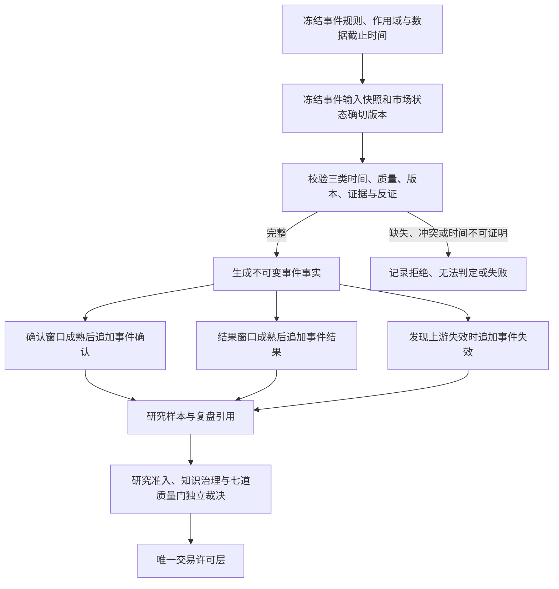

# 《知势市场事件层架构》V1.0

<!-- markdownlint-disable MD013 -->

> 市场事件只记录当时可见、可验证、可重放的市场行为；事件不是信号，更不是交易许可。

- 文档性质：市场行为事件的对象、版本、时间、确认、结果、失效与重放合同
- 适用范围：BTC、ETH；4小时、8小时、24小时、48小时
- 当前状态：理论架构；未实现探测器、存储、服务、模型或交易能力
- 当前数据结论：315个质量验证单元均为`无法判定`；历史重放4个拒绝、311个无法判定、0个通过；简单基准模型阶段为`禁止`
- 真实资金状态：关闭

## 一、目标、边界与决策问题

### 1.1 目标

本架构在不可变数据快照与研究、决策之间增加市场事件层，用独立对象回答：

1. 在指定交易场所、市场、标的集合、尺度和观察窗口中，当时观察到了什么市场行为；
2. 该观察使用了哪些截止时刻已经到达的数据、规则、市场状态版本、证据和反证；
3. 后续信息是否确认、拒绝或冲突，但不反向改写原事件事实；
4. 结果窗口成熟后实际观察到什么，以及结果如何与原事件防泄漏隔离；
5. 数据、规则或重放后来失效时，哪些事件及下游引用受到影响；
6. 历史重放能否使用原冻结版本复现事件成员、顺序、状态和完整性指纹。

本层主要减少事后定义事件、只保留成功事件、跨范围外推和把单次市场行为直接解释为
交易机会的错误，增强数据门、样本门和风险门的可审计约束，但不证明任何市场优势。

### 1.2 不在范围

本架构不：

- 实现实时或离线事件探测器、特征计算、标签程序、数据库、服务、队列或调度器；
- 规定价格、成交量、波动率、相关性、确认周期或结果窗口的生产数值阈值；
- 访问、采集、补采、清洗、修订、删除、覆盖或迁移真实市场数据；
- 训练模型、运行回测、计算预测胜率、收益、赔率或净期望；
- 生成首选标的、买卖方向、仓位、订单、止损或交易许可；
- 改写《知势市场状态架构》的五个状态轴或宏观事件状态枚举；
- 把事件结果解释为因果关系、稳定优势或未来事件发生概率。

### 1.3 与权威合同的职责边界

| 合同或层 | 负责 | 市场事件层的连接 | 市场事件层不得替代 |
| --- | --- | --- | --- |
| 最小数据闭环 | 来源、原始记录、质量、标准化、快照与血缘 | 只引用确切数据快照、质量和重放版本 | 不创建、修订或宣布数据可用 |
| 市场状态层 | 五个状态轴、组合状态、状态置信与约束 | 事件事实引用探测时确切状态版本；状态可引用事件版本作为后续证据 | 不由单个事件自动改变状态 |
| 宏观事件状态 | 合格外部来源下的事件常态、观察、限制、冻结或无法判定 | 可用精确引用关联外生窗口与内生市场反应 | 不复制外部事件身份、可信度或状态 |
| 研究准入 | 假设、样本、基准、成本、稳健性、准入与淘汰 | 提供版本化候选样本与失败样本 | 不批准研究或关系 |
| AI决策推理 | 在冻结上下文内形成受约束评议材料 | 可读取已授权事件事实、确认、结果与限制 | 不允许AI补齐事件、改写状态或授予许可 |
| 七道质量门 | 分别裁决数据、样本、优势、成本、风险、执行和纪律 | 提供证据引用、作用域和失败约束 | 不判定任何质量门通过 |
| 交易许可层 | 生成唯一的允许或禁止许可 | 只允许精确版本被许可记录引用 | 不包含许可、仓位或订单字段 |

发生冲突时，资金与数据安全、当时可见性、不可变历史、任务合同、市场状态合同、研究
准入和交易许可硬门优先。

## 二、核心不变量

未来实现必须同时满足：

1. **事实与评价分离：** 事件事实、确认、结果和失效分别形成不可变对象。
2. **当时可见：** 事件事实只读取`到达时间 <= 数据截止时间`的冻结输入。
3. **后置信息隔离：** 确认窗口和结果窗口内的信息不能进入原事件身份、输入或探测结论。
4. **版本精确：** 所有引用指向版本标识和内容指纹，不用名称、路径、时间戳或“最新”推断。
5. **作用域不可外推：** 交易场所、市场、标的冻结集合、主尺度、时间范围和市场状态逐项匹配。
6. **失败样本保留：** 观察到、拒绝、冲突、无法判定、失败、未成熟和失效均为正式记录。
7. **证据与反证并存：** 事件不能只保存支持材料；同源材料不能冒充多项独立证据。
8. **事件不等于信号：** 事件不输出预测、方向选择、仓位、订单或交易许可。
9. **状态不被覆盖：** 单个事件或事件簇不能自动改写市场状态版本或覆盖状态轴硬失败。
10. **结果不证明因果：** 事后结果只描述可观察事实，不自动升级研究、知识关系或许可。
11. **重放不漂移：** 重放只使用原Schema、规则、快照、状态和截止时间，拒绝当前版本替换。
12. **缺失安全停止：** 缺失、晚到、冲突、未成熟、版本不明或重放不一致时不生成默认事件。
13. **原始数据只读：** 事件对象只引用上游版本，不删除、覆盖或修正原始记录。
14. **许可保持唯一：** 任何事件状态都不能跳过七道质量门或改变二元许可合同。

## 三、概念模型与数据流

### 3.1 核心对象

| 对象 | 职责 | 不可变身份 | 禁止行为 |
| --- | --- | --- | --- |
| 事件规则版本 | 冻结事件类型、输入、窗口、判定和失败语义 | 规则逻辑标识、规则版本、指纹 | 用当前规则解释旧现场 |
| 事件输入快照 | 冻结探测时可见的数据、质量、作用域与状态版本 | 快照版本、截止时间、成员清单指纹 | 补入晚到或事后修订数据 |
| 事件事实 | 记录一次探测得到的观察、拒绝、无法判定或失败 | 事件逻辑标识、事件版本、内容指纹 | 被确认或结果原地改写 |
| 事件确认 | 使用独立确认窗口评价原事实是否得到后续支持 | 确认逻辑标识、确认版本、原事件版本 | 成为原事件输入或身份字段 |
| 事件结果 | 在预注册结果窗口成熟后记录可观察结果 | 结果逻辑标识、结果版本、原事件版本 | 被解释为因果或稳定优势 |
| 事件失效 | 追加记录上游失效、重放不一致或规则缺陷的影响 | 失效记录标识、版本、目标版本 | 删除或改写原事实与旧引用 |
| 事件簇 | 按冻结规则关联多个精确事件版本 | 事件簇逻辑标识、簇版本、成员有序清单 | 投票、去重隐藏失败或产生许可 |

### 3.2 追加式流程



图中的箭头只表示版本引用与处理顺序，不表示事件自动触发下游状态升级。确认、结果和
失效都可以多次追加新版本；它们不能返回并改变原事件事实。

### 3.3 生命周期是对象图，不是可变状态行

事件业务生命周期为：

```text
探测请求冻结
  → 事件事实终态：观察到 / 拒绝 / 无法判定 / 失败
  → 确认记录：已确认 / 已拒绝 / 冲突 / 无法判定 / 未成熟 / 失败
  → 结果记录：已观察 / 未成熟 / 无法判定 / 失败
  → 可选失效记录：已失效
```

每个箭头都创建新对象或新版本，不执行数据库行内状态更新。`观察到`只表示规则在原
现场匹配到行为；`已确认`只表示确认合同通过；二者都不表示预测成功或可以交易。

## 四、作用域、身份与版本

### 4.1 事件作用域

每个事件事实必须冻结：

```text
交易场所
市场类型与精确合约定义
标的冻结集合及其排序规则
主标的（如适用）
比较基准标的（如适用）
主时间尺度：4小时 / 8小时 / 24小时 / 48小时
观察窗口及边界包含规则
数据事件时间范围、到达时间范围与采集时间范围
数据截止时间与时区
市场状态报告确切版本集合
```

BTC、ETH必须分别保留证据；跨标的联动事件使用有序冻结集合，缺少任一必需成员
时不得用其他标的代替。现货、永续、不同交易所和不同合约不得静默合并。

### 4.2 双层身份

- **事件逻辑标识：** 标识同一事件探测问题，由事件类型、交易场所、市场、标的冻结集合、
  主尺度、观察窗口身份和规则逻辑标识共同限定。
- **事件版本标识：** 标识一次确切不可变输出，还必须绑定规则版本、Schema版本、输入快照、
  市场状态版本、数据截止时间、证据、反证、状态和内容指纹。

逻辑标识相同但输入、规则、Schema、状态版本、证据或反证变化时，必须创建新事件版本。
不同观察窗口中的事件不得因为类型和标的相同而复用身份。

### 4.3 新版本触发

以下任一变化生成新版本并保留前序引用与差异原因：

- 数据快照、成员、质量、三类时间、截止时间或完整性指纹变化；
- 事件规则、窗口、阈值合同、公式、单位、精度或Schema变化；
- 交易场所、市场、合约、标的集合、尺度或市场状态版本变化；
- 支持证据、主要反证、冲突处理或排除规则变化；
- 修正原因、状态、中文说明或失效影响范围；
- 确认、结果或重放产生新的评价记录。

新版本不自动取代旧版本。未来的激活、研究或复盘必须显式选择版本，历史引用保持不变。

## 五、七类初始市场事件

初始`事件类型`只允许以下七个中文枚举。规则版本必须在真实实现前通过独立研究与治理，
本架构不提供生产阈值。

| 事件类型 | 定义 | 最小输入范围 | 明确禁止推导 |
| --- | --- | --- | --- |
| 突破 | 价格结构在冻结观察窗口内按已批准规则越过同尺度参考上边界 | 单一标的的价格结构、参考边界、三类时间、质量、规则与同尺度状态版本 | 不推导继续上涨、做多、胜率或目标价 |
| 跌破 | 价格结构在冻结观察窗口内按已批准规则越过同尺度参考下边界 | 单一标的的价格结构、参考边界、三类时间、质量、规则与同尺度状态版本 | 不推导继续下跌、做空、胜率或目标价 |
| 放量上涨 | 价格上行观察与成交参与扩张同时满足同一冻结规则和范围 | 同一市场、标的、尺度和窗口的价格、成交量或成交额、比较基准、单位与质量 | 不推导资金净流入、买盘主体、趋势延续或许可 |
| 放量下跌 | 价格下行观察与成交参与扩张同时满足同一冻结规则和范围 | 同一市场、标的、尺度和窗口的价格、成交量或成交额、比较基准、单位与质量 | 不推导资金净流出、卖盘主体、趋势延续或许可 |
| 缩量回调 | 在确切前序结构范围内，价格反向变动与成交参与收缩同时满足冻结规则 | 前序结构版本、价格、成交量或成交额、比较基准、同尺度窗口与质量 | 不推导回调结束、原趋势恢复、入场点或低风险 |
| 趋势切换 | 前序与后续方向结构版本按已批准切换规则形成类别变化 | 同一标的、市场、尺度的前后市场状态确切版本、迟滞规则、输入快照与证据 | 不自动改写市场状态，不推导未来方向或执行动作 |
| BTC/ETH联动 | 两个标的在同一冻结市场、尺度和观察窗口内按已批准规则形成同步或结构化联动 | BTC、ETH有序冻结集合、对齐规则、各自数据与状态版本、完整覆盖和质量 | 不推导因果、固定轮动顺序、首选标的或任一标的可用性 |

新增、拆分、合并或重命名事件类型必须创建新Schema与规则版本，并通过任务文件、词典和
架构评审。别名不能绕过枚举治理。

## 六、窗口、时间与防泄漏

### 6.1 三类窗口

| 窗口 | 用途 | 允许输入 | 禁止输入 |
| --- | --- | --- | --- |
| 观察窗口 | 探测并形成原事件事实 | 截止时间前已到达且属于冻结范围的数据 | 确认、结果、晚到、补采或事后修订数据 |
| 确认窗口 | 按独立合同评价原事件是否得到后续支持 | 确认窗口内按确认截止时间可见的数据 | 改写原事件类型、身份、输入或状态 |
| 结果窗口 | 在标签成熟后记录可观察后果 | 结果窗口内按结果截止时间可见的数据 | 进入原探测、宣称因果或自动形成准入 |

三个窗口使用半开区间`[窗口开始, 窗口结束)`，相邻窗口可以在边界时刻衔接，但同一数据
记录不能同时作为原事件特征和其确认或结果标签。未来规则若需要隔离间隔，必须在查看
结果前冻结，并记录起止和排除规则版本。

默认时间顺序必须满足：

```text
观察窗口开始 < 观察窗口结束
观察窗口结束 <= 确认窗口开始 < 确认窗口结束
确认窗口结束 <= 结果窗口开始 < 结果窗口结束
```

任何例外都不得让确认或结果信息进入观察窗口；需要不同窗口关系时，必须由新的研究、
Schema和规则版本证明无泄漏后另行评审，不能在运行后调整。

### 6.2 必需时间

每个对象分别记录：

- **事件时间：** 原始市场记录所表达的业务发生时间；
- **到达时间：** 该记录已经被系统接收并可读取的时间；
- **采集时间：** 采集、转换或持久化动作的记录时间；
- **数据截止时间：** 本对象允许读取记录的到达时间上界；
- **对象生成时间：** 仅用于审计，不能作为市场时间或版本身份；
- **成熟时间：** 确认或结果窗口结束且所需数据按合同允许评价的最早时刻。

原事件可见集合必须满足：

```text
输入记录到达时间 <= 原事件数据截止时间
输入记录事件时间属于观察窗口
确认记录成熟时间 > 原事件数据截止时间
结果记录成熟时间 > 原事件数据截止时间
```

事件时间早于截止时间但到达时间晚于截止时间的数据属于晚到数据，不能补入原事件。
文件修改时间、当前时间和结果成熟时间都不能替代三类时间。

### 6.3 未成熟与缺失

- 确认或结果窗口尚未结束时，生成`未成熟`记录或不发起评价，不能提前填入结论；
- 窗口已结束但必需数据缺失、时间不可证明或作用域不符时，记录`无法判定`及解除条件；
- 到达时间晚于相应截止时间的数据只能进入新对象版本，不得回填旧对象；
- `未成熟`、`无法判定`和`无记录`含义不同，不能统一写为未发生或失败。

## 七、证据、反证与冲突

### 7.1 证据引用最小合同

每项证据至少包含：

```text
证据引用标识与版本
证据类型与中文语义
数据对象或结果版本
事件时间、到达时间、采集时间与数据截止时间
交易场所、市场、标的、尺度和窗口作用域
单位、精度、质量与异常状态
规则、公式、参数和代码版本（如适用）
独立来源组与同源关系
内容指纹与血缘引用
```

支持证据和主要反证必须同时冻结。单一指标、同源摘要、重复派生结果、多数票或综合分
不能覆盖时间、质量、作用域、重放和风险硬失败。

### 7.2 冲突顺序

1. 来源、三类时间、版本、作用域或指纹冲突时，停止相关对象并输出`失败`或`无法判定`；
2. 支持证据与主要反证均合格但规则未定义取舍时，输出`冲突`；
3. 证据不足时输出`无法判定`，不沿用上一事件、不生成“无事件”；
4. 规则已预注册的拒绝条件满足时输出`拒绝`或`已拒绝`，并保存原因与反证；
5. 未知异常输出`失败`，记录停止代码，不自动重试为成功。

## 八、技术中立Schema合同

字段名用于固定语义；未来存储格式可以不同，但不得删除必需语义或把多个时间合并。

### 8.1 事件事实Schema

```text
事件逻辑标识
事件版本标识
前序事件版本（没有时写不适用及原因）
事件Schema版本
事件规则逻辑标识与规则版本
事件类型：七类初始枚举之一
事件事实状态：观察到 / 拒绝 / 无法判定 / 失败
交易场所、市场类型与精确合约定义
标的冻结有序集合、主标的与比较基准
主时间尺度
观察窗口开始、结束与半开边界规则
输入事件时间、到达时间和采集时间范围
数据截止时间、时区与时钟规则版本
事件输入快照版本与成员清单指纹
数据质量摘要与历史重放证据版本
市场状态报告确切版本有序集合
支持证据版本有序集合
主要反证版本有序集合
同源证据分组与冲突记录
单位、精度、公式和参数集合版本
排除规则、异常与缺失记录
中文原因、限制与禁止推导
创建时间、冻结时间与执行主体引用
内容完整性指纹
```

事件事实状态在冻结后不可改变。`拒绝`也必须有身份、输入、规则和原因，不能只记一条
日志；必需时间或版本不可证明时不得伪装成`未观察到`。

### 8.2 事件确认Schema

```text
确认逻辑标识与确认版本标识
前序确认版本（没有时写不适用及原因）
原事件逻辑标识与原事件确切版本
确认Schema、确认规则与评价合同版本
确认状态：已确认 / 已拒绝 / 冲突 / 无法判定 / 未成熟 / 失败
确认窗口开始、结束与半开边界规则
确认成熟时间、确认数据截止时间与时区
确认输入快照版本与成员清单指纹
确认输入三类时间范围
作用域及其与原事件的逐项比较结果
支持证据、主要反证、同源关系与冲突记录
市场状态报告确切版本集合
中文原因、限制、解除条件与异常记录
生成时间、冻结时间与执行主体引用
内容完整性指纹
```

确认对象只评价原事件是否满足确认合同。它不能把原事件的`拒绝`改成`观察到`，也不能
将`已确认`解释为未来继续发生或研究已经有效。

### 8.3 事件结果Schema

```text
结果逻辑标识与结果版本标识
前序结果版本（没有时写不适用及原因）
原事件逻辑标识与原事件确切版本
结果Schema、结果规则与评价合同版本
结果状态：已观察 / 未成熟 / 无法判定 / 失败
结果标签及严格可观察定义
结果观察窗口开始、结束与半开边界规则
结果成熟时间、结果数据截止时间与时区
结果输入快照版本与成员清单指纹
结果输入三类时间范围
标的、市场、尺度、方向口径、单位与精度
成本、执行或排除口径版本（适用时）
支持证据、主要反证、失败样本与异常引用
作用域比较、缺失和限制
中文原因及禁止因果解释
生成时间、冻结时间与执行主体引用
内容完整性指纹
```

结果标签必须在读取受保护结果前定义。新增窗口、修改标签、成本、排除规则、单位或精度
都生成新结果版本。`已观察`只表示窗口内事实可评价，不表示事件成功或研究假设成立。

### 8.4 事件失效Schema

```text
失效记录逻辑标识与版本标识
前序失效记录版本（没有时写不适用及原因）
目标对象类型与目标确切版本
失效类型：输入失效 / 规则失效 / Schema失效 / 作用域失效 / 重放失效 / 语义失效
失效状态：已失效
触发证据与主要反证版本
发现时间、失效成熟时间、适用开始时间与数据截止时间
影响范围与下游精确版本清单
安全降级、停止条件与复验入口
是否影响未来使用及中文原因
生成时间、冻结时间与执行主体引用
内容完整性指纹
```

失效只影响明确声明的未来使用，不删除原事件、确认、结果、事件簇、研究或历史决策。
修复必须生成新对象版本并引用失效记录。

### 8.5 事件簇Schema

```text
事件簇逻辑标识与事件簇版本标识
事件簇规则与Schema版本
作用域、观察窗口、数据截止时间与时区
事件版本有序集合及成员顺序依据
成员关系类型与精确版本
支持证据、主要反证、冲突与缺失记录
市场状态版本集合
成员清单指纹与内容完整性指纹
中文用途、限制与禁止推导
生成时间与冻结时间
```

事件簇只表达版本化关联，不合并成员身份、不删除重复或失败记录、不通过多数票产生方向、
预测或许可。

## 九、市场状态与事件关系

### 9.1 多对多精确版本关系

- 一个事件事实可以引用多个市场状态报告版本，例如两个标的各自的同尺度报告；
- 一个市场状态报告可以被多个事件事实引用；
- 趋势切换事件必须同时引用前序与后续方向结构所在的确切报告版本；
- 新事件可以作为未来状态报告的一项证据引用，但必须由状态层规则重新评议；
- 任何关系都保存关系类型、作用域、有效时间和双方内容指纹。

单个突破、跌破、放量或联动事件不能原地修改状态轴。市场状态变化只能由市场状态层
基于完整输入、证据、反证、迟滞和冲突规则生成新的状态报告版本。

### 9.2 市场行为事件与宏观事件状态

| 维度 | 市场行为事件 | 宏观事件状态 |
| --- | --- | --- |
| 对象 | 价格、成交、结构切换和跨标的联动等市场内生行为 | 计划或突发外生事件窗口及其来源可信状态 |
| 事实来源 | 市场数据快照及事件规则 | 合格事件源、公告到达时间及状态规则 |
| 时间重点 | 观察、确认和结果窗口 | 事件前后风险窗口与来源可见性 |
| 输出 | 事件事实、确认、结果、失效和事件簇 | 事件常态、事件观察、事件限制、事件冻结或无法判定 |
| 禁止 | 推断外部事件原因、方向或许可 | 用宏观叙事替代市场行为证据 |

两者只能通过精确版本引用关联，例如“某宏观事件状态版本期间观察到某市场行为事件”。
该关联不证明外部事件导致市场行为，也不能让无来源的宏观状态变为事件常态。

## 十、确认、结果与研究样本边界

### 10.1 确认不是信号确认

事件确认只回答后续观察是否满足预注册确认规则。它不回答是否应该入场，也不允许：

- 把已确认事件解释为高确定性、高胜率或优势；
- 把已拒绝事件从样本和重放中删除；
- 用确认窗口选择性调整原事件阈值；
- 用多数确认记录覆盖数据、时间、风险或重放硬失败。

### 10.2 结果不是成功标签的默认解释

结果对象记录严格可观察的窗口结果。任何“成功”“失败”“命中”语义必须属于另行冻结的
研究标签和评价合同，并独立通过样本、基准、成本、稳健性和复现检查。单个结果、最佳
窗口或少数异常样本不能支持预测关系。

### 10.3 进入研究的最低边界

事件版本只有在以下条件全部有证据时，才可以申请成为研究输入：

1. 数据验证允许该精确市场、标的、尺度、字段和时间范围；
2. 原事件、确认和结果分别使用正确快照与截止时间，且无标签泄漏；
3. 规则、Schema、市场状态、证据、反证、单位、精度和指纹完整；
4. 历史重放满足原合同；
5. 观察到、拒绝、冲突、无法判定、失败与失效样本均按预注册规则保留；
6. 研究问题、简单基准、成本、样本外、稳健性和失效条件另行冻结。

满足上述条件只表示可申请研究，不表示研究状态升级、知识关系成立或可以交易。

## 十一、历史重放合同

### 11.1 重放身份与输入

每次重放创建不可变重放记录，至少绑定：

```text
重放标识与重放记录版本
原事件事实、确认、结果、失效和事件簇确切版本（按请求范围）
原事件Schema、规则、参数、公式与代码版本
原数据快照、质量摘要、三类时间与数据截止时间
原市场状态报告确切版本集合
原证据、反证、异常、排除和同源关系版本
原运行环境与确定性声明
重放请求原因、开始时间与执行主体引用
输入集合完整性指纹
```

任一必需版本不可取得、指纹冲突、作用域不符或时间不可证明时，结论为`无法重放`，不
自动改用相似来源、当前状态、当前规则或当前“最新”数据。

### 11.2 未来数据拒绝

原事件重放只接受：

```text
输入到达时间 <= 原事件数据截止时间
输入事件时间属于原观察窗口
输入版本属于原冻结成员清单
```

确认数据、结果数据、成熟标签、晚到数据、补采数据、事后修订、当前规则或当前市场状态
只要进入原事件输入，重放必须拒绝并记录`未来数据被拒绝`。确认与结果只能在各自对象的
截止时间和窗口内单独重放。

### 11.3 输出比较

确定性重放逐项比较：

- 事件成员集合及成员数量；
- 事件稳定排序与并列处理结果；
- 事件逻辑标识、版本标识与前序引用；
- 事件类型、作用域、窗口、时间和状态；
- 输入快照、市场状态、证据、反证与规则版本；
- 拒绝、冲突、无法判定、失败、未成熟和失效记录；
- 每个对象和输出集合的完整性指纹。

重放结论只允许`完全一致`、`不一致`或`无法重放`。任一必需成员、顺序、状态、版本或
指纹不同即为`不一致`；不允许用“业务含义相似”或事后容差把不一致改成通过。

### 11.4 稳定顺序

同一批次内事件按冻结排序合同排列，至少依次使用事件时间、事件类型固定序、标的冻结
集合规范序和事件版本标识。并列处理规则属于规则版本；不能依赖数据库返回顺序、文件
遍历顺序或并发完成时间。

## 十二、异常、原因代码与安全降级

| 原因代码 | 含义 | 对象结果 | 下游处理 |
| --- | --- | --- | --- |
| `事件输入不完整` | 必需来源、字段、快照或证据缺失 | 无法判定 | 补齐后创建新版本 |
| `时间可见性不可证明` | 三类时间缺失或输入晚于截止时间 | 失败或无法判定 | 数据门不得视为通过 |
| `未来数据被拒绝` | 确认、结果、晚到或修订数据进入原现场 | 失败 | 隔离输入并调查血缘 |
| `Schema版本冲突` | 字段语义或Schema引用不一致 | 失败 | 不猜测兼容关系 |
| `规则未获准入` | 事件规则缺少批准版本或已失效 | 拒绝 | 不生成观察到事件 |
| `作用域不符` | 市场、标的、尺度、窗口或状态不匹配 | 无法判定 | 不得跨范围外推 |
| `证据不足` | 支持材料质量、独立性或数量不满足规则 | 无法判定或拒绝 | 保留缺失与解除条件 |
| `证据冲突` | 合格支持与反证冲突且无预注册裁决 | 冲突 | 不用投票或综合分覆盖 |
| `确认未成熟` | 确认窗口尚未达到成熟时间 | 未成熟 | 不提前确认 |
| `结果未成熟` | 结果窗口尚未达到成熟时间 | 未成熟 | 不提前生成标签 |
| `重放不一致` | 成员、顺序、版本、状态或指纹不同 | 失败并追加失效评估 | 停止预测性使用 |
| `未知异常` | 无法归入已知失败类别 | 失败 | 安全停止并记录审计事件 |

任何异常都不得返回默认事件、缓存事件、上一事件或“无事件”。错误记录不得包含秘密值、
账户凭据或不必要的个人信息。

## 十三、技术中立接口语义

未来实现至少提供以下原子能力；名称和技术可以不同：

| 能力 | 必需输入 | 输出 | 失败时 |
| --- | --- | --- | --- |
| 冻结事件输入 | 规则、作用域、截止时间、数据和状态版本 | 输入快照版本与指纹 | 不生成半套快照 |
| 探测市场事件 | 冻结快照、规则与Schema版本 | 不可变事件事实或正式失败记录 | 不返回默认事件 |
| 评价事件确认 | 原事件版本、确认合同与独立快照 | 不可变确认版本 | 未成熟或无法判定 |
| 记录事件结果 | 原事件版本、结果合同与独立快照 | 不可变结果版本 | 未成熟或无法判定 |
| 追加事件失效 | 目标版本、失效证据与影响范围 | 不可变失效记录 | 不改写目标对象 |
| 形成事件簇 | 成员确切版本、关联规则和稳定顺序 | 不可变事件簇版本 | 不丢弃冲突成员 |
| 重放事件对象 | 原对象、全部冻结输入和环境 | 完全一致、不一致或无法重放 | 不替换原版本 |
| 查询事件血缘 | 精确版本和查询方向 | 版本化路径与断点 | 不按名称猜测 |

写入必须支持幂等请求、条件写入、整组失败回滚和唯一身份冲突拒绝。幂等重试可以返回
已有对象身份，但不能产生无法区分的重复记录或覆盖失败记录。

## 十四、与AI、质量门和唯一许可的映射

### 14.1 AI决策推理

AI只能在冻结上下文内：

- 引用精确事件事实、确认、结果、失效和事件簇版本；
- 区分观察事实、后续评价、主要反证和当前限制；
- 将无法判定、作用域不符、未成熟和失效移交对应评议单元；
- 检查自然语言摘要是否忠于结构化对象。

AI不得生成缺失事件、猜测阈值、把事件转成预测胜率、覆盖硬失败或自行改变许可。

### 14.2 七道质量门

| 事件层材料 | 可能影响的质量门 | 仅允许的作用 | 不得推导 |
| --- | --- | --- | --- |
| 快照、三类时间、截止时间、质量与重放 | 数据门 | 提供可见性和完整性证据 | 数据门自动通过 |
| 事件类型、作用域、状态版本与样本保留 | 样本门 | 约束同类样本定义和覆盖 | 样本足够或可外推 |
| 确认、结果、支持与反证 | 优势门 | 作为研究候选材料 | 正净期望或预测优势 |
| 结果中的冻结成本口径 | 成本门 | 提供可审计引用 | 成本已覆盖 |
| 失效、冲突、联动和异常 | 风险门 | 提供否决或复验上下文 | 风险可接受 |
| 市场与合约作用域 | 执行门 | 检查上下文是否匹配 | 市场可执行 |
| 事件簇和历史频度 | 频率与纪律门 | 提供复盘材料 | 自动决定交易次数 |

每道门仍由其权威评议单元独立输出。事件资料完整不代表任一门通过；任一硬门失败，唯一
交易许可仍为禁止。

### 14.3 唯一许可边界

市场事件层的正式输出中不包含许可状态、建议仓位、交易方向、订单或执行指令。下游若
引用事件，必须同时引用冻结决策上下文、评议报告和七道门结果，由交易许可层生成唯一
二元许可。事件对象无法取得、失效、作用域不符或重放不一致时，预测性使用停止。

## 十五、版本失效、影响查询与回滚

以下情况触发失效评估：

- 上游数据、来源、字段、三类时间、质量、快照或指纹发现缺陷；
- 事件规则、Schema、参数、公式、单位或精度存在错误或不再适用；
- 市场、合约、标的、尺度、窗口或市场状态作用域发生不兼容变化；
- 历史重放不一致或发现未来数据进入旧现场；
- 确认或结果合同出现标签泄漏、排除偏差或语义错误；
- 下游研究、知识或复盘产生可验证的新反证。

失效记录必须支持从目标事件正向查询受影响的确认、结果、事件簇、研究、知识、评议和
许可引用，也支持从下游反查原始数据与规则。回滚只允许未来消费者显式恢复到经评审的
旧版本；不删除新旧对象，不改写历史决策。

## 十六、未来实现验收场景

未来实现至少覆盖：

1. 缺少事件规则、Schema或输入快照版本时拒绝探测；
2. 到达时间晚于原截止时间的数据不能进入事件事实；
3. 事件时间早但晚到的数据仍被原现场拒绝；
4. 突破事件不会自动生成继续上涨、做多或许可；
5. 跌破事件不会自动生成继续下跌、做空或许可；
6. 放量上涨或放量下跌不会推断资金主体和因果；
7. 缩量回调缺少前序结构版本时输出无法判定；
8. 趋势切换不会原地改写市场状态报告；
9. BTC/ETH任一成员缺失时联动事件不能借用其他标的补齐；
10. 现货事件不会静默外推到永续或其他交易场所；
11. 4小时事件不会外推到8小时、24小时或48小时；
12. 支持证据与反证冲突且无规则时输出冲突；
13. 单一指标、同源摘要或多数票不能覆盖硬失败；
14. 确认窗口未成熟时不提前生成已确认；
15. 结果窗口未成熟时不提前生成结果标签；
16. 确认和结果数据不能改变原事件身份或状态；
17. 修改规则、窗口、阈值合同、单位或精度生成新版本；
18. 观察到、拒绝、无法判定和失败记录在新版本产生后仍可查询；
19. 失效记录不会删除原事件或改写历史下游引用；
20. 事件簇保留成员顺序、冲突和失败，不以投票生成方向；
21. 重放拒绝确认数据、成熟标签、晚到数据和当前最新规则；
22. 重放逐项比较成员、顺序、版本、状态和指纹；
23. 重放不一致时停止预测性使用并触发失效评估；
24. 事件结果不会自动升级研究生命周期或知识关系；
25. AI不能补齐缺失事件、改变结构化状态或授予许可；
26. 数据门通过不自动表示样本门、优势门或其他质量门通过；
27. 市场行为事件与宏观事件状态只能通过精确版本关联；
28. 当前数据审计未放行时不生成真实事件或真实研究样本；
29. 未知异常安全停止且不返回默认或缓存事件；
30. 真实资金关闭时任何事件状态都不能触发账户写入。

## 十七、当前阶段限制

- 当前315个质量验证单元均为`无法判定`；
- 当前历史重放结果为4个拒绝、311个无法判定、0个通过；
- 简单基准模型阶段仍为`禁止`，没有真实事件规则、阈值、快照、事件、确认或结果版本；
- 本文未访问服务器、数据库、市场接口、真实数据、模型、回测系统或交易账户；
- 本文不选择存储、序列化、计算、队列、调度、服务或部署技术；
- 后续实现、数据验证和规则研究必须由独立任务文件授权并通过真实证据验收。

因此本架构当前只能作为未来实现合同，不能据此声称BTC或ETH发生任何事件，也不能
形成预测、研究准入、知识关系或交易许可。

## 十八、架构自检

- [x] 事件事实、确认、结果、失效和事件簇职责分离且不可变；
- [x] 七类初始事件均定义最小输入与禁止推导；
- [x] 事件Schema覆盖身份、作用域、三类时间、截止时间、窗口、快照、状态、规则、证据、反证、状态、原因与指纹；
- [x] 确认、结果和失效Schema保存原对象、前序版本、成熟时间与独立快照；
- [x] 市场状态与事件使用多对多精确版本关系，单个事件不能改写状态；
- [x] 市场行为事件与宏观事件状态职责分离；
- [x] 历史重放拒绝未来数据并比较成员、顺序、版本、状态和指纹；
- [x] 研究准入、AI推理、七道质量门与唯一许可边界明确；
- [x] 当前限制真实记录，没有虚构阈值、事件、胜率、收益或完成状态。

## 十九、最终判断

市场事件层只把“当时观察到了什么”变成不可变、可验证、可重放的事实图谱。它通过把
原事件与确认、结果和失效彻底分离，减少事后信息污染历史现场的风险；通过保留拒绝、
冲突和无法判定样本，减少只看成功事件造成的研究偏差。

在数据、时间、版本、作用域、重放或研究证据不能证明时，正确输出是拒绝、无法判定、
失败或未成熟。宁可没有事件，也不得用未来结果补写一个看似成功的历史事件。
