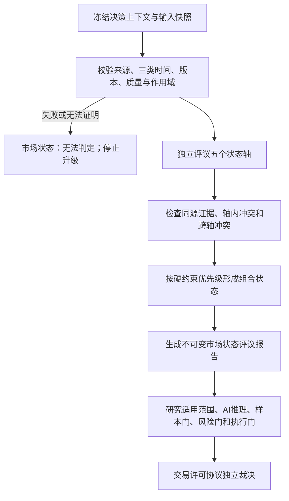

# 《知势市场状态架构》V1.0

<!-- markdownlint-disable MD013 -->

> 市场状态只回答“当前研究和决策处于什么环境、哪些能力仍然适用”，不回答“现在应该买还是卖”。

- 文档性质：Market Regime（市场状态）顶层架构与接口合同
- 适用标的：第一阶段BTC、ETH；不得静默删减或跨标的外推
- 适用时间尺度：4小时、8小时、24小时、48小时；每份报告只有一个主时间尺度
- 当前能力状态：只定义架构，不生成真实市场状态，不启用模型或交易执行
- 真实资金状态：关闭

## 一、目标、边界与决策问题

### 1.1 目标

本架构把方向结构、波动环境、流动性状态、风险偏好和宏观事件状态组织为可追溯、
可版本化、可重放的市场状态报告，为以下下游问题提供受约束的上下文：

1. 当前研究结论是否适用于本次标的、尺度和市场环境；
2. 当前风险、成本和执行假设是否仍处于验证范围；
3. 哪些证据支持状态判断，哪些反证会使状态失效；
4. 状态不完整、冲突或漂移时，哪些质量门必须降级或停止；
5. 历史重放时能否只使用决策时刻已经到达的信息复现原状态报告。

它减少的错误交易主要包括：把趋势方法用于震荡环境、把高波动误作高机会、在流动性
收缩时沿用常态成本与仓位假设、用单一指标猜测风险偏好，以及用事后数据重写历史状态。

### 1.2 不在范围

本文不：

- 定义任何指标的生产阈值、永久权重或训练参数；
- 选择规则模型、统计模型、机器学习模型、供应商或代理框架；
- 预测未来市场状态、价格、方向、胜率或收益；
- 生成唯一首选标的、建议仓位、订单或交易许可；
- 实现数据采集、数据库、服务、回测、模拟交易或真实交易；
- 把市场状态替代相关状态、资金状态、风险评议、执行评议或交易许可协议；
- 假设任务-000003至任务-000005发现的数据已经满足市场状态研究要求。

### 1.3 与权威合同的职责边界

| 合同 | 权威职责 | 本架构的连接方式 |
| --- | --- | --- |
| 《知势白皮书》 | 固定长期原则、阶段顺序与唯一许可边界 | 服从先判断形势、默认安全失败和状态层不直接产生日内方向 |
| 《知势知识图谱》 | 定义市场状态、波动、流动性等节点及证据状态 | 只引用确切节点和关系版本，不把待验证假设升级为事实 |
| 《知识图谱运行时设计》 | 管理不可变版本、激活清单、快照和血缘 | 市场状态报告绑定知识快照，不能改写图谱或历史快照 |
| 《知势研究准入规范》 | 决定规则、特征和模型是否达到研究阶段 | 状态规则和阈值必须独立准入，本架构本身不证明其有效 |
| 《知势AI决策推理规范》 | 约束AI如何读取状态、证据、风险和反证 | AI只能摘要冻结报告，不能重新分类或把状态变成买卖方向 |
| 《知势交易许可协议》 | 生成唯一允许或禁止许可 | 市场状态报告只提供样本、风险和执行约束，不含许可字段 |
| 《风险预算规范》 | 定义最大允许损失、仓位和组合风险 | 状态可触发更保守评议，不计算或放宽风险上限 |

## 二、核心不变量

未来任何实现都必须满足：

1. **多轴分离：** 方向、波动、流动性、风险偏好和事件状态分别判定，不能用一个综合分掩盖冲突。
2. **单一指标无权分类：** 每个经验状态至少需要规则版本要求的多类证据；单一价格、成交量、OI或资金费率不能独立决定状态。
3. **状态不是信号：** 趋势上行不等于做多，趋势下行不等于做空，高波动不等于高机会，风险偏好扩张不等于买入高风险标的。
4. **时间尺度独立：** 4小时、8小时、24小时和48小时分别形成报告，不得平均成一个无尺度状态。
5. **时间可见：** 历史判断只能使用`到达时间 <= 数据截止时间`的记录，晚到数据不能补写旧状态。
6. **版本不可变：** 输入、规则、知识、证据、状态或作用域变化必须生成新版本，禁止覆盖原报告。
7. **作用域一致：** 交易场所、市场、标的集合、时间尺度、时间范围和有效期必须与下游研究共同匹配。
8. **证据双向：** 支持证据、主要反证、同源关系、冲突和未知必须同时保存。
9. **置信等级不是概率：** 市场状态置信等级只描述证据完整性、一致性和独立性，不能被解释为预测胜率。
10. **硬失败优先：** 数据不可见、版本冲突、作用域不符和硬风险不能被投票、平均分或高置信等级覆盖。
11. **无法判定是正式结果：** 必需输入缺失、轴冲突无法解决或状态超出验证范围时，必须输出`无法判定`及解除条件。
12. **最终许可唯一：** 市场状态评议无权输出交易许可、方向、仓位或复活旧许可。

## 三、概念模型与评议流程

### 3.1 核心对象

| 对象 | 作用 | 最小身份 | 不得承担的职责 |
| --- | --- | --- | --- |
| 市场状态规则版本 | 冻结轴定义、输入要求、分类和冲突规则 | 规则逻辑标识、规则版本标识 | 用文档存在证明规则已经准入 |
| 市场状态输入快照 | 冻结本次可见数据、质量和作用域 | 输入快照标识、数据截止时间、内容指纹 | 补入晚到或事后修订数据 |
| 状态轴结果 | 保存单一轴的类别、证据、反证和失败状态 | 状态报告编号、轴名称、轴结果版本 | 直接生成方向、仓位或许可 |
| 组合市场状态 | 汇总全部轴但不抹平轴结果 | 状态逻辑标识、状态版本标识 | 用一个综合标签覆盖流动性或事件硬约束 |
| 市场状态评议报告 | 向研究、AI和许可链提供不可变状态材料 | 报告编号、报告版本 | 替代正式样本、风险、执行或许可报告 |
| 状态失效记录 | 追加记录旧状态何时及为何不可继续使用 | 失效记录编号 | 修改旧报告的原判断 |

### 3.2 评议顺序



市场状态评议发生在数据质量评议之后。数据门失败时不得继续用剩余指标拼出状态；
状态评议完成也不表示样本门、风险门、执行门或其他质量门已经通过。

### 3.3 作用域与粒度

每份报告必须绑定一个：

```text
交易场所与市场
候选标的冻结集合
主时间尺度
事件时间范围
到达时间范围
数据截止时间
规则版本
输入快照版本
知识快照版本
```

同一决策可以分别引用4小时、8小时、24小时和48小时状态材料，但正式决策必须先选择
唯一主时间尺度。其他尺度只能作为带版本的背景或反证，不能覆盖主尺度状态。若研究只在
BTC范围验证，其状态结论不能静默应用于ETH；若决策要求比较BTC、ETH，
状态报告的标的覆盖不足时必须记录作用域不符。

## 四、输入合同

### 4.1 冻结上下文

| 字段 | 必需 | 约束 |
| --- | --- | --- |
| 状态评议编号 | 是 | 一次评议一个唯一编号，重试使用新编号 |
| 决策编号或研究编号 | 是 | 明确报告服务于决策还是研究，不得混用 |
| 评议时间 | 是 | 带时区 |
| 数据截止时间 | 是 | 所有输入到达时间不得晚于该时刻 |
| 主时间尺度 | 是 | 4小时、8小时、24小时或48小时之一 |
| 交易场所与市场 | 是 | 不同现货、永续、交易所不得静默拼接 |
| 候选标的冻结集合 | 是 | 明确BTC、ETH的纳入与排除原因 |
| 数据版本与输入快照 | 是 | 必须为确切不可变版本，不能写“最新” |
| 数据质量与重放结论 | 是 | 引用任务-000004/000005同范围证据或后续合格版本 |
| 状态规则版本 | 是 | 分类、冲突、置信和失效规则完整冻结 |
| 知识快照版本 | 是 | 精确引用市场状态相关节点、关系和证据 |

### 4.2 七类输入域

| 输入域 | 最小内容 | 主要支持轴 | 缺失时处理 |
| --- | --- | --- | --- |
| 价格结构 | 同尺度收益、结构高低点、区间与跳变，含三类时间和版本 | 方向、波动 | 对应轴无法判定，不得用最终价格补齐 |
| 波动率 | 已准入波动定义、窗口、单位、分布与异常状态 | 波动、风险 | 波动轴无法判定，成本和风险假设不得沿用 |
| 成交量与成交额 | 市场、币种、去异常规则、可比基线与版本 | 风险偏好、流动性 | 不得用单一成交放大解释资金进入 |
| 盘口结构 | 深度、价差、冲击、档位、采样与退出压力 | 流动性、风险 | 流动性轴无法判定，执行门不得视为通过 |
| 未平仓合约量 | 市场、合约、币本位或U本位、单位、修订和版本 | 风险偏好、波动 | 不得用OI增加直接证明新增做多资金 |
| 资金费率 | 合约、周期、结算、预估与已实现状态、单位和版本 | 风险偏好、成本 | 不得把正费率直接写成看多结论 |
| 宏观事件状态 | 来源、计划/突发类型、事件窗口、公告到达时间和可信状态 | 事件、风险 | 事件轴无法判定；无来源不等于无事件 |

输入存在不表示可用。每个输入还必须通过来源、字段、三类时间、质量、版本、作用域、
单位、精度和可重放检查。当前审计未证明某输入时，正确值是`不可用`或`无法判定`，
不是0、常态或无事件。

### 4.3 证据引用最小合同

```text
证据编号与版本
来源及来源类型
数据对象或研究版本
事件时间、到达时间、采集时间
适用交易场所、标的、尺度、市场状态与有效时间
证据状态：规范约束 / 派生定义 / 待验证假设 / 相关观察 / 已验证关系
支持或反对的状态轴
独立来源组与同源标记
质量与重放结论
内容指纹
```

待验证假设和相关观察可以说明为什么保持不确定，但不能单独支撑正式分类用于预测性
许可。多个来自同一底层数据或同一报告的摘要只算一个来源组。

## 五、五个状态轴

### 5.1 方向结构轴

允许类别：

| 类别 | 语义 | 禁止推导 |
| --- | --- | --- |
| 趋势上行 | 在指定尺度和范围内，已准入结构规则支持上行趋势类别 | 不等于做多或未来继续上涨 |
| 趋势下行 | 已准入结构规则支持下行趋势类别 | 不等于做空或未来继续下跌 |
| 区间震荡 | 结构规则支持价格在可复算区间内往返 | 不等于自动启用均值回归策略 |
| 方向冲突 | 合格证据支持相互不兼容的方向类别 | 不取多数、不平均成震荡 |
| 无法判定 | 输入、版本、质量、样本或规则不足 | 不得沿用上一状态 |

方向轴至少结合两类经研究准入的独立结构证据。具体特征、窗口、阈值和切换规则不由
本文规定，必须由独立研究版本冻结。

### 5.2 波动环境轴

允许类别：

| 类别 | 语义 | 对下游的约束 |
| --- | --- | --- |
| 低波动 | 波动处于规则版本定义的较低范围 | 目标波动和成本覆盖不能沿用常态假设 |
| 常态波动 | 波动处于规则验证的常态范围 | 仍须独立通过成本、风险和执行门 |
| 高波动 | 波动处于较高范围但结构仍可评议 | 增大估计不确定性并进入压力评议 |
| 高波动混沌 | 跳变、分布或结构冲突使常规状态规则失去适用性 | 样本适用性停止升级，风险与执行从严评议 |
| 无法判定 | 波动输入或规则不完整 | 不得用历史默认波动替代 |

高波动不是高收益证据；低波动也不是低风险证明。波动类别只说明环境和适用性。

### 5.3 流动性状态轴

允许类别：

| 类别 | 语义 | 对下游的约束 |
| --- | --- | --- |
| 流动性充足 | 深度、价差、冲击与退出压力在规则验证范围内 | 仍不自动表示执行门通过 |
| 流动性常态 | 流动性处于已验证常态范围 | 成本和仓位仍按当前输入独立计算 |
| 流动性收缩 | 深度下降、价差或冲击上升达到状态规则 | 收紧执行、成本与风险评议，不得沿用常态上限 |
| 流动性失序 | 报价、深度、跳价或退出能力异常，无法形成可靠执行假设 | 执行门不得通过，市场状态报告本身不授予许可 |
| 无法判定 | 盘口、成交或退出压力输入不足 | 不得用成交额替代盘口和冲击证据 |

流动性必须按具体交易场所、市场、标的、方向和计划规模评议。一个交易所或现货市场的
结论不能静默替代另一个交易所或永续市场。

### 5.4 风险偏好轴

允许类别：

| 类别 | 语义 | 禁止推导 |
| --- | --- | --- |
| 风险偏好扩张 | 多类准入证据支持资金更愿意承担市场风险 | 不等于任一标的优先或上涨概率提高 |
| 风险偏好中性 | 证据未显示稳定扩张或收缩且处于验证范围 | 不等于“无风险” |
| 风险偏好收缩 | 多类证据支持风险承担意愿下降 | 不等于必须做空 |
| 风险偏好冲突 | 价格、成交、OI、资金成本或跨标的证据相互冲突 | 不用综合分强行归类 |
| 无法判定 | 来源、范围、时间或研究证据不足 | 不得由单一币种或单一指标外推 |

风险偏好轴应区分价格变化、成交参与、杠杆持仓、资金成本和跨标的扩散。OI增加既可能
来自多头也可能来自空头，资金费率和成交量也具有多种解释；没有多类证据与反证时保持
`无法判定`。

### 5.5 宏观事件轴

允许类别：

| 类别 | 语义 | 对下游的约束 |
| --- | --- | --- |
| 事件常态 | 合格事件源证明当前不在规则定义的重点窗口 | 不能证明市场平稳或无突发事件 |
| 事件观察 | 事件接近、信息不完整或影响范围尚待确认 | 增加反证和复评要求 |
| 事件限制 | 已进入规则定义的高影响窗口 | 样本、成本、风险和执行假设必须显式覆盖该状态 |
| 事件冻结 | 事件来源、市场机制或可执行性异常，现有规则不能证明安全 | 停止状态升级，受影响质量门不得视为通过 |
| 无法判定 | 没有合格来源、到达时间或事件规则 | 不得写成无事件 |

事件状态不预测事件结果和市场方向。计划事件与突发事件必须分开记录；公告发布时间、
系统到达时间和后续修订时间不得混用。

## 六、组合市场状态与冲突处理

### 6.1 组合原则

组合状态必须完整保留五轴结果，不把它们压缩成一个可被误解的分数。报告包含：

```text
主状态类别
方向结构轴
波动环境轴
流动性状态轴
风险偏好轴
宏观事件轴
附加硬约束集合
跨轴冲突集合
```

主状态类别只用于索引和下游作用域匹配，允许值为：

```text
趋势上行
趋势下行
区间震荡
高波动混沌
流动性收缩
无法判定
```

风险偏好与事件状态保留为独立轴，不扩张主类别枚举。流动性失序通过主类别
`流动性收缩`加附加硬约束`流动性失序`表达，避免丢失严重程度。

### 6.2 形成优先级

主类别按以下顺序形成：

1. 来源、时间、版本、作用域或任一必需轴无法证明时，主类别为`无法判定`；
2. 事件轴为`事件冻结`时，主类别为`无法判定`并保留事件冻结硬约束；
3. 流动性轴为`流动性失序`或`流动性收缩`时，主类别为`流动性收缩`；
4. 波动轴为`高波动混沌`时，主类别为`高波动混沌`；
5. 其余情况下，主类别取方向轴的趋势上行、趋势下行或区间震荡；
6. 方向轴为冲突或无法判定时，主类别为`无法判定`。

该顺序不是风险程度排行榜，也不代表交易许可结果。它只保证流动性、混沌和事件硬
约束不会被方向标签遮挡。

### 6.3 冲突规则

- 轴内冲突不能由多数证据或平均分解决，必须依据来源质量、时间、作用域和独立性；
- 跨轴看似矛盾不一定是错误，例如趋势上行与流动性收缩可以同时成立；
- 不同尺度方向相反时分别保留，不拼成一个“中性”状态；
- 合格支持与合格反证无法按冻结规则裁决时，对应轴为冲突，组合状态从严降级；
- 规则未预先定义的组合不临时发明标签，输出`无法判定`和缺失的规则版本；
- 任何人工解释只能创建新证据或新规则版本，不能修改已冻结结果。

### 6.4 状态置信等级

市场状态置信等级允许：`高`、`中`、`低`、`无法判定`。它只根据冻结规则评价：

- 必需输入和证据是否完整；
- 证据来源是否独立、可访问和可重放；
- 支持与反证是否一致；
- 分类距离边界的稳定性是否通过预注册敏感性检查；
- 当前作用域是否位于研究验证范围；
- 状态是否临近失效或切换条件。

置信等级不能由模型自行命名，不能换算为预测胜率，不能覆盖任何质量门。未经过研究
准入的阈值不得输出`高`。任一必需轴为`无法判定`时，组合置信等级必须为`无法判定`。

## 七、输出合同

### 7.1 市场状态评议报告

每份不可变报告至少包含：

```text
报告编号与报告版本
状态逻辑标识与状态版本标识
报告状态：完整 / 无法判定 / 失败
决策编号或研究编号
评议时间、数据截止时间与时区
交易场所、市场、候选标的冻结集合与主时间尺度
数据、质量、重放、输入快照、规则和知识快照版本
五个状态轴结果
当前市场状态：主状态类别、五轴向量与附加硬约束
市场状态置信等级
证据完整度
支持证据版本集合与支持范围
主要反证版本集合与反证条件
同源证据组与冲突集合
适用范围与不适用范围
受影响研究、质量门和评议单元
对研究和交易许可的下游约束集合
失效条件、复评触发与解除条件
输入完整性指纹与输出完整性指纹
前序状态版本
创建时间与复盘入口
```

`报告状态=完整`只说明本报告满足结构和版本合同，不表示研究适用、质量门通过或交易
许可允许。无证据字段必须写`无法判定`及原因，不能留空、填0或沿用缓存状态。

### 7.2 状态轴结果

每个轴至少输出：

```text
轴名称
轴类别
轴结果状态：完整 / 无法判定 / 冲突 / 失败
规则版本
输入版本集合
支持证据集合
主要反证集合
同源证据组
边界与敏感性结论
适用范围
失效条件
原因代码与中文原因
解除条件
```

### 7.3 下游约束集合

| 状态事实 | 研究约束 | AI推理约束 | 质量门影响 |
| --- | --- | --- | --- |
| 状态或置信等级无法判定 | 不得把当前样本归入已验证状态 | 停止市场状态分析升级 | 样本门不得视为通过 |
| 当前状态超出研究适用范围 | 研究结论不得外推 | 输出`作用域不符` | 样本门禁止或无法判定 |
| 高波动混沌 | 只能使用明确覆盖混沌状态的研究与成本假设 | 保留跳变、尾部与反证，不生成方向 | 样本、成本、风险门从严评议 |
| 流动性收缩或失序 | 不能沿用常态滑点、冲击和容量假设 | 标记执行和退出风险 | 成本、风险、执行门从严；失序时执行门不得通过 |
| 风险偏好冲突 | 不得作为唯一标的或方向优势证据 | 保留冲突，不取平均 | 优势门不能由该轴支持通过 |
| 事件限制或冻结 | 必须使用覆盖同类事件窗口的验证 | 标记事件窗口和未知，不预测结果 | 样本、风险、执行门需显式处理；冻结时不得通过受影响门 |

市场状态报告只能指出“受影响”和“不得视为通过”。七道质量门的正式结果仍由对应评议
报告和交易许可协议生成。

## 八、与研究、知识、AI和交易许可的映射

### 8.1 研究准入

市场状态分类规则、特征、阈值和组合方法属于研究对象，必须：

1. 对应唯一决策问题并可证伪；
2. 预注册标的、市场、尺度、时间范围、状态与不适用范围；
3. 使用按时间顺序的样本外或前推验证；
4. 报告每类状态的样本数、持续时间、切换次数、边界样本和无法判定比例；
5. 检查轻微阈值变化、不同窗口和不同市场阶段的稳定性；
6. 同时报告支持、反证、失败状态、冲突和状态切换延迟；
7. 证明没有使用标签窗口、未来修订或晚到数据判断历史状态；
8. 经研究准入后再申请进入知识图谱激活清单。

本架构不规定哪个算法最好，也不为任何状态规则授予`候选`、`已纳入`或`已验证关系`。

### 8.2 知识图谱

本架构复用：

- `N-S01 市场状态`作为组合状态节点；
- `N-S02 波动环境`作为波动轴节点；
- `N-S03 流动性状态`作为流动性轴节点；
- `N-C01 相关状态`作为独立下游上下文，不并入五轴；
- `N-F01 资金行为`作为独立资金评议，不用风险偏好轴替代；
- `N-V01/N-V02/N-V03`保存支持、反证与失效；
- `R-004 市场状态适用于机会假设`保持待验证假设，不能直接授予许可。

方向结构、风险偏好和宏观事件若未来需要独立图谱节点，必须由新的治理任务更新词典、
节点合同和关系合同；本文不直接改写既有图谱证据状态。

### 8.3 AI决策推理

AI只能读取冻结市场状态评议报告并：

- 核对报告版本、作用域、有效期、证据、反证和失效条件；
- 说明当前研究是否覆盖该状态；
- 保留五轴结果和冲突，不自行压缩或重分类；
- 将`无法判定`、`作用域不符`和硬约束移交受影响评议单元；
- 在报告失效或版本冲突时停止移交。

AI不能仅凭行情文字、新闻摘要或单一指标创建状态，不能把`趋势上行`写成做多建议，
不能把状态置信等级写成预测胜率，也不能输出交易许可字段。

### 8.4 交易许可与七道质量门

| 市场状态材料 | 主要消费单元 | 主要质量门 | 失败结果 |
| --- | --- | --- | --- |
| 数据、三类时间、快照与重放引用 | 数据质量评议 | 数据门 | 时间或版本不可证明则禁止 |
| 状态类别、作用域、样本覆盖与置信等级 | 市场状态评议、机会与成本评议 | 样本门 | 状态未覆盖或无法判定则禁止或仅影子验证 |
| 高波动、风险偏好冲突与事件约束 | 风险评议 | 风险门 | 风险不可算或超限则禁止、仓位0 |
| 流动性、冲击、退出和事件窗口 | 执行条件评议 | 成本门、执行门 | 成本或执行不可证明则禁止 |
| 支持、反证、冲突和失效条件 | 所有受影响单元 | 对应门 | 未解决硬冲突不得升级 |

最终交易许可仍只有`允许`和`禁止`。市场状态报告不包含许可状态、建议仓位、唯一标的、
唯一方向或订单字段，不能被下游当作缓存许可。

## 九、版本、有效性与状态切换

### 9.1 双层身份

- **状态逻辑标识：** 由交易场所、市场、候选标的集合、主尺度和规则逻辑身份构成，跨版本稳定；
- **状态版本标识：** 由冻结上下文、输入快照、五轴结果、证据集合和规则版本的内容指纹生成。

名称、创建时间、自然语言摘要或“当前状态”不能替代版本标识。内容相同的重放可以得到
同一内容指纹，但每次运行记录仍必须有独立报告编号。

### 9.2 新版本触发

以下任一变化必须生成新状态版本：

- 新数据到达、数据修订或数据截止时间变化；
- 交易场所、市场、标的集合、主尺度或时间范围变化；
- 输入、质量、重放、规则、知识或证据版本变化；
- 任一轴类别、置信等级、支持、反证或冲突变化；
- 状态规则、阈值、窗口、来源映射或组合优先级变化；
- 失效条件触发、事件状态变化或旧报告过期；
- 修复影响分类、可重放性或安全降级的错误。

新版本不修改旧报告，也不使旧研究、AI记录或交易许可自动迁移。

### 9.3 切换、迟滞与稳定性

状态切换规则必须由研究版本预先定义，至少记录：

- 进入、保持、退出和无法判定条件；
- 边界包含规则；
- 最小确认窗口或迟滞规则（如使用）；
- 缺失、断流、恢复和跨日处理；
- 状态切换的最早可知时间；
- 切换延迟、误切换和漏切换的评估方法。

本文不预设确认周期或迟滞阈值。未经准入的平滑不得用来隐藏状态快速恶化；硬流动性、
事件或数据失败必须立即进入安全降级，不能等待多数窗口确认。

### 9.4 有效性与失效

报告必须声明有效时间和可观察失效条件。出现以下任一情况时，旧报告不得继续被新决策
消费：输入版本改变、数据质量恶化、作用域改变、规则失效、主要反证增强、事件状态
变化、流动性硬约束触发或超过有效时间。

失效只影响未来使用。历史报告保留其当时结论，并追加失效记录；不得把旧类别改成新
类别，也不得复活引用旧状态的交易许可。

## 十、历史重放合同

### 10.1 冻结输入

历史重放必须加载原报告绑定的：

- 决策或研究编号、评议时间、数据截止时间和作用域；
- 数据、质量、输入快照和历史重放版本；
- 事件时间、到达时间、采集时间与字段冻结状态；
- 状态规则、知识快照、证据、来源映射和参数版本；
- 五轴原结果、组合状态、置信等级、反证、冲突和完整性指纹；
- 当时的缺失、超时、异常、降级和失败记录。

### 10.2 防止未来数据

每条输入必须证明：

```text
到达时间 <= 原报告数据截止时间
```

事件已经发生但数据晚到、事后修订、更高时间尺度尚未成熟的完整K线、后来确认的宏观
结果、未来窗口标签和当前最新规则都不能进入旧状态判断。数据缺少到达时间时，历史状态
只能为`无法判定`。

### 10.3 重放比较

重放至少比较：

- 输入成员、排序、内容与资产集合指纹；
- 五轴类别、轴结果状态和原因代码；
- 主状态类别、附加硬约束和冲突集合；
- 状态置信等级、作用域、失效与下游约束；
- 输入、输出和报告完整性指纹。

相同最终主类别但证据、轴结果、硬约束或指纹不同，不能判为一致。无法取得原版本时，
结果为`无法判定`或`重放不一致`，不得用当前数据生成同名报告。

## 十一、异常处理与安全降级

| 原因代码 | 含义 | 状态报告结果 | 下游处理 |
| --- | --- | --- | --- |
| `状态输入不完整` | 必需输入、轴或字段缺失 | 无法判定 | 补齐后使用新报告编号 |
| `时间不可见` | 输入晚于数据截止时间到达或时间语义不明 | 失败或无法判定 | 数据门不得通过 |
| `版本冲突` | 数据、规则、知识、证据或报告版本不一致 | 失败 | 重新冻结一致版本 |
| `作用域不符` | 标的、市场、尺度、状态或有效期不匹配 | 无法判定 | 不得外推研究或许可 |
| `证据不足` | 证据状态、独立性或质量不足 | 对应轴无法判定 | 返回研究准入 |
| `状态冲突` | 合格证据支持不兼容类别且规则无法裁决 | 冲突，组合从严降级 | 不投票、不平均 |
| `状态未覆盖` | 当前类别不在研究验证范围 | 报告可完整但下游约束为不适用 | 样本门不得通过 |
| `状态已失效` | 有效期、反证或硬约束使旧报告不可消费 | 追加失效记录 | 创建新状态评议 |
| `重放不一致` | 原输入或结构化输出无法一致复现 | 失败 | 不得作为正式状态证据 |
| `未知异常` | 无法分类且不能证明安全 | 失败 | 停止并保留审计记录 |

异常不得返回上一次有效状态、常态、0或空值。重试、补充或纠错必须使用新报告编号和新
版本，保留前序失败与差异。

## 十二、技术中立接口合同

未来实现可以使用文件、服务或其他经评审的存储，但必须提供等价语义：

```text
冻结市场状态输入(上下文, 输入版本集合) -> 输入快照版本 | 明确失败
评议单一状态轴(输入快照版本, 轴规则版本) -> 状态轴结果 | 明确失败
组合市场状态(五轴结果, 组合规则版本) -> 组合状态 | 明确失败
发布市场状态报告(组合状态, 证据集合) -> 不可变报告版本 | 明确失败
按作用域解析状态(报告版本, 决策上下文) -> 唯一匹配 | 不匹配原因
重放市场状态(报告版本, 原冻结输入) -> 一致 / 不一致 / 无法判定
使状态失效(报告版本, 失效证据) -> 新失效记录 | 拒绝原因
```

接口必须拒绝模糊“当前版本”、多个同等匹配报告、缺少三类时间、缺少指纹和未授权覆盖。
读取可以缓存不可变对象，但缓存失效时不能返回旧状态作为安全默认值。

## 十三、未来验收场景

未来实现至少覆盖：

1. 同一冻结输入和规则重复评议得到相同五轴结果与内容指纹；
2. 单一指标支持趋势时，因证据类型不足保持无法判定；
3. 趋势上行与流动性收缩同时成立时，主类别不掩盖流动性硬约束；
4. 高波动不会自动生成高机会、方向或交易许可；
5. OI增加不会被直接解释为新增多头或风险偏好扩张；
6. 无事件源时输出事件轴无法判定，而不是事件常态；
7. 4小时上行与24小时下行分别保存，不平均为中性；
8. BTC范围报告不能用于ETH或双标的完整比较；
9. 待验证假设和相关观察不能独立支撑用于预测性许可的状态分类；
10. 多个同源摘要不被计为多份独立证据；
11. 支持与反证冲突无法解决时不使用多数票；
12. 到达时间晚于数据截止时间的记录被拒绝；
13. 尚未成熟的未来时间窗口不能用于历史状态；
14. 规则或阈值变化生成新版本，不改写旧报告；
15. 状态失效后旧报告仍可重放，但不能用于新决策；
16. 相同主类别但轴结果或硬约束不同，重放判为不一致；
17. 状态置信等级不会映射成预测胜率；
18. 市场状态报告完整但风险评议失败时，最终许可仍禁止；
19. 流动性失序时执行门不得因其他轴高置信而通过；
20. 未知异常不返回缓存状态、默认常态或旧许可；
21. 输出中出现建议仓位、买卖方向或许可字段时模式校验失败；
22. 从任一报告能够反查数据、规则、知识、证据、反证和前序版本。

## 十四、当前阶段限制

- 任务-000005的正式结果中没有单元进入重放第二门，本架构不能据此生成真实历史市场状态；
- 任务-000006已经形成最终审计合同，但允许预测性研究范围为空，不能启动状态规则的
  正式研究；
- 本文所有经验分类方法、输入组合和状态适用关系仍需独立研究准入；
- 本文不声明BTC、ETH在任何时刻属于某一状态，不声明状态具有稳定胜率或收益；
- 不访问服务器、数据库或市场数据，不训练模型、不回测、不模拟、不自动下单；
- 真实资金交易保持关闭，本文不能作为启用依据。

## 十五、架构自检

- [x] 方向、波动、流动性、风险偏好和宏观事件五轴均有独立输入、枚举和失败语义；
- [x] 主状态类别与《系统蓝图》的趋势、震荡、混沌和流动性类别一致；
- [x] 状态置信等级与预测胜率、确定性和交易许可明确分离；
- [x] 支持、反证、同源证据、冲突、失效与解除条件均进入输出合同；
- [x] 与知识图谱节点、AI五段流程、七道质量门和唯一交易许可完成映射；
- [x] 版本、作用域、三类时间、不可变报告和历史重放合同完整；
- [x] 缺失、冲突、超时、未知和未来数据均默认安全失败；
- [x] 未引入模型、阈值、数据库、生产代码、服务器操作或真实交易能力。

## 十六、最终判断

市场状态层的价值不是提高系统给出方向的频率，而是明确哪些研究、风险和执行假设在
当前环境中仍然成立。只有当来源、时间、版本、作用域、五轴证据和反证都可追溯时，
状态材料才有资格进入下游评议；状态不明、冲突或超出验证范围时，正确结果是停止升级、
保持无法判定并让交易许可继续服从硬门。

宁可错过一个看似明确的行情，也不得用单一指标、事后数据或模糊状态降低准入标准。
