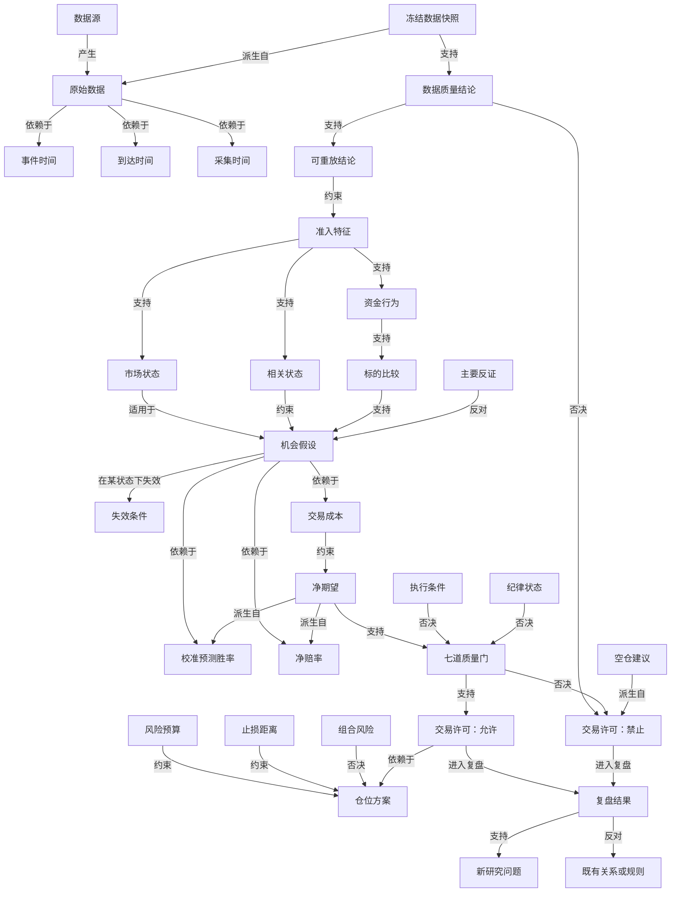

# 《知势知识图谱》V1.0

<!-- markdownlint-disable MD013 -->

> 图谱用于约束概念、证据与决策之间的关系，不替代数据、研究或验收。

- 文档性质：核心概念、关系、证据状态与准入合同
- 适用范围：BTC、ETH；4小时、8小时、24小时、48小时
- 当前证据边界：数据审计任务已交付但阶段1证据门未通过，预测性关系不得标记为已验证
- 默认安全结果：关系缺失、证据不足、版本冲突或硬门失败时，交易许可禁止、建议仓位为0
- 真实资金状态：关闭

## 一、目标与边界

本图谱把《知势》的数据、时间、特征、状态、证据、风险、执行与交易许可放入同一套可追溯关系中。它主要回答：

1. 一个概念由什么定义、从哪里取得证据；
2. 一个特征影响哪个决策问题和哪道质量门；
3. 一项结论依赖什么、受什么约束、被什么否决；
4. 支持证据、反证、失效条件和退出条件分别放在哪里；
5. 一次许可或禁止如何进入复盘，并反向形成研究问题。

图谱是治理和解释工具，不是因果发现结果，也不是运行时数据库选型。节点被登记不等于能力已经实现，关系被画出不等于关系已经通过研究准入。图谱不得：

- 把共现或相关写成因果；
- 把待验证假设写成生产规则；
- 把评分、确定性或证据完整度写成预测胜率；
- 用一条支持关系越过数据门、风险门、执行门或纪律门；
- 用缺失值、旧值、默认值或自然语言推断补齐必需输入；
- 因图形完整而虚构数据源、阈值、胜率、收益或已验证状态。

**对决策质量的意义：** 图谱强制每项能力连接到决策问题、证据与验证路径，减少指标堆砌、概念混用和无证据结论进入主决策链路。

## 二、图谱语义合同

### 2.1 节点合同

每个节点至少包含：

```text
节点编号：
中文名称：
中文定义：
节点域：
来源或证据来源：
输出用途：
可能误用：
验证方式：
所属质量门：
适用标的与时间尺度：
版本：
状态：提议 / 验证中 / 候选 / 试运行 / 已纳入 / 已淘汰 / 已失效
```

只有状态为“已纳入”且适用范围与当前决策一致的能力，才可能参与生产评议。节点状态不能由图谱维护者单独提升，必须引用研究准入或治理评审证据。

### 2.2 关系合同

每条关系至少包含：

```text
关系编号：
起点节点：
关系类型：
终点节点：
决策问题：
证据状态：规范约束 / 派生定义 / 待验证假设 / 相关观察 / 已验证关系
证据引用：
适用范围：
失效条件：
版本：
```

“已验证关系”必须有可重放、样本外、计入成本且通过研究准入的证据；没有证据引用时不得使用该状态。当前数据审计硬门尚未通过，因此本文不登记任何预测性的“已验证关系”。

### 2.3 五种证据状态

| 证据状态 | 含义 | 能否直接进入交易许可 |
| --- | --- | --- |
| 规范约束 | 由宣言、决策合同、风险或治理规范规定的必须行为 | 可作为硬约束，不能证明市场优势 |
| 派生定义 | 由可复算公式或字段合同确定的关系 | 可提供输入，仍须通过对应质量门 |
| 待验证假设 | 可证伪但尚无充分准入证据的市场或方法关系 | 否 |
| 相关观察 | 在限定样本中观察到共变，但未证明因果或稳定性 | 否 |
| 已验证关系 | 已通过数据、样本外、成本、稳健性和评审要求 | 仅在版本与适用范围一致时可使用 |

关系状态不是置信程度评分。任何状态变更必须生成新版本并保留旧状态，不能覆盖历史。

## 三、总体关系图



图中的“支持”表示提供一项必要证据，不表示单独足以授予交易许可。“否决”表示对应合同条件触发时必须禁止或输出仓位0。“派生自”的箭头方向统一为“派生结果指向其输入节点”。

## 四、核心节点目录

下表中的“来源”可以是数据、正式文档、研究或评议报告。来源存在不表示质量合格；“验证”列规定节点获得准入所需的证据。

### 4.1 数据与数据质量、时间与可重放域

| 编号 | 节点与中文定义 | 来源或证据来源 | 输出用途 | 可能误用 | 验证方式 | 质量门 |
| --- | --- | --- | --- | --- | --- | --- |
| N-D01 | 数据源：产生市场或账户事实的系统、接口、数据库或文件 | 数据源清单、只读发现结果 | 确定字段来源、权限、时效与故障边界 | 把“能访问”当作“可用于正式研究” | 数据资产发现、权限和字段回读 | 数据门 |
| N-D02 | 原始数据：未被派生结论替代、保留来源与时间语义的记录 | 交易所、数据库、文件或接口 | 提供可追溯事实 | 清洗后覆盖原始记录 | 哈希、版本、只读和抽样回读 | 数据门 |
| N-D03 | 数据质量：缺失、延迟、乱序、重复、异常和断档的综合健康结论 | 数据质量审计 | 决定数据门和降级范围 | 用单一完整率代表全部质量 | 分字段、分标的、分时间段审计 | 数据门 |
| N-D04 | 冻结数据快照：在决策时刻固定且只能引用当时可见数据的版本集合 | 决策上下文、输入引用 | 供全部评议单元共享事实 | 许可生成后补写数据使旧许可复活 | 版本一致性与历史重放 | 数据门 |
| N-T01 | 事件时间：市场事件实际发生时间 | 原始字段或可证明映射 | 对齐市场事实 | 把事件时间当作系统可见时间 | 字段语义审计与时区检查 | 数据门 |
| N-T02 | 到达时间：数据被系统接收并可用于决策的时间 | 采集日志、消息元数据 | 防止使用当时尚不可见数据 | 用采集或落库时间倒推到达时间 | 延迟审计与未来注入测试 | 数据门 |
| N-T03 | 采集时间：采集程序记录、转换或持久化数据的时间 | 采集程序日志 | 诊断处理延迟与重试 | 把采集时间冒充事件时间 | 多时钟对账与链路回放 | 数据门 |
| N-T04 | 数据截止时间：本次决策允许使用数据的上界 | 决策上下文 | 限定输入窗口 | 使用截止时间后的修订或补采 | `到达时间 <= 数据截止时间 <= 决策时间` 校验 | 数据门 |
| N-T05 | 可重放：只使用历史决策时刻之前已到达数据重建输入与结果的能力 | 重放验证报告 | 证明决策未时间穿越 | 只重放最终价格，不重放当时可见性 | 输入哈希、版本和结果一致性验证 | 数据门 |

### 4.2 市场状态、相关状态与资金行为域

| 编号 | 节点与中文定义 | 来源或证据来源 | 输出用途 | 可能误用 | 验证方式 | 质量门 |
| --- | --- | --- | --- | --- | --- | --- |
| N-S01 | 市场状态：指定时间尺度上的趋势、震荡、混沌、流动性和风险偏好类别 | 准入特征、状态规则或模型 | 判断研究适用范围 | 直接把状态当买卖方向 | 前推、分状态稳定性与边界测试 | 样本门 |
| N-S02 | 波动环境：当前波动水平、结构及其变化类别 | 价格与波动特征 | 约束目标波动、止损和成本覆盖 | 高波动等同高机会 | 分状态成本后验证与压力测试 | 样本门、风险门 |
| N-S03 | 流动性状态：深度、价差、冲击和可退出性的综合状态 | 订单簿、成交和执行回放 | 决定执行与仓位上限 | 只用成交额代替流动性 | 冲击回放、退出压力和异常场景 | 执行门、风险门 |
| N-C01 | 相关状态：BTC、ETH联动强弱及变化 | 同口径同步收益序列 | 约束样本适用与组合风险 | 把相关性解释为固定轮动因果 | 多窗口、错位和结构突变测试 | 样本门、风险门 |
| N-C02 | 共同市场因子风险：多个仓位依赖同一市场假设的集中风险 | 相关状态、敞口与压力场景 | 合并计算组合损失 | 把两个标的视为两份独立风险 | 止损损失和压力损失取较大值 | 风险门 |
| N-F01 | 资金行为：新增资金偏向进入、退出或停留在哪类资产的待验证判断 | 价格、成交、持仓、资金成本和流动性 | 形成资金之势 | 用单一成交量或持仓量证明资金流向 | 多类证据、反证和样本外研究 | 优势门 |
| N-F02 | 资金轮动：资金偏好在BTC、ETH与稳定币/空仓之间变化的待验证结构 | 资金行为与相关状态 | 支持标的比较 | 固化单向轮动顺序 | 分状态、分标的前推验证 | 优势门 |

### 4.3 特征与标的比较域

| 编号 | 节点与中文定义 | 来源或证据来源 | 输出用途 | 可能误用 | 验证方式 | 质量门 |
| --- | --- | --- | --- | --- | --- | --- |
| N-X01 | 相对强度：同一时间尺度下标的相对其他标的的表现差异 | 同口径价格或收益 | 支持横向排序 | 把历史强势直接外推未来 | 与简单基准比较、前推和分状态验证 | 优势门 |
| N-X02 | 持续性：特征或优势在连续窗口中保持方向与有效性的程度 | 特征时间序列 | 过滤瞬时脉冲 | 通过延长窗口掩盖失效 | 多窗口敏感性和失效样本 | 样本门、优势门 |
| N-X03 | 加速度：相对强度或资金特征变化速度的变化 | 版本化派生特征 | 识别优势增强或衰减假设 | 二阶噪声被解释为趋势 | 稳健性、降噪和交易成本后验证 | 优势门 |
| N-X04 | 承接能力：卖压出现时持续买盘吸收的能力 | 成交方向、订单簿或准入替代指标 | 反对缺乏买盘支持的上涨 | 只以“跌得少”下结论 | 压力样本、替代指标和失效样本验证 | 优势门、执行门 |
| N-X05 | 成交扩张：成交量或成交额相对可比基线的扩张 | 成交数据与版本化基线 | 检查行情参与度 | 忽略刷量、市场迁移和基线变化 | 多源、分市场状态和异常审计 | 数据门、优势门 |
| N-X06 | 资金效率：单位新增成交、持仓或资金成本变化对应的价格响应 | 价格、成交、持仓与成本 | 判断资金推动效果 | 直接宣称因果或忽略反向交易 | 可证伪定义、基准与样本外研究 | 优势门 |
| N-X07 | 标的比较：在同尺度同方向口径下对BTC、ETH的完整排序 | 已准入特征和评议报告 | 选择唯一首选或无 | 缺一个标的仍做不对称排名 | 双标的完整性、敏感性和差异门槛验证 | 优势门 |

### 4.4 机会、成本、概率与净期望域

| 编号 | 节点与中文定义 | 来源或证据来源 | 输出用途 | 可能误用 | 验证方式 | 质量门 |
| --- | --- | --- | --- | --- | --- | --- |
| N-O01 | 机会假设：指定标的、方向、尺度和状态下可被证伪的交易判断 | 研究假设与评议输入 | 启动机会审查 | 用叙事替代适用范围与失败条件 | 预注册合同、前推与反证分析 | 样本门、优势门 |
| N-O02 | 交易成本：手续费、滑点、资金费率、执行延迟和安全余量 | 费率、执行回放与压力假设 | 计算成本后收益 | 仅使用名义手续费 | 来源审计、压力情景和敏感性分析 | 成本门 |
| N-O03 | 校准预测胜率：历史同类样本中经校准的成功概率及区间 | 样本外研究与校准报告 | 与盈亏平衡胜率比较 | 把评分、确定性或模型置信度当概率 | 可靠性、区间、样本量和失准监控 | 样本门、优势门 |
| N-O04 | 净赔率：扣除成本后的平均净盈利与平均净亏损之比 | 样本外交易结果 | 描述收益损失比 | 高赔率被误作高胜率 | 分布、尾部、成本和稳定性验证 | 优势门、成本门 |
| N-O05 | 盈亏平衡胜率：使净期望为零所需的成功概率 | 平均净盈利和净亏损 | 给出最低概率要求 | 忽略区间与安全边际 | 公式复算与输入版本检查 | 优势门、成本门 |
| N-O06 | 净期望：成功与失败概率加权、扣除全部成本后的单笔预期 | 校准胜率、净盈利和净亏损 | 判断机会是否值得承担风险 | 只报告点估计或少数异常交易 | 样本外区间、稳健性和成本压力 | 优势门、成本门 |

### 4.5 风险、执行与纪律域

| 编号 | 节点与中文定义 | 来源或证据来源 | 输出用途 | 可能误用 | 验证方式 | 质量门 |
| --- | --- | --- | --- | --- | --- | --- |
| N-R01 | 风险预算：单笔、单日或组合允许承担的最大损失 | 账户权益和版本化风险参数 | 限定本笔可用风险 | 用资金占用或杠杆代替损失 | 公式复算、边界和压力测试 | 风险门 |
| N-R02 | 止损距离：计划入场价到价格止损的相对距离 | 入场与价格止损计划 | 计算有效损失率 | 任意百分比替代逻辑失效 | 与失效、跳价和执行回放联合验证 | 风险门 |
| N-R03 | 组合风险：全部敞口在止损与压力情景下的集中损失 | 仓位、相关和压力场景 | 限制共同因子暴露 | 按交易笔数假设分散 | 止损和压力损失取较大值 | 风险门 |
| N-R04 | 仓位方案：由风险预算、有效损失率及各项上限推导的敞口计划 | 风险评议 | 给出名义仓位、数量和保证金 | 先定杠杆或信心再反推仓位 | 公式、精度、强平和上限测试 | 风险门 |
| N-E01 | 执行条件：市场状态、深度、冲击、精度、价格偏离和退出可行性 | 交易所规则与实时执行输入 | 决定计划能否安全执行 | 理论机会自动等于可成交机会 | 模拟下单、回放、异常和退出压力 | 执行门 |
| N-E02 | 退出条件：目标、失效、风险、超时或数据异常触发的离场合同 | 决策卡与机会合同 | 约束持仓结束 | 入场后临时延长尺度 | 场景覆盖、可观测性与执行回放 | 风险门、执行门 |
| N-L01 | 纪律状态：次数、累计风险、暂停、敞口和重新入场合规状态 | 决策、执行与暂停日志 | 阻止报复性或强制交易 | 因高分或盈利豁免违规 | 日志完整性与规则场景测试 | 频率与纪律门 |

### 4.6 证据、许可与复盘域

| 编号 | 节点与中文定义 | 来源或证据来源 | 输出用途 | 可能误用 | 验证方式 | 质量门 |
| --- | --- | --- | --- | --- | --- | --- |
| N-V01 | 支持证据：提高某项结论可信度但不能单独授予许可的版本化事实或研究结果 | 数据、研究或评议报告 | 支持节点和关系 | 重复同源证据冒充独立证据 | 来源、时间、版本和独立性审查 | 对应关系所属门 |
| N-V02 | 主要反证：反对结论、限制范围或提示失效的证据 | 数据、失败样本和评议冲突 | 降低确定性或触发否决 | 只把反证作为备注而不影响结果 | 反证覆盖、压力样本和裁决测试 | 对应关系所属门 |
| N-V03 | 失效条件：原机会、特征或关系不再成立的可观测条件 | 研究合同和决策卡 | 使旧结论失效并触发退出或重评 | 用任意价格止损代替逻辑失效 | 可观测性、历史触发和假阳性分析 | 优势门、风险门 |
| N-Q01 | 七道质量门：数据、样本、优势、成本、风险、执行、纪律的硬检查集合 | 决策标准与委员会合同 | 汇聚许可条件 | 用平均分或多数票覆盖硬门 | 端到端否决场景和版本一致性 | 全部质量门 |
| N-P01 | 交易许可：对唯一决策上下文输出允许或禁止 | 十份评议报告和质量门 | 形成唯一最终裁决 | 输出“观望”等第三状态或沿用旧许可 | 完整性、唯一性、超时和否决测试 | 全部质量门 |
| N-P02 | 空仓建议：没有合格新方向仓位的正式决策 | 禁止许可及否决原因 | 保存选择权并记录原因 | 当作缺失输出或系统失败 | 原因完整性、仓位0与复盘检查 | 全部质量门 |
| N-P03 | 决策卡：冻结输入、门状态、许可、风险、证据和版本的统一记录 | 最终裁决 | 审计、执行与复盘入口 | 允许交易时缺字段或事后补写 | 模式校验、引用完整性和不可变性 | 全部质量门 |
| N-P04 | 复盘结果：过程、执行和结果分离后的事后评价 | 决策卡、执行记录与结果窗口 | 发现错误类型和新研究问题 | 用单次盈亏直接改规则 | 周期性样本、归因和版本评审 | 研究准入、全部质量门 |

## 五、关系类型目录

| 关系类型 | 方向语义 | 必需条件 | 禁止用法 |
| --- | --- | --- | --- |
| `依赖于` | 起点没有终点就不能完整成立 | 说明依赖是否必需及缺失降级 | 用循环依赖让节点互相定义 |
| `支持` | 起点为终点提供一项正向证据 | 同时允许挂接反证，记录独立性 | 把支持写成充分条件或因果 |
| `反对` | 起点削弱、限制或否定终点 | 说明影响确定性、范围或质量门 | 记录反证但不改变任何结果 |
| `约束` | 起点限制终点的范围、数值或状态 | 约束可执行、可测试、可版本化 | 用模糊文字代替边界 |
| `否决` | 起点触发时终点必须失败或降级 | 指向质量门、许可或仓位，含否决代码 | 被评分、票数或人工叙事覆盖 |
| `派生自` | 起点可由终点及明确公式或规则复算 | 保存公式、输入、单位和版本 | 从不可追溯摘要派生生产值 |
| `适用于` | 起点只在终点范围内有效 | 明确标的、尺度、状态和版本 | 将局部结果全局外推 |
| `在某状态下失效` | 起点关系在终点条件出现时停止有效 | 条件可观测且在使用前定义 | 结果出现后补写失效条件 |
| `进入复盘` | 起点决策或结果进入终点复盘流程 | 保存过程、执行和结果引用 | 只复盘亏损或只看盈亏 |

## 六、关键关系清单

| 编号 | 关系声明 | 证据状态 | 决策问题与失效条件 |
| --- | --- | --- | --- |
| R-001 | 到达时间 `约束` 冻结数据快照 | 规范约束 | 当时是否真实可见；时间语义不明即失效 |
| R-002 | 冻结数据快照 `支持` 可重放结论 | 规范约束 | 能否重建现场；版本或输入引用不一致即反对 |
| R-003 | 数据质量失败 `否决` 交易许可 | 规范约束 | 数据能否用于决策；未通过或无法判定即禁止 |
| R-004 | 市场状态 `适用于` 机会假设 | 待验证假设 | 机会是否位于验证范围；状态未识别即失效 |
| R-005 | 相关状态 `约束` 组合风险 | 规范约束 | 多标的是否共享风险因子；结构突变时采用保守估计 |
| R-006 | 资金行为 `支持` 标的比较 | 待验证假设 | 新增资金偏向是否提高唯一标的识别；证据冲突即失效 |
| R-007 | 相对强度 `支持` 标的比较 | 待验证假设 | 横向差异是否有样本外增益；第一二名差异不足即反对 |
| R-008 | 持续性 `支持` 机会假设 | 待验证假设 | 优势是否非瞬时；窗口敏感或快速反转即失效 |
| R-009 | 加速度 `支持` 机会假设 | 待验证假设 | 优势增强是否有增量价值；噪声主导即失效 |
| R-010 | 承接能力 `支持` 机会假设 | 待验证假设 | 买盘吸收是否减少追涨错误；替代指标未准入即失效 |
| R-011 | 成交扩张 `支持` 资金行为 | 待验证假设 | 参与度是否印证资金偏向；异常成交或基线漂移即失效 |
| R-012 | 资金效率 `支持` 标的比较 | 待验证假设 | 单位资金变化是否改善排序；因果未证明，不得单独使用 |
| R-013 | 主要反证 `反对` 机会假设 | 规范约束 | 支持与反证是否冲突；无法解释时方向为无 |
| R-014 | 校准预测胜率 `派生自` 样本外研究 | 派生定义 | 概率能否复算；校准失效或样本不足时不得填写 |
| R-015 | 交易成本 `约束` 净赔率与净期望 | 派生定义 | 优势在成本后是否存在；压力成本下非正即否决 |
| R-016 | 净期望 `派生自` 校准预测胜率、平均净盈利与平均净亏损 | 派生定义 | 单笔是否值得承担风险；区间和输入版本缺失即无效 |
| R-017 | 净期望 `支持` 优势门 | 规范约束 | 成本后是否为正且优于基准；不能单独越过其他门 |
| R-018 | 风险预算与止损距离 `约束` 仓位方案 | 派生定义 | 最大损失能否受控；核心字段不可算则仓位0 |
| R-019 | 组合风险超限 `否决` 仓位方案 | 规范约束 | 共同因子损失是否超限；超限即仓位0 |
| R-020 | 执行条件失败 `否决` 交易许可 | 规范约束 | 理论机会能否安全成交和退出；不可执行即禁止 |
| R-021 | 纪律状态失败 `否决` 交易许可 | 规范约束 | 次数、暂停和动机是否合规；日志缺失按暂停处理 |
| R-022 | 七道质量门全部通过 `支持` 允许交易 | 规范约束 | 必需条件是否共同满足；任何硬门失败即失效 |
| R-023 | 空仓建议 `派生自` 禁止交易 | 规范约束 | 没有合格机会时是否保持仓位0；不得返回含糊第三状态 |
| R-024 | 允许或禁止许可 `进入复盘` 复盘结果 | 规范约束 | 许可和否决是否有效；未执行与空仓同样复盘 |
| R-025 | 复盘结果 `支持` 新研究问题 | 规范约束 | 错误是否可重复研究；单次盈亏不能直接改变关系状态 |
| R-026 | 复盘反证 `反对` 既有关系 | 规范约束 | 关系是否失准；必须进入研究和版本评审后才能降级 |

## 七、特征到决策问题的映射

| 特征节点 | 必须回答的决策问题 | 主要输出 | 支持证据位置 | 反证位置 | 失败结果 |
| --- | --- | --- | --- | --- | --- |
| 相对强度 | 哪个标的在同尺度同口径下具有相对优势 | 双标的比较输入 | 特征报告的支持引用 | 参数敏感、差异不足、状态突变 | 首选标的无 |
| 持续性 | 观察到的优势是否跨窗口保持 | 优势稳定性 | 连续窗口与样本外结果 | 快速反转、窗口依赖 | 优势门不通过或确定性降低 |
| 加速度 | 优势是在增强、衰减还是由噪声造成 | 变化方向 | 版本化派生计算 | 二阶噪声、轻微改参崩溃 | 不纳入或淘汰 |
| 承接能力 | 上涨或抗跌是否有可验证买盘吸收 | 买盘支持证据 | 成交方向与订单簿引用 | 深度恶化、替代指标无效 | 机会不成立或执行否决 |
| 成交扩张 | 价格变化是否伴随真实参与度扩张 | 参与度证据 | 去异常成交与可比基线 | 刷量、迁移、基线漂移 | 数据或优势门不通过 |
| 资金效率 | 单位资金变化是否产生稳定、可交易的价格响应 | 标的比较输入 | 价格、成交、持仓和成本联合研究 | 反向交易、状态依赖、因果未证 | 保留假设，不进入主链路 |
| 相关状态 | 双标的能否独立比较、组合风险是否集中 | 状态与共同因子提示 | 同步多窗口序列 | 错位、结构突变、异常点主导 | 样本或风险门不通过 |

任何新增特征若不能填满本表的一行，不得进入主图谱。

## 八、决策委员会与质量门映射

本节与已合并的《知势决策委员会》V1.0十个逻辑单元保持一致。委员会是职责划分，
不是多个模型投票。

| 评议单元 | 消费的主要节点 | 产生的主要节点 | 对应质量门 | 硬失败结果 |
| --- | --- | --- | --- | --- |
| 数据质量评议 | 数据源、原始数据、三类时间、冻结快照 | 数据质量、可重放 | 数据门 | 禁止交易、仓位0 |
| 市场状态评议 | 准入特征、波动与流动性环境 | 市场状态、适用范围 | 样本门 | 未覆盖时禁止 |
| 相关状态评议 | 同步收益序列、压力结构 | 相关状态、共同因子风险 | 样本门、风险门 | 必需输入无法判定时禁止 |
| 资金行为评议 | 价格、成交、持仓、成本和流动性 | 资金行为、轮动及反证 | 优势门 | 必需证据不足时无法形成优势 |
| 标的比较评议 | 市场、相关、资金和特征节点 | 完整排名、唯一首选或无 | 优势门 | 无唯一首选则禁止 |
| 机会与成本评议 | 唯一候选、样本、概率、赔率和成本 | 方向、净期望、成本覆盖 | 样本门、优势门、成本门 | 任一失败则禁止 |
| 风险评议 | 风险预算、止损、组合风险 | 仓位方案与风险边界 | 风险门 | 禁止、仓位0 |
| 执行条件评议 | 仓位方案、市场和订单约束 | 可执行计划 | 执行门 | 禁止、仓位0 |
| 纪律评议 | 决策、风险、暂停和敞口日志 | 纪律状态 | 频率与纪律门 | 禁止、仓位0 |
| 最终交易许可裁决 | 九份评议报告、同一冻结上下文 | 许可、决策卡、空仓或复盘入口 | 全部质量门 | 默认禁止、仓位0 |

低层评分不能越过高层失败。处理优先级固定为：数据与版本有效性，高于硬否决；硬否决高于字段完整性；字段完整性高于研究适用范围；研究适用范围高于证据冲突；证据冲突高于评分与排序。

## 九、空仓、否决、失效与复盘

### 9.1 空仓

空仓由“交易许可：禁止”与“建议仓位：0”共同表达，并必须连接否决质量门、原因、恢复条件和数据版本。它不是空值、无结果或执行失败。没有唯一标的、没有唯一方向、样本不足、成本覆盖不足或任一硬门失败都可以产生空仓。

### 9.2 否决

否决节点必须含机器可读代码和中文原因，并指向被否决的质量门、许可或仓位。否决不能被平均分、支持证据数量、确定性、预测胜率或人工叙事覆盖。多个否决同时存在时全部保留，不只记录第一个。

### 9.3 失效

失效条件必须在关系或许可使用前定义，能够被当时可见数据观测，并说明失效后动作：降级关系、重新评议、退出、禁止交易或淘汰研究。价格止损可以触发执行，但不能替代逻辑失效。

### 9.4 复盘

允许、禁止、实际执行、未执行和空仓都进入复盘。复盘分开保存：

- 当时数据是否可靠且可见；
- 关系与研究是否位于适用范围；
- 支持证据和反证是否被正确处理；
- 硬否决是否执行；
- 建议与实际执行差异；
- 过程评价与盈亏结果；
- 需要降级、淘汰或新建的研究问题。

复盘只能提出关系状态变更候选。正式变更仍须经过研究准入、版本更新和评审。

## 十、新增节点准入模板

```markdown
# 节点准入：<节点中文名称>

- 节点编号：
- 节点域：
- 中文定义：
- 业务状态：提议 / 验证中 / 候选 / 试运行 / 已纳入 / 已淘汰 / 已失效
- 适用标的：
- 适用时间尺度：
- 适用市场状态：
- 版本：

## 决策问题

该节点减少哪类错误交易、提高哪类机会的净期望，或增强哪项风险约束：

## 来源与时间语义

- 数据或证据来源：
- 事件时间：
- 到达时间：
- 采集时间：
- 数据版本：
- 可重放结论：

## 输出合同

- 输出字段：
- 中文单位与精度：
- 取值范围：
- 缺失处理：
- 异常处理：
- 失效条件：
- 降级动作：

## 关系声明

| 起点 | 关系 | 终点 | 证据状态 | 证据引用 | 适用范围 | 失效条件 |
| --- | --- | --- | --- | --- | --- | --- |
| | | | | | | |

## 支持与反证

- 主要支持证据：
- 主要反证：
- 证据独立性说明：

## 验证

- 简单基准：
- 样本外与前推方法：
- 成本、滑点、资金费率和延迟：
- 失败样本：
- 稳健性与敏感性：
- 概率校准（如适用）：
- 对应质量门：

## 准入结论

- 结论：候选 / 继续研究 / 淘汰
- 允许进入的链路：
- 禁止进入的链路：
- 评审与版本证据：
```

节点准入时必须同时检查：是否已有同义节点；是否形成循环定义；是否能挂接决策问题；是否同时容纳支持与反证；是否有验证与失效路径；是否会混淆评分、确定性、预测胜率与证据完整度。

## 十一、图谱一致性与版本治理

### 11.1 无循环定义

派生关系必须形成可计算的有向路径。净期望依赖预测胜率与净盈利/亏损，不能反过来定义预测胜率；仓位依赖风险预算与有效损失率，不能用目标仓位反推风险预算；交易许可依赖质量门，不能用最终许可证明质量门通过。

### 11.2 同名与同义治理

《知势词典》是中文名称基准。第三方字段可以保留英文，但必须映射到已有节点或先新增词典定义。禁止用“信心”“模型概率”“综合强度”等名称绕过确定性、预测胜率、证据完整度和评分的分离。

### 11.3 版本与历史

节点和关系变更不得覆盖历史决策引用。每次变更记录：版本、变更原因、影响的决策问题、质量门、适用范围、验证证据、已知限制和回滚版本。旧版本失效后，旧许可不会自动迁移到新版本；必须生成新决策编号。

### 11.4 当前阶段限制

在数据资产审计、质量审计、历史重放和最小数据闭环完成前：

- 本图谱中的预测性关系保持“待验证假设”；
- 不声明任何特征具有稳定胜率或收益；
- 不用无法证明时间对齐的数据做正式回测；
- 不把候选关系标记为“已纳入”；
- 不启动真实资金交易；
- BTC与ETH必须分别形成证据，不得互相外推。

## 十二、验收自检

- [x] 数据、时间、市场状态、相关状态、资金行为、特征、机会、成本、风险、执行、证据、许可和复盘节点域均已覆盖。
- [x] 每个核心节点均记录中文定义、来源、用途、误用、验证方式和质量门。
- [x] 九种关系均有方向语义、必要条件与禁止用法。
- [x] 规范约束、派生定义、待验证假设、相关观察与已验证关系明确分离。
- [x] 每个核心特征均映射到决策问题、支持证据、反证和失败结果。
- [x] 空仓、否决、失效、退出和复盘均有正式表达位置。
- [x] 十个委员会单元与七道交易许可质量门已映射。
- [x] 提供新增节点准入模板，并明确防循环、术语和版本要求。
- [x] 未写入未经证据支持的胜率、收益、因果或机构背书。

《知势知识图谱》的价值不在于让系统拥有更多连接，而在于让每条连接都能说明其来源、边界、证据状态和失败方式。无法连接到决策问题、验证路径和安全降级的节点，不进入主图谱；无法证明的关系，保持假设；任一硬门失败，交易许可禁止。
