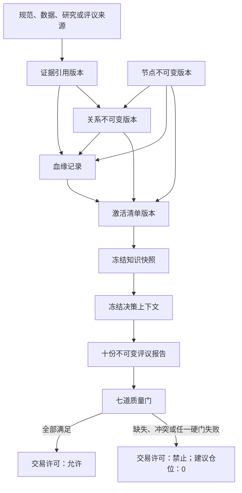

# 《知势知识图谱运行时设计》V1.0

<!-- markdownlint-disable MD013 -->

> 运行时只管理可追溯的知识版本与决策绑定，不替代数据审计、研究准入或交易许可质量门。

- 文档性质：未来工程实现的技术中立架构合同
- 设计方案：生命周期状态机与不可变版本合同
- 上游合同：《知势知识图谱》《研究准入规范》《知势决策委员会》
- 当前阶段：架构设计；不表示运行时、数据源或预测性关系已经实现
- 安全默认：缺失、冲突、越界、过期或不可追溯时，交易许可禁止、建议仓位为0
- 真实资金状态：关闭

## 一、目标、边界与设计不变量

### 1.1 目标

本文把《知势知识图谱》的节点、关系和证据合同展开为未来可实现的运行时边界，回答：

1. 节点、关系和证据如何进入、变更、退出与恢复；
2. 每次变更如何形成不可覆盖的新版本；
3. 一项知识如何追溯到规范、数据、研究、评议和历史版本；
4. 数据对象如何被引用而不被图谱复制或虚构；
5. 决策如何冻结并绑定唯一知识快照；
6. 错误版本如何回滚，同时保持历史决策可重放。

该设计减少未评审、已失效或版本混杂的关系进入决策链路，从而增强数据门、样本门和优势门的约束。它不证明任何市场优势，也不提高任何预测胜率。

### 1.2 非目标

本文不：

- 选择数据库、编程语言、框架、消息系统或部署方式；
- 创建、迁移、读取或修改任何真实数据；
- 假设市场数据、研究报告、模型或服务器已经可用；
- 定义具体存储表、索引、网络接口或容量指标；
- 实现回测、训练、下单、账户写入或真实资金交易；
- 用图谱状态替代研究准入、架构评审或七道质量门；
- 把待验证假设、相关观察或文档声明写成已验证事实。

### 1.3 不变量

未来实现必须始终满足：

1. **逻辑身份稳定：** 同一业务概念使用同一逻辑标识；内容变化产生新版本标识。
2. **版本不可变：** 已登记版本的内容、状态、来源和指纹不得原地覆盖。
3. **状态可追溯：** 每次状态变化都以新版本记录发起者、依据、时间、前序版本和评审结果。
4. **证据不越权：** 证据状态与生命周期状态分离；“已纳入”不能自动把假设升级为事实。
5. **历史不漂移：** 已冻结决策继续引用当时版本；后续修订或回滚不得改写历史决策。
6. **作用域相交：** 节点、关系、证据和决策的标的、尺度、市场状态及时间边界必须共同匹配。
7. **三类时间完整：** 涉及数据的引用必须区分事件时间、到达时间和采集时间。
8. **硬门不可覆盖：** 投票、平均分、人工叙事或高评分不得覆盖任何硬否决。
9. **默认安全失败：** 必需引用缺失、冲突、过期或无法验证时不得沿用旧值。
10. **唯一最终许可：** 图谱只提供受控输入；最终交易许可仍由《知势决策委员会》的唯一裁决单元输出。

## 二、运行时概念模型

### 2.1 核心对象

| 对象 | 作用 | 最小身份 | 不得承担的职责 |
| --- | --- | --- | --- |
| 节点版本 | 描述一个业务概念在特定版本的定义、来源、用途和状态 | 节点逻辑标识、节点版本标识 | 直接证明市场关系成立 |
| 关系版本 | 描述两个确定节点版本之间的有向语义 | 关系逻辑标识、关系版本标识 | 用连接本身替代证据 |
| 证据引用 | 指向规范、数据、研究或评议的不可变证据对象 | 证据标识、证据版本标识 | 复制或改写原始数据 |
| 状态变更记录 | 保存一次生命周期或证据状态变更的请求与裁决 | 变更标识 | 覆盖旧状态 |
| 血缘记录 | 连接来源、派生过程、版本和输出 | 血缘标识 | 用摘要替代原始引用 |
| 激活清单 | 声明某作用域当前允许被选择的版本集合 | 激活清单标识、版本标识 | 修改被激活对象的内容 |
| 知识快照 | 冻结一次决策可见的节点、关系、证据和激活清单 | 知识快照标识 | 在冻结后补写输入 |
| 决策绑定 | 将知识快照与唯一决策上下文、评议报告和决策卡关联 | 决策编号 | 授予或扩大交易许可 |

### 2.2 身份与引用规则

每个节点和关系均使用两层身份：

- **逻辑标识：** 跨版本稳定，用于表达“这是同一个业务概念或关系”；
- **版本标识：** 每次内容、状态、作用域或证据发生变化时生成，用于精确重放。

引用必须指向版本标识，不能只保存中文名称、逻辑标识或“最新版本”。运行时查询“当前版本”时，必须先解析指定作用域的激活清单，再返回其中明确列出的版本。

名称可以更改，逻辑身份不能由名称推断。两个名称相同但定义或作用域不同的对象不得共用逻辑标识；同一逻辑标识下出现不兼容定义时必须停止发布并进入冲突处理。

### 2.3 对象关系



图中所有箭头都表示可追溯引用，不表示来源已经存在或关系已经通过验证。

## 三、节点生命周期

### 3.1 状态定义

节点沿用《知势知识图谱》的七个状态：

| 状态 | 含义 | 能否进入决策知识快照 |
| --- | --- | --- |
| 提议 | 已有完整定义草案，尚未开始验证 | 否 |
| 验证中 | 正在依据声明的验证方式收集证据 | 否 |
| 候选 | 已达到候选标准，等待受控运行验证 | 否 |
| 试运行 | 只允许在模拟或影子范围观察 | 否 |
| 已纳入 | 已完成所需研究准入、治理评审和作用域确认 | 仅在激活清单明确列出时可以 |
| 已淘汰 | 未达到准入要求或不再值得继续研究 | 否 |
| 已失效 | 曾经有效，但当前证据、来源或适用条件已不再满足 | 否 |

“试运行”不等于真实资金启用，“已纳入”也不自动允许交易。真实资金开关、数据门和全部质量门仍独立生效。

### 3.2 允许的状态转换

| 当前状态 | 允许进入 | 必需依据 |
| --- | --- | --- |
| 提议 | 验证中、已淘汰 | 完整节点合同；验证计划或停止原因 |
| 验证中 | 候选、已淘汰 | 可重放验证结果、失败样本与适用范围 |
| 候选 | 试运行、验证中、已淘汰 | 候选评审；退回原因或淘汰证据 |
| 试运行 | 已纳入、候选、已失效 | 影子验证、风险影响、评审结论 |
| 已纳入 | 已失效 | 失效证据、影响分析和替代或降级方案 |
| 已淘汰 | 验证中 | 新证据与重新立项评审；创建新版本 |
| 已失效 | 验证中 | 解除失效条件的证据与重新评审；创建新版本 |

未列出的转换一律拒绝。任何回退或恢复都生成新版本，不把旧版本状态改回去。

### 3.3 节点版本最小合同

```text
节点逻辑标识
节点版本标识
中文名称与中文定义
节点域
来源或证据来源引用
输出用途与决策问题
可能误用
验证方式
所属质量门
适用标的、时间尺度、市场状态与有效时间
生命周期状态
前序版本引用
内容指纹
变更原因
评审引用
创建时间
```

节点版本缺少任一必需字段时，只能保存为未发布草案，不能进入激活清单。验证方式不能只写“人工确认”或“符合预期”，必须给出可复现的验收入口。

## 四、关系生命周期

### 4.1 生命周期与证据状态分离

关系同时具有：

- **生命周期状态：** 表示该关系版本处于提议、验证、候选、试运行、纳入、淘汰或失效的哪一阶段；
- **证据状态：** 表示关系属于规范约束、派生定义、待验证假设、相关观察或已验证关系。

二者不得互相推导。例如，生命周期为“已纳入”的规范约束仍不能证明市场优势；生命周期为“候选”的相关观察仍不能进入交易许可；一条关系即使过去是“已验证关系”，在作用域不匹配或证据失效时也不能使用。

### 4.2 生命周期规则

关系生命周期使用与节点相同的七个状态和转换框架，并增加以下前置条件：

1. 起点和终点必须引用确切节点版本，且节点逻辑身份没有冲突；
2. 关系类型必须属于《知势知识图谱》已定义目录；
3. 关系必须声明决策问题、作用域、失效条件和证据引用；
4. 任一端节点未达到该关系所需状态时，关系不得先于节点进入“已纳入”；
5. 端节点出现新版本时，旧关系不会自动迁移，必须重新判断兼容性并生成新关系版本；
6. 关系失效不删除历史边，只从后续激活清单中撤出；
7. 派生链出现循环、方向错误或无法复算时，相关关系不得发布。

### 4.3 进入激活清单的条件

关系只有同时满足下列条件，才可进入对应作用域的激活清单：

- 生命周期为“已纳入”；
- 起点和终点节点版本均可用且作用域相交；
- 证据状态满足该关系用途；
- 证据引用、评审引用和失效条件完整；
- 没有未解决的版本冲突、反证或血缘断点；
- 与质量门、决策委员会和风险合同没有矛盾。

对于预测性关系，证据状态必须为“已验证关系”，并有可重放、样本外、计入成本、稳健性和研究评审证据。规范约束和派生定义可按各自合同使用，但不得被解释为预测性优势。

### 4.4 关系版本最小合同

```text
关系逻辑标识
关系版本标识
起点节点版本标识
关系类型
终点节点版本标识
决策问题
生命周期状态
证据状态
证据引用集合
支持证据与主要反证
适用范围与有效时间
失效条件
前序版本引用
内容指纹
变更原因
评审引用
创建时间
```

## 五、证据状态升级流程

### 5.1 三条独立证据轨道

五种证据状态不是一条从低到高的统一阶梯：

1. **规范轨道：** 规范约束来自已批准的宣言、决策、风险或治理合同；
2. **定义轨道：** 派生定义来自可复算公式、字段和单位合同；
3. **经验轨道：** 待验证假设可以在限定条件下形成相关观察，只有通过全部研究准入后才可成为已验证关系。

规范约束不能“升级”为已验证关系，派生定义也不能证明市场因果。经验关系不得借用规范或公式身份绕过验证。

### 5.2 经验轨道升级门槛

#### 待验证假设到相关观察

至少需要：

- 预先声明可证伪假设、对象、方向、尺度、窗口和失效条件；
- 明确简单基准与对照；
- 数据来源、版本、事件时间、到达时间、采集时间和截止时间可追溯；
- 结果可重放，且支持证据与失败样本同时保存；
- 结论只描述限定样本中的观察，不宣称因果、稳定性或生产可用。

#### 相关观察到已验证关系

至少需要：

- 数据资产审计和历史重放硬门已通过；
- 按时间顺序的样本外或前推验证，不随机打乱时间序列；
- 手续费、滑点、资金费率、执行延迟和安全余量均已计入；
- 与简单基准比较，并报告交易次数、空仓比例、胜率、盈亏比、单笔期望和最大回撤；
- 主要反证、失败样本、参数敏感性和适用范围完整；
- 轻微参数变化不导致结果立即崩溃；
- 研究准入与架构评审均引用当前头版本；
- BTC、ETH结果不被外推为SOL结论。

当前数据资产审计尚未完成，因此运行时设计不登记任何预测性的“已验证关系”实例。

### 5.3 降级、撤销与冲突

新反证、复盘结果、数据错误或作用域变化只能提出状态变更请求，不能直接改写证据状态。处理规则为：

1. 冻结受影响关系版本和证据集合；
2. 标明受影响的作用域、激活清单和未完成决策；
3. 在无法排除风险时，将该版本从后续激活清单撤出；
4. 通过研究与治理评审决定新版本的证据状态；
5. 记录支持、反对、无法判定及最终裁决；
6. 历史决策继续引用旧版本，并在复盘中标记“后续发现失效”，不得事后重算为另一许可。

同一证据被多个关系引用时必须保留共同来源标记，不得把同源证据计为多个独立支持。支持与反证冲突无法解决时，不进行多数票；关系不得进入新知识快照。

## 六、版本管理

### 6.1 何时创建新版本

以下任一变化都必须创建新版本：

- 定义、关系方向、关系类型或作用域变化；
- 生命周期状态或证据状态变化；
- 来源、公式、阈值、规则、模型或验证方法变化；
- 新增、撤回或替换支持证据、反证或失效条件；
- 端节点版本变化；
- 评审结果、有效时间或安全降级规则变化；
- 修复影响语义、计算结果或可重放性的错误。

仅修正不影响语义的排版可不生成知识版本，但仍应由文档版本控制记录。

### 6.2 版本谱系

每个新版本必须保存：

- 唯一前序版本；若由多个版本合并，保存全部来源但指定唯一语义基线；
- 变更类型、变更原因和影响分析；
- 变更前后内容指纹；
- 创建时间、评审时间和生效时间；
- 受影响的决策问题、质量门、作用域和下游对象；
- 回滚目标与不能自动回滚的原因。

版本号仅供阅读，版本身份必须使用不可歧义的版本标识。禁止通过排序版本号或创建时间猜测“最新可用版本”。

### 6.3 激活与发布

发布不是修改节点或关系，而是生成新的激活清单版本。激活清单至少声明：

```text
激活清单逻辑标识与版本标识
适用标的、时间尺度、市场状态和有效时间
节点版本集合
关系版本集合
证据版本集合
规则与风险参数引用
前序激活清单
变更原因
评审引用
完整性校验结果
```

同一作用域同一时刻最多有一个生效激活清单。出现重叠、歧义或无法解析的版本时，知识快照发布失败；不得自动选择创建时间较新者。

### 6.4 并发与一致性

未来实现必须支持：

- 基于前序版本的条件写入，防止两个评审结果互相覆盖；
- 发布前验证引用对象仍与评审时一致；
- 知识快照要么完整生成，要么完全失败，不允许半套版本进入决策；
- 重复提交同一变更请求不产生语义重复版本；
- 生命周期、证据状态、激活清单和血缘记录在同一次发布中保持一致。

## 七、血缘追踪

### 7.1 血缘层级

每项可用知识至少能向上追溯到：

1. 规范、数据对象、研究报告或评议报告的精确版本；
2. 数据对象的来源及事件时间、到达时间、采集时间；
3. 派生公式、参数、单位、精度和运行版本；
4. 支持证据、主要反证、失效条件和评审结论；
5. 前序节点、关系、证据和激活清单版本；
6. 使用该知识版本的知识快照、决策编号和评议报告。

### 7.2 血缘记录最小合同

```text
血缘标识
上游对象类型、逻辑标识与版本标识
下游对象类型、逻辑标识与版本标识
血缘类型：来源于 / 派生自 / 支持 / 反对 / 约束 / 激活于 / 使用于
转换或选择规则引用
事件时间、到达时间、采集时间
创建时间
完整性状态
```

不涉及市场数据的规范或治理引用可以不填写三类市场时间，但必须明确标记“不适用”，不能留空后由运行时猜测。

### 7.3 完整性规则

- 派生血缘必须有向无环；检测到循环时阻止发布；
- 摘要、图表或自然语言解释不能替代原始引用；
- 来源不可访问、版本不存在或指纹不匹配时标记血缘断点；
- 血缘断点影响必需输入时，知识快照不得发布；
- 从决策编号反向查询必须能得到完整知识快照和数据引用；
- 从失效证据正向查询必须能列出受影响的关系、激活清单和决策。

## 八、回滚机制

### 8.1 回滚语义

回滚是创建新的激活清单版本，使未来知识快照重新选择一个已评审、仍满足作用域的旧对象版本。回滚不：

- 删除错误版本；
- 修改旧版本状态或内容；
- 改写历史知识快照、评议报告、决策卡或交易许可；
- 自动恢复真实资金能力；
- 跳过研究准入、风险评审或安全检查。

### 8.2 回滚前置检查

回滚请求至少包含：

- 触发原因与证据；
- 当前激活清单、目标激活清单及内容差异；
- 受影响的标的、尺度、市场状态、质量门和决策；
- 目标版本在当前作用域是否仍然有效；
- 数据、规则、模型和风险参数是否与目标版本兼容；
- 未完成决策的处置方式；
- 验证、评审、观察和再次回滚条件。

如果旧版本的证据已失效、依赖不可用或安全边界不兼容，不得强行回滚。此时应撤出相关关系，生成安全降级激活清单，并使后续交易许可禁止。

### 8.3 回滚后的处理

1. 新请求停止获取已撤出激活清单；
2. 已冻结但尚未裁决的决策上下文失效，重新生成决策编号；
3. 已裁决历史保持不变，并追加回滚影响标记；
4. 新激活清单完成引用、血缘、作用域和硬门一致性验证；
5. 观察结果只能形成新证据，不能擦除回滚事件。

## 九、数据对象与知识节点映射

### 9.1 映射原则

知识图谱只保存数据对象引用、语义和验证状态，不复制原始数据，也不声明数据已经存在。数据对象进入映射前必须先通过未来的数据资产发现和质量审计。

映射分为三层：

| 层级 | 说明 | 示例性质 |
| --- | --- | --- |
| 数据对象引用 | 指向外部受控数据对象的版本 | 原始记录集合、冻结数据快照或审计报告引用 |
| 语义映射 | 声明字段、单位、时间语义和节点定义之间的对应 | 数据字段支持事件时间节点的定义 |
| 证据映射 | 声明该对象支持、反对或约束哪条关系 | 审计报告支持数据质量结论 |

示例只说明映射性质，不表示对应数据或报告已经存在。

### 9.2 数据对象引用最小合同

```text
数据源逻辑标识
数据对象逻辑标识与版本标识
数据模式版本
字段映射版本
事件时间范围
到达时间范围
采集时间范围
数据截止时间
冻结快照引用
内容指纹或等价完整性证明
质量审计状态与报告引用
访问边界
```

质量审计状态只能表达审计结果，不能由“可访问”“字段非空”或“文件存在”推断。任何必需时间语义不明、数据截止时间不一致或快照不可重放时，映射不得进入决策知识快照。

### 9.3 映射验证

未来实现至少验证：

- 数据字段与节点定义、单位、时区和精度一致；
- 到达时间不晚于决策数据截止时间；
- 同一决策中的数据对象属于同一冻结数据版本；
- 派生节点可从明确输入和公式复算；
- 缺失、延迟、乱序、重复和异常有显式状态；
- 原始数据只读，修订通过新数据版本表达；
- 研究结果只在声明标的和时间尺度内映射，不跨标的外推。

## 十、决策链路映射

### 10.1 冻结顺序

一次决策必须按以下顺序建立绑定：

1. 创建唯一决策编号和冻结决策上下文；
2. 依据标的、尺度、决策时间和数据截止时间解析唯一激活清单；
3. 验证全部节点、关系、证据、数据对象和规则版本；
4. 生成不可变知识快照；
5. 将知识快照标识写入同一决策上下文；
6. 十个评议单元只读取该上下文与快照，分别输出不可变报告；
7. 七道质量门按合同汇总，最终裁决单元输出唯一交易许可；
8. 决策卡保存知识快照、十份报告、门结果、主要证据与反证。

冻结后发现新数据、关系升级、失效或回滚时，不得补写本次上下文。需要继续评议时必须生成新决策编号。

### 10.2 图谱对象到评议单元

| 评议单元 | 主要图谱输入 | 主要验证 | 失败结果 |
| --- | --- | --- | --- |
| 数据质量评议 | 数据源、原始数据、三类时间、冻结数据快照 | 来源、可见性、质量、版本与可重放 | 数据门否决 |
| 市场状态评议 | 市场状态、波动环境及准入特征 | 适用范围、状态冲突与失效条件 | 无法判定或对应门失败 |
| 相关状态评议 | 相关状态、共同市场因子风险 | 同口径、同步性与结构变化 | 无法判定或风险降级 |
| 资金行为评议 | 资金行为、轮动及其证据与反证 | 不把观察写成因果 | 优势不足 |
| 标的比较评议 | BTC、ETH、SOL的同版本比较节点 | 三标的完整、唯一首选和差异门槛 | 无唯一标的 |
| 机会与成本评议 | 机会、概率、赔率、成本、净期望 | 样本外、成本后、安全边际 | 样本门、优势门或成本门失败 |
| 风险评议 | 风险预算、止损、组合风险、仓位 | 损失优先、集中风险与上限 | 风险门否决、仓位0 |
| 执行条件评议 | 流动性、冲击、精度、退出条件 | 可成交、可退出与异常状态 | 执行门否决 |
| 纪律评议 | 次数、暂停、敞口和重新入场状态 | 频率、累计风险和行为合规 | 频率与纪律门否决 |
| 最终交易许可裁决 | 前九份报告、同一知识快照和决策上下文 | 完整性、唯一性、硬门和版本一致 | 交易许可禁止、仓位0 |

该映射是职责分工，不是多个拟人化主体或投票机制。任何一份硬否决不能被其余报告的数量、评分或叙事覆盖。

### 10.3 决策绑定最小合同

```text
决策编号
决策时间与数据截止时间
标的范围与主时间尺度
数据版本
规则与模型版本
激活清单版本
知识快照版本
输入引用集合
十份评议报告版本
七道质量门结果
最终交易许可
否决原因与建议仓位
决策卡版本
```

任一版本缺失、冲突、过期、超出作用域或无法追溯时，绑定无效，最终必须输出：

```text
交易许可：禁止
建议仓位：0
```

## 十一、技术中立接口合同

下列接口名只表示职责边界，不代表具体传输协议或实现技术。

| 接口 | 最小输入 | 成功输出 | 必须拒绝的情况 |
| --- | --- | --- | --- |
| 提议节点版本 | 节点合同、前序版本、变更原因 | 新节点版本标识 | 逻辑身份冲突、必需字段缺失 |
| 提议关系版本 | 关系合同、两端节点版本、证据引用 | 新关系版本标识 | 端点不存在、关系类型非法、作用域不相交 |
| 附加证据引用 | 目标版本、证据版本、血缘类型 | 新目标版本与血缘记录 | 来源不可追溯、时间语义缺失 |
| 申请状态变更 | 当前版本、目标状态、依据、影响范围 | 待评审变更记录 | 非法转换、依据版本不匹配 |
| 裁决状态变更 | 变更记录、评审结论、评审版本 | 新对象版本 | 自审自批、旧批准、硬门未满足 |
| 发布激活清单 | 作用域、对象版本集合、评审引用 | 新激活清单版本 | 版本冲突、血缘断点、作用域重叠 |
| 冻结知识快照 | 决策上下文、激活清单版本 | 知识快照版本 | 数据截止时间冲突、引用不完整 |
| 查询血缘 | 精确对象版本、查询方向 | 版本化血缘结果 | 只提供名称或“最新”引用 |
| 申请回滚 | 当前与目标激活清单、原因、影响分析 | 待评审回滚记录 | 目标已失效、依赖不兼容 |
| 绑定决策上下文 | 决策编号、知识快照、报告集合 | 决策绑定版本 | 报告不全、版本不一致、硬门失败却申请允许 |

每个接口都必须返回明确错误类别、受影响对象和安全结果。未知异常不能返回“沿用上次成功结果”。

## 十二、失败处理与可观测性

### 12.1 失败分类

| 失败类型 | 处理 | 决策影响 |
| --- | --- | --- |
| 身份冲突 | 停止发布，要求人工解析逻辑身份 | 禁止使用冲突对象 |
| 非法状态转换 | 拒绝请求并保留审计记录 | 原激活版本不变 |
| 血缘断点 | 标记受影响下游并撤出待发布清单 | 必需输入受影响则禁止交易 |
| 作用域不匹配 | 拒绝绑定 | 不得跨标的、尺度或状态外推 |
| 版本冲突 | 整个知识快照生成失败 | 交易许可禁止、仓位0 |
| 证据过期或失效 | 发起降级评审并停止新决策使用 | 历史不改，未来默认禁止 |
| 回滚失败 | 保持安全降级清单，不恢复旧能力 | 交易许可禁止、仓位0 |
| 未知异常 | 记录错误、停止发布和裁决 | 不猜测、不沿用旧许可 |

### 12.2 必需审计事件

节点、关系和证据版本创建，状态变更申请与裁决，激活、撤出、快照冻结、决策绑定、回滚和失败都必须产生不可变审计事件。事件至少记录对象版本、动作、依据、时间、评审引用、结果和安全影响，不得记录密钥、令牌、账户凭据或不必要的个人信息。

## 十三、未来实现分层与验收入口

### 13.1 建议实现顺序

未来工程实现应按依赖顺序拆分：

1. 定义对象模式、身份、状态转换和错误合同；
2. 实现不可变版本登记与条件写入；
3. 实现血缘完整性和派生无环校验；
4. 实现证据状态变更与独立评审绑定；
5. 实现激活清单、知识快照和作用域解析；
6. 实现回滚与影响分析；
7. 与冻结数据快照和决策上下文做只读集成；
8. 在模拟或影子范围验证后，再单独申请后续阶段能力。

每一步都应由独立任务文件定义。本文不授权直接实施这些步骤，也不预设具体技术选型。

### 13.2 合同测试场景

未来实现至少覆盖：

1. 修改已登记节点内容时生成新版本，旧版本指纹和引用不变；
2. 非法跨状态转换被拒绝；
3. 待验证假设和相关观察不能进入预测性激活清单；
4. 规范约束不能被误报为已验证市场关系；
5. 端节点升级后，旧关系不会自动迁移；
6. 同源证据不会被重复计为独立支持；
7. 派生血缘出现循环时发布失败；
8. 数据三类时间或截止时间缺失时知识快照失败；
9. 两个激活清单作用域重叠时不猜测选择；
10. 已冻结决策不受后续版本、降级或回滚改写；
11. 回滚生成新激活清单，不删除任何历史版本；
12. 十份报告中任一必需报告缺失时最终许可禁止；
13. 任一硬门失败时，多数报告通过也不能授予许可；
14. 版本冲突、未知异常和血缘断点均产生仓位0的安全结果；
15. 从任一决策编号能够反查知识、数据、证据、规则和评审版本。

### 13.3 架构验收检查

- [x] 节点生命周期与既有七状态合同一致；
- [x] 关系生命周期与证据状态明确分离；
- [x] 证据升级区分规范、定义和经验轨道；
- [x] 所有语义变更生成不可变版本；
- [x] 血缘能够双向追踪来源和决策影响；
- [x] 回滚不删除版本、不改写历史决策；
- [x] 数据映射只定义引用合同，不假设数据存在；
- [x] 决策链映射十个评议单元和七道质量门；
- [x] 没有引入数据库、框架或真实交易代码；
- [x] 默认安全结果保持交易许可禁止、建议仓位为0。

## 十四、最终判断

知识图谱运行时的价值不是让系统积累更多“最新结论”，而是确保每次决策只消费当时可见、作用域匹配、经过评审且能够重放的确切知识版本。

生命周期防止未成熟对象提前进入主链路，不可变版本防止历史漂移，血缘与快照防止证据断裂，回滚合同限制错误版本继续扩散。任何一个环节无法证明时，系统宁可停止或空仓，也不得猜测补齐、沿用旧许可或降低研究门槛。
