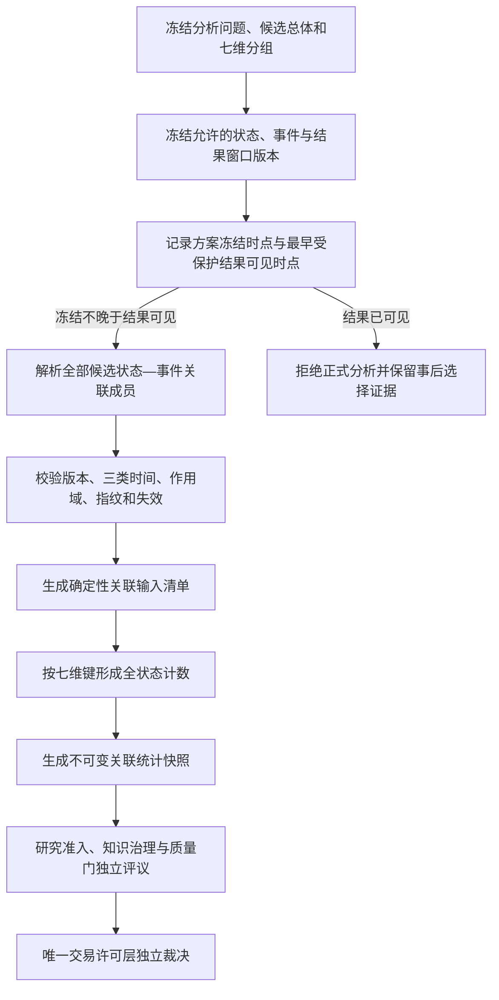

# 《知势市场状态—事件关联分析合同》V1.0

<!-- markdownlint-disable MD013 -->

> 先冻结状态、事件、总体和分组，再看结果；关联只描述共同出现，不证明因果或优势。

- 文档性质：Market Regime确切版本与Market Event确切版本的预注册关联分析合同
- 适用标的：BTC、ETH；分别统计，不得跨标的补偿缺失
- 项目主研究尺度：4小时、8小时、24小时、48小时
- 辅助结果观察窗口：15分钟、1小时；只用于事后结果观察
- 当前状态：理论研究架构；未实现运行时、数据库、模型、回测或交易能力
- 当前数据结论：315个质量验证单元均为`无法判定`；历史重放4个拒绝、311个无法判定、0个通过；简单基准模型阶段为`禁止`
- 真实资金状态：关闭

## 一、目标、边界与决策问题

### 1.1 目标

本合同连接《知势市场状态架构》《知势市场事件层架构》和《知势历史事件回放与结果统计
体系》，回答以下受约束问题：

1. 某个Market Event确切版本在形成时引用了哪个Market Regime确切版本；
2. 关联双方在交易场所、合约、标的、主研究尺度、时间和内容指纹上是否逐项一致；
3. 能否在读取受保护结果前冻结候选总体、分组、结果窗口、计数和排除规则；
4. 能否用确定性成员清单保留全部候选、拒绝、无法判定、失败、未成熟和失效对象；
5. 能否按七个必需维度形成不可变、可复算、可追溯的描述性统计快照；
6. 上游版本变化或失效时，能否追加新版本而不改写旧快照；
7. 能否证明任何描述性差异没有被直接解释为因果、预测优势或交易许可。

本合同主要减少结果可见后更换状态、只保留表现好的事件、修改分组、缩小分母、跨标的
补偿缺失、短窗口越权和寻找事后最优组合等错误，增强数据门、样本门和研究准入约束。
它不证明任何状态、事件或组合具有稳定胜率、收益、赔率、净期望或交易价值。

### 1.2 不在范围

本合同不：

- 访问服务器、数据库、市场接口、真实市场数据、生产服务或交易账户；
- 实现状态分类器、事件探测器、关联运行时、数据库、服务、队列或调度器；
- 训练模型、运行回测、参数搜索、窗口优化、模拟交易或真实交易；
- 定义市场状态、事件、结果标签、排除、显著性或交易规则的真实数值阈值；
- 重算、修订、合并或覆盖Market Regime与Market Event上游对象；
- 生成预测胜率、收益、盈亏比、赔率、净期望、最大回撤或因果结论；
- 生成首选标的、买卖方向、仓位、订单、交易信号或交易许可；
- 把15分钟或1小时升级为市场状态、事件探测、主研究或交易许可尺度；
- 自动升级研究生命周期、知识关系、激活清单、质量门或许可状态。

### 1.3 与权威合同的职责边界

| 合同或层 | 本合同只读取 | 本合同只输出 | 不得替代 |
| --- | --- | --- | --- |
| 市场状态层 | 状态报告逻辑标识、确切版本、五轴结果、作用域、有效时间、失效和指纹 | 状态确切版本的只读关联引用 | 不重算、改写或重新分类状态 |
| 市场事件层 | 事件事实、确认、结果、失效及其原状态版本引用 | 事件与状态确切版本之间的关联成员 | 不探测事件，不改变事件身份或状态 |
| 历史回放与结果统计 | 回放结论、窗口合同、结果评价、输入清单和统计快照语义 | 关联方案、关联输入清单和关联统计快照 | 不替代事件回放或结果评价 |
| 研究数据合同 | 预注册、版本、方案、快照、指纹、血缘和失效规则 | 可申请成为研究输入的版本化描述材料 | 不运行实验或裁决研究结论 |
| 研究准入 | 可证伪假设、基准、成本、样本外、稳健性和淘汰规则 | 覆盖率、全状态计数、反证和限制 | 不批准研究或知识关系 |
| 七道质量门 | 各评议单元的正式输入和结果 | 只读证据与失败约束引用 | 不判定任何质量门通过 |
| 交易许可层 | 已冻结的质量门和许可合同 | 无许可输出 | 不生成许可、方向、仓位或订单 |

发生冲突时，资金与数据安全、当时可见性、不可变历史、任务合同、上游状态和事件合同、
研究准入及交易许可硬门依次优先。本合同只能从严拒绝或停止，不能选择较方便的版本继续。

## 二、核心不变量

未来任何实现必须同时满足：

1. **确切版本关联：** 每个关联成员必须同时绑定Market Regime确切版本与Market Event
   确切版本，名称、类别、时间戳或“最新版本”都不能替代。
2. **原引用优先：** 事件事实已冻结的市场状态版本是关联事实来源，不能在结果可见后
   重新运行状态分类并替换。
3. **先冻结后看结果：** 方案、总体、分组、窗口、指标、计数和排除规则必须在最早受保护
   结果可见前冻结。
4. **候选总体不可缩小：** 候选生成规则冻结后，任何成员都不能因结果不利、缺失、拒绝、
   无法判定、失败、未成熟或失效而静默删除。
5. **七维精确分组：** 标的、交易场所、合约、主研究尺度、事件类型、状态确切版本和
   结果观察窗口必须逐项进入正式分组键。
6. **全状态守恒：** 每个分组的候选总体必须由已观察、拒绝、无法判定、失败、未成熟和
   失效六个互斥主计数完整分解。
7. **确定性成员顺序：** 输入清单与输出行使用冻结排序规则，不依赖数据库、文件遍历或
   并发完成顺序。
8. **快照只追加：** 新数据、状态、事件、窗口、规则、失效或修复只能生成新快照版本，
   不能覆盖旧数字。
9. **短窗不扩尺度：** 15分钟和1小时只属于事后结果观察，不能进入状态分类或事件探测。
10. **标的严格隔离：** BTC、ETH分别形成成员、分母、计数和结论；任一标的缺失
    不能由其他标的补偿。
11. **描述不等于因果：** 同一状态下某类事件的结果差异只表示冻结样本中的共同出现。
12. **描述不等于优势：** 覆盖率、分布或组间差异不能直接变成预测胜率、收益或净期望。
13. **统计不授予准入：** 关联快照不能自动升级研究状态、知识关系或激活清单。
14. **许可保持唯一：** 任一关联、计数或差异都不能绕过七道质量门或生成交易许可。
15. **原始对象只读：** 本合同只引用确切版本，不删除、迁移、修订或覆盖任何上游数据。
16. **无法证明即停止：** 版本、时间、作用域、成员、分母、窗口或指纹不能证明时，输出
    拒绝、`无法判定`、失败、未成熟或失效，不返回默认值或缓存结论。

## 三、对象模型与追加式流程

### 3.1 核心对象

| 对象 | 职责 | 关键身份 | 禁止行为 |
| --- | --- | --- | --- |
| 关联分析方案 | 预先冻结问题、总体、分组、窗口、计数、排除和比较规则 | 方案逻辑标识、方案版本、内容指纹 | 看到结果后修改范围或标准 |
| 状态—事件关联成员 | 绑定一个状态确切版本、事件确切版本与一个结果窗口 | 成员逻辑标识、成员版本、双方指纹 | 用类别名或当前版本替代确切版本 |
| 状态—事件关联输入清单 | 保存全部候选成员、顺序、状态、版本和分组键 | 清单逻辑标识、清单版本、成员清单指纹 | 只登记成功或已观察成员 |
| 关联统计快照 | 保存七维分组、全状态计数、描述性结果和限制 | 快照逻辑标识、快照版本、输入清单版本 | 覆盖旧快照或授予准入 |
| 关联失效记录 | 追加记录上游失效、方案缺陷或分母漂移的影响 | 失效逻辑标识、失效版本、目标版本 | 删除旧成员或快照 |

### 3.2 追加式对象关系

```text
Market Regime确切版本 ─┐
                       ├→ 状态—事件关联成员 ─┐
Market Event确切版本 ──┘                    │
结果窗口合同确切版本 ───────────────────────┤
                                            ↓
预注册关联分析方案 → 状态—事件关联输入清单 → 不可变关联统计快照
                                                  ↓
                                         可选关联失效记录
```

箭头只表示单向版本引用。关联成员不能修改状态或事件；统计快照不能反向改变方案、输入
清单、状态分类、事件事实或结果标签。修订只能追加前序版本和差异原因。

### 3.3 处理顺序



## 四、关联分析方案与冻结时点

### 4.1 分析方案最小合同

```text
关联分析方案逻辑标识与版本标识
前序方案版本（没有时写不适用及原因）
分析问题、用途与明确禁止推导
候选总体生成规则、统计时间范围与空组保留规则
允许的Market Regime逻辑标识、确切版本和失效规则
允许的Market Event类型、Schema、规则和确切版本规则
允许的结果窗口、锚点、标签和评价合同确切版本
七个必需分组键、规范化规则与稳定排序
候选总体、六个互斥主状态计数和分母定义
描述性指标、比较、单位、精度和空值规则
重复、冲突、缺失、拒绝、未成熟、失效和排除规则
BTC、ETH独立统计与跨标的事件拆分规则
受保护结果定义、最早结果可见时点和方案冻结时点
输入清单、输出Schema、指纹与血缘合同
停止条件、原因代码和安全降级
创建、批准、冻结时间及执行主体引用
内容完整性指纹
```

缺少任一必需字段时方案状态为`未冻结`，不得读取受保护结果或生成正式输入清单。

### 4.2 冻结时点

正式分析必须满足：

```text
方案冻结时点 <= 候选总体中最早受保护结果可见时点
```

受保护结果包括：结果窗口标签、窗口内价格或派生值、确认结果、事件后状态变化、后续
收益、成本后结果、分组差异和任何能揭示成员表现的信息。创建时间不能替代冻结时点；
冻结记录必须绑定方案内容指纹和不可变批准引用。

如果结果已经可见才首次定义状态版本集合、事件筛选、分组、窗口、指标、分母或排除
规则，该尝试必须记录为`结果后定义被拒绝`。可以保留为探索线索，但不能伪装成预注册
分析、准入证据或交易许可材料。

### 4.3 方案新版本触发

以下任一变化必须创建新方案版本，并且新版本不能改变旧快照：

- 分析问题、用途、禁止推导或统计时间范围变化；
- 候选总体、事件类型、状态范围、标的、场所、合约或尺度变化；
- 任何分组键、规范化、排序、重复、排除或空组规则变化；
- 结果窗口、锚点、标签、成熟、单位、精度或成本口径变化；
- 分母、计数、覆盖率、聚合、比较或最小样本披露规则变化；
- 状态、事件、结果、Schema、规则、数据或环境允许版本变化；
- 发现未来数据、结果后筛选、分母漂移、跨标的补偿或语义缺陷；
- 指纹算法、规范化合同或失效范围变化。

新方案若冻结在部分结果已经可见之后，只能用于明确标记的后续新时间范围或探索性材料，
不能反向重写原时间范围的预注册状态。

## 五、Market Regime与Market Event关联身份

### 5.1 关联成立的必要条件

一个状态—事件关联成员只有在以下条件全部满足时才可形成：

1. Market Event确切版本明确记录Market Regime确切版本引用；
2. 状态版本在事件数据截止时间前已经生成并可见，或者事件合同明确冻结该状态版本；
3. 状态有效时间覆盖事件合同声明的状态引用时点；
4. 双方交易场所、市场类型、精确合约、单一标的和主研究尺度逐项一致；
5. 双方状态、事件、Schema、规则、输入快照、三类时间和内容指纹均可取得；
6. 事件引用中的状态版本标识和状态内容指纹与实际加载对象完全一致；
7. 双方均无在分析冻结时点已适用且禁止本次用途的失效记录。

缺少或冲突时不能按名称、类别、最近时间、当前状态或重新分类结果猜测关联。

### 5.2 双层身份

- **关联逻辑标识：** 由分析问题、关联类型、事件逻辑标识、状态逻辑标识、单一标的、
  交易场所、精确合约、主研究尺度和结果窗口逻辑标识共同限定。
- **关联成员版本标识：** 在逻辑标识基础上绑定方案确切版本、Market Event确切版本、
  Market Regime确切版本、结果窗口合同确切版本、结果评价确切版本、全部作用域、成员
  状态、前序引用和内容指纹。

正式成员身份必须包含双方确切版本，不能只保存逻辑标识。状态类别相同但状态版本不同，
或事件类型相同但事件版本不同，均为不同关联成员。

### 5.3 关联成员Schema

```text
关联逻辑标识与关联成员版本标识
前序关联成员版本（没有时写不适用及原因）
关联分析方案确切版本
Market Regime逻辑标识、确切版本和内容指纹
Market Event逻辑标识、确切版本和内容指纹
事件事实状态与事件规则、Schema、快照确切版本
状态报告状态、五轴向量、主类别与状态规则确切版本
关联类型、状态引用时点与关联成立证据
单一标的、交易场所、市场类型与精确合约
主研究尺度、事件类型和结果观察窗口
结果窗口、锚点、标签、评价与事件结果确切版本
事件时间、到达时间、采集时间和各对象数据截止时间
状态有效时间与事件观察窗口的作用域比较
候选成员主状态：已观察 / 拒绝 / 无法判定 / 失败 / 未成熟 / 失效
原始对象状态、拒绝、缺失、失败、未成熟和失效详细引用
分组键、排序键、重复处理和纳入证据
中文原因、限制、解除条件和禁止推导
生成、冻结时间与执行主体引用
内容完整性指纹
```

关联成员的`已观察`只表示原事件、关联资格和相应结果窗口都已按冻结合同形成可观察结果。
它不等于事件成功、方向正确、状态有效、研究假设成立或可以交易。

### 5.4 多状态引用与跨标的事件

一个事件事实可以引用多个状态报告确切版本，但正式统计叶子成员必须拆为单一标的与
单一状态确切版本。跨标的事件还必须保留原事件的BTC、ETH有序集合身份和完整性
指纹，使单标的叶子行能够反查共同事件。

缺少任一必需标的状态版本、事件成员或结果成员时：

- 缺失标的对应成员记录`无法判定`、拒绝、失败、未成熟或失效；
- 其他标的只能保留自己的叶子成员，不能补齐缺失成员；
- 跨标的总体完整性必须标记失败或无法判定；
- 不得用BTC或ETH结果生成、推断、加权或修正另一标的成员及结论。

## 六、状态—事件关联输入清单

### 6.1 候选总体生成

候选总体必须由方案冻结的事件总体生成规则产生，覆盖时间范围内全部符合逻辑范围的
Market Event确切版本，包括事件事实为`观察到`、`拒绝`、`无法判定`或`失败`的成员。
每个事件再按方案冻结的结果窗口目录生成候选关联成员。

候选总体不得以以下条件事后缩小：

- 结果标签已经存在或方向符合预期；
- 状态类别看起来更有解释力；
- 事件已经确认、结果完整或回放成功；
- 标的、窗口、月份或市场阶段表现更好；
- 成员缺失、拒绝、无法判定、失败、未成熟或失效；
- 聚合后差异不明显、方向相反或不利于原假设。

### 6.2 确定性成员顺序

输入清单至少依次使用以下冻结排序键：

```text
单一标的固定序：BTC / ETH
交易场所规范序
市场类型与精确合约规范序
主研究尺度固定序：4小时 / 8小时 / 24小时 / 48小时
事件类型固定枚举序
Market Regime确切版本标识
结果观察窗口固定序：15分钟 / 1小时 / 4小时 / 8小时 / 24小时 / 48小时
原事件时间
Market Event确切版本标识
关联成员版本标识
```

交易场所、合约和事件类型规范序必须属于方案版本。并列处理不得依赖数据库返回顺序、
文件名、目录遍历、线程调度或完成时间。

### 6.3 输入清单Schema

```text
关联输入清单逻辑标识与版本标识
前序输入清单版本（没有时写不适用及原因）
关联分析方案确切版本与内容指纹
候选总体生成规则、冻结时间范围和候选总数
Market Regime确切版本有序集合及集合指纹
Market Event确切版本有序集合及集合指纹
结果窗口、评价、事件结果和失效确切版本有序集合
关联成员确切版本有序清单及成员清单指纹
每个成员的七维分组键与确定性排序键
每个成员的已观察、拒绝、无法判定、失败、未成熟或失效主状态
原状态、原事件、结果评价和失效详细状态引用
重复、冲突、缺失、排除和解除条件证据
三类时间、数据截止时间、作用域和血缘完整性摘要
生成、冻结时间与执行主体引用
输入、成员和清单完整性指纹
```

输入清单必须支持从每个统计行反查全部候选成员，也支持从任一状态、事件或结果确切版本
正向查询受影响的统计快照。只有聚合数字而没有成员清单，不构成正式关联分析证据。

### 6.4 清单幂等与漂移

相同方案版本、候选总体版本和上游版本集合应产生相同成员顺序与清单指纹。重试可以返回
已有不可变清单身份，但必须保留独立执行尝试记录。

实际成员、顺序、状态、分组键或指纹与冻结清单不同时，结果为`关联输入清单漂移`。
不得删除差异成员后重新声称一致；必须保留旧清单并生成新方案或新清单版本。

## 七、七维精确分组与标的隔离

### 7.1 必需分组键

每个正式统计叶子行至少由以下七个维度唯一确定：

```text
1. 单一标的：BTC / ETH
2. 交易场所
3. 市场类型与精确合约定义
4. 原事件主研究尺度：4小时 / 8小时 / 24小时 / 48小时
5. 事件类型
6. Market Regime确切版本
7. 结果观察窗口：15分钟 / 1小时 / 4小时 / 8小时 / 24小时 / 48小时
```

统计方案版本、结果标签合同版本和统计时间范围还必须进入统计行身份。它们不是可省略的
展示字段，但不替代上述七个业务分组维度。

### 7.2 不允许的静默合并

以下任一不同都必须形成不同叶子行：

- BTC或ETH；
- 不同交易所、数据场所或市场；
- 现货、永续、交割合约、币本位、U本位或其他精确合约；
- 4小时、8小时、24小时或48小时主研究尺度；
- 不同事件类型、事件Schema或事件规则作用域；
- 不同Market Regime确切版本，即使主类别和五轴类别完全相同；
- 15分钟、1小时、4小时、8小时、24小时或48小时结果窗口；
- 不同标签、锚点、单位、精度或统计方案版本。

若未来需要按状态主类别、五轴类别、事件族或多版本状态汇总，必须在结果可见前冻结新的
上位汇总方案，保留全部七维叶子行和成员血缘。上位汇总不能替代精确版本底表。

### 7.3 BTC、ETH独立性

每个标的必须分别报告：

- 候选总体和六个互斥主状态计数；
- 数据、状态、事件、结果与失效版本覆盖；
- 缺失、拒绝、无法判定、失败、未成熟和失效原因；
- 描述性指标、主要反证、异常和限制；
- 零分母、样本不足和不适用状态。

禁止：

- 用任一标的样本量、覆盖率或结果替代另一标的；
- 用双标的合计掩盖单一标的零分母或高缺失；
- 因任一标的缺失而删除对应分组或缩小已冻结分母；
- 用跨标的联动事件的总体方向为缺失标的补标签；
- 用任一标的的状态版本或事件结果外推其他标的。

## 八、候选总体、分母与全状态计数

### 8.1 六个互斥主状态

每个候选关联成员在一个统计快照中必须且只能进入一个主状态：

| 主状态 | 判定语义 | 必须保留的证据 |
| --- | --- | --- |
| 已观察 | 原事件、关联资格和结果窗口均满足冻结合同，事件结果已观察 | 双方确切版本、结果版本、标签版本和指纹 |
| 拒绝 | 已有证据证明违反预注册资格、作用域、版本、窗口或排除规则 | 规则版本、拒绝证据、原因和影响 |
| 无法判定 | 必需事实缺失或不可证明，但不能确认违规或技术失败 | 缺失字段、影响、安全降级和解除条件 |
| 失败 | Schema、指纹、未来数据、清单漂移或未知异常等硬失败 | 停止代码、证据、调查和复验入口 |
| 未成熟 | 评价时刻早于结果窗口结束 | 窗口版本、成熟时间和最早复验时点 |
| 失效 | 分析冻结时已有适用失效，或快照后追加失效影响记录 | 目标版本、失效证据、影响和前序状态 |

同一成员同时具备多个底层状态时，主状态优先级固定为：

```text
失效 > 失败 > 拒绝 > 无法判定 > 未成熟 > 已观察
```

优先级只用于保证单一分母中的互斥计数，不删除底层状态。输入清单仍须保留原事件状态、
结果评价状态、事件结果状态和全部失效引用。

### 8.2 分母守恒

每个七维分组必须满足：

```text
候选总体数
  = 已观察数
  + 拒绝数
  + 无法判定数
  + 失败数
  + 未成熟数
  + 失效数
```

正式覆盖率只允许使用冻结候选总体为分母。例如：

```text
结果可观察覆盖率 = 已观察数 / 候选总体数
```

覆盖率只描述可观察程度，不描述成功率或预测质量。候选总体为零时，比率必须为
`无法判定`并记录`关联统计零分母`，不能填0、100%或沿用其他标的、状态或窗口的值。

### 8.3 分母不得缩小

结果可见后禁止：

- 删除拒绝、无法判定、失败、未成熟或失效成员；
- 只保留事件事实为观察到、已经确认、重放成功或结果完整的成员；
- 排除方向相反、异常、低覆盖或不支持假设的成员；
- 改变统计起止时间、事件类型、状态版本或结果窗口以提高差异；
- 合并小样本组或移除零分母组而不创建新方案版本；
- 以数据质量、研究便利或展示简洁为由覆盖原候选总体。

发现分母变化时，旧快照标记受影响并追加失效记录；新分析必须使用新方案和新清单，
不能修改旧快照的分母。

## 九、结果窗口与尺度边界

### 9.1 固定窗口目录

| 结果观察窗口 | 固定经过时长 | 身份类别 | 允许用途 | 禁止用途 |
| --- | ---: | --- | --- | --- |
| 15分钟 | 900秒 | 辅助事后结果观察 | 描述事件后短期可观察反应 | 市场状态、事件探测、主研究、回测策略或许可尺度 |
| 1小时 | 3600秒 | 辅助事后结果观察 | 描述事件后短期可观察反应 | 市场状态、事件探测、主研究、回测策略或许可尺度 |
| 4小时 | 14400秒 | 主研究尺度对应结果观察 | 描述4小时结果 | 跨尺度外推或许可 |
| 8小时 | 28800秒 | 主研究尺度对应结果观察 | 描述8小时结果 | 跨尺度外推或许可 |
| 24小时 | 86400秒 | 主研究尺度对应结果观察 | 描述24小时结果 | 跨尺度外推或许可 |
| 48小时 | 172800秒 | 主研究尺度对应结果观察 | 描述48小时结果 | 跨尺度外推或许可 |

固定经过时长、锚点、半开边界、成熟、结果截止时间和标签语义沿用《知势历史事件回放
与结果统计体系》。本合同不重新选择锚点或标签。

### 9.2 主研究尺度保持不变

Market Regime确切版本和Market Event确切版本的主研究尺度只允许4小时、8小时、
24小时、48小时。15分钟和1小时只能出现在`结果观察窗口`字段，不能写入：

- 市场状态报告主时间尺度；
- 市场事件事实主时间尺度或事件探测窗口；
- 研究假设适用主尺度；
- 回测策略、持有尺度或交易许可目标尺度；
- 跨尺度补偿、状态确认或事件确认规则。

短窗口结果更完整、更显著或方向更一致，也不能替代任一主尺度证据。

## 十、不变统计快照与追加式版本

### 10.1 统计快照Schema

```text
关联统计快照逻辑标识与版本标识
前序快照版本（没有时写不适用及原因）
关联分析方案与关联输入清单确切版本
七维分组键、统计时间范围和结果标签确切版本
候选总体数、已观察数、拒绝数、无法判定数、失败数、未成熟数和失效数
分母守恒检查结果
覆盖率分子、分母、值和零分母状态
允许的描述性指标、单位、精度、算法和结果
组间比较身份、比较方向和预注册比较规则
失败样本、主要反证、异常、缺失、限制和禁止推导
数据、时间、作用域、重放、血缘和上游失效摘要
前序版本差异成员与差异原因
生成、冻结时间与执行主体引用
内容指纹与输出集合完整性指纹
```

`统计快照完整`只表示结构、版本、分母和指纹合同满足，不表示样本充分、差异显著、研究
假设成立、关系已验证或交易许可允许。

### 10.2 新快照触发

以下任一变化只能生成新快照版本：

- 结果窗口由未成熟变为可评价；
- 晚到数据、补采数据或事后修订形成新的合格上游版本；
- Market Regime、Market Event、结果评价或事件结果产生新版本；
- 任一上游状态、事件、结果、方案、规则、Schema或数据失效；
- 输入清单成员、顺序、状态、分组键或指纹变化；
- 统计公式、单位、精度、聚合、比较或错误修复变化；
- 发现未来数据、结果后筛选、分母漂移或跨标的补偿。

新快照必须引用前序版本、差异成员、差异原因和影响范围。旧快照及其历史研究、知识、
决策和复盘引用保持不变。

### 10.3 不允许覆盖

禁止：

- 把未成熟成员在旧快照中原地改成已观察；
- 把后续失效写回旧成员并删除其原状态；
- 用修订数据重新计算旧数字后覆盖原快照；
- 用更高覆盖率、差异更大或更符合假设的新快照隐藏旧快照；
- 修改旧分母、成员顺序、原因代码、限制或内容指纹；
- 把快照版本号、创建时间或数据库主键当作内容身份。

## 十一、防结果后选择与事后最优

### 11.1 结果可见后禁止改变

一旦任一受保护结果可见，当前方案不得更改：

- Market Regime分类、确切版本集合、类别映射或状态有效时间；
- Market Event类型、确切版本集合、确认要求或事件筛选；
- 标的、交易场所、合约、主研究尺度或统计时间范围；
- 结果窗口、锚点、标签、方向口径、单位或精度；
- 七维分组、上位汇总、分母、指标、重复或排除规则；
- 缺失、拒绝、无法判定、失败、未成熟或失效处理；
- 组间比较、排序、报告重点或通过标准。

确有新问题时创建新方案版本，明确标注`结果可见后提出`，并使用独立后续样本。新问题
不能重命名为原预注册问题，也不能覆盖旧结果或作为旧假设的确认。

### 11.2 禁止寻找最佳组合

禁止事后枚举并选择：

- “最佳状态”或最佳五轴组合；
- “最佳事件”或最佳事件类型；
- “最佳窗口”、最佳锚点或最佳持有期；
- 最佳标的、交易所、合约、尺度、月份或市场阶段；
- 最佳状态—事件—窗口三元组合；
- 最能提高覆盖率、胜率、收益或统计差异的排除规则。

若预注册方案要求完整枚举，必须报告全部组合、候选总体、全状态计数、比较数量、失败
样本和多重比较限制，不得只展示排名第一的组合。当前任务不运行此类枚举。

### 11.3 状态重分类防护

事后发现更合适的状态规则、类别或阈值时：

1. 原Market Regime确切版本和原关联成员保持不变；
2. 新状态规则生成新的Market Regime版本；
3. 新关联必须使用新方案、新清单和新快照；
4. 新旧结果并列保留，披露差异和结果可见时间；
5. 不允许把新状态版本说成原事件发生时已经使用的状态。

## 十二、描述性统计与禁止推导

### 12.1 允许的描述性输出

在版本、时间、作用域、输入清单和分母完整时，快照可以记录：

- 候选总体、六个互斥主状态计数及覆盖率；
- 预注册标签的计数、总和、最小值、最大值、中位数或分位数；
- 预注册七维分组之间的描述性差异；
- 数据覆盖、缺失结构、失败样本、主要反证和异常分布；
- 方案、清单、快照和上游对象的版本差异。

任何聚合必须冻结算法、单位、精度、排序、并列、空值和零分母规则。当前任务没有读取
真实数据，因此不产生任何真实计数、覆盖率或描述性结果。

### 12.2 明确禁止直接推导

描述性差异不能直接推导：

- Market Regime导致Market Event或其结果；
- Market Event导致后续价格、成交、波动或资金变化；
- 某状态下某事件具有预测优势、稳定性或可交易性；
- 预测胜率、策略胜率、收益、盈亏比、赔率、净期望或最大回撤；
- 某研究达到候选、试运行、已纳入或已验证关系；
- 数据门、样本门、优势门、成本门、风险门、执行门或频率与纪律门通过；
- 交易许可允许、首选标的、买卖方向、仓位、止损或订单。

要形成上述任何研究性结论，必须另行预注册可证伪假设、简单基准、成本、样本外、前推、
稳健性、校准、反证和失效条件，并通过研究准入及相应治理。关联快照只能作为候选材料。

### 12.3 相关观察的最高边界

单一时间范围、单一标的、单一状态版本或单一事件类型的描述性差异，最多只能形成待验证
线索。即使多个分组方向一致，也不能自动成为知识图谱的`相关观察`；证据状态仍须由独立
研究和知识治理裁决。`相关观察`更不能被改写为因果或许可。

## 十三、异常、原因代码与安全降级

| 原因代码 | 含义 | 对象结果 | 安全降级 |
| --- | --- | --- | --- |
| `关联方案未冻结` | 必需问题、总体、分组、窗口或规则缺失 | 拒绝 | 不读取受保护结果 |
| `结果后定义被拒绝` | 方案或关键规则晚于最早结果可见时点 | 拒绝或失败 | 只能登记为探索线索 |
| `状态确切版本缺失` | 事件引用的状态版本或指纹不可取得 | 无法判定 | 不用当前状态替代 |
| `事件确切版本缺失` | 候选事件版本或指纹不可取得 | 无法判定 | 不按名称或时间猜测 |
| `关联时间不可见` | 状态、事件或结果的三类时间和截止时间不能证明 | 失败或无法判定 | 数据门不得视为通过 |
| `关联作用域不符` | 标的、场所、合约、尺度、事件或状态不匹配 | 拒绝或无法判定 | 不跨范围外推 |
| `关联指纹冲突` | 引用指纹与实际对象不一致 | 失败 | 隔离对象并停止统计 |
| `关联输入清单漂移` | 成员、顺序、状态、分组键或指纹改变 | 失败 | 不缩小总体重跑 |
| `关联统计分母漂移` | 候选总体或六类计数不守恒 | 失败 | 保留旧快照并新建方案 |
| `关联统计零分母` | 七维分组没有候选成员 | 无法判定 | 比率不填0或100% |
| `跨标的补偿被拒绝` | 使用其他标的补齐缺失成员或结果 | 失败 | 恢复单标的缺失状态 |
| `短窗口越权被拒绝` | 15分钟或1小时被用作状态、事件或许可尺度 | 失败 | 保持四个主研究尺度 |
| `事后最优选择被拒绝` | 结果后选择最佳状态、事件、窗口或分组 | 失败 | 保留全部组合和选择证据 |
| `上游对象已失效` | 状态、事件、结果、规则或数据已有适用失效 | 失效 | 停止未来预测性使用 |
| `未知异常` | 无法分类且不能证明安全 | 失败 | 停止并保留审计记录 |

错误记录不能包含密钥、密码、令牌、账户凭据、不必要的个人信息或真实市场数据正文。

## 十四、技术中立接口语义

未来实现至少提供以下原子能力；名称和技术可以不同：

| 能力 | 必需输入 | 输出 | 失败时 |
| --- | --- | --- | --- |
| 冻结关联分析方案 | 问题、总体、分组、窗口、计数、排除和时间边界 | 不可变方案版本 | 不形成半套方案 |
| 解析关联成员 | 方案、状态、事件和结果窗口确切版本 | 关联成员版本 | 不使用模糊匹配 |
| 冻结关联输入清单 | 方案和全部候选成员 | 有序清单版本与指纹 | 不静默删除成员 |
| 校验分母守恒 | 七维分组和六类互斥状态 | 守恒结论与差异 | 不发布部分统计 |
| 生成关联统计快照 | 方案、输入清单和描述规则 | 不可变快照版本 | 不覆盖旧快照 |
| 追加关联失效 | 目标版本、失效证据和影响范围 | 不可变失效记录 | 不修改目标对象 |
| 查询关联血缘 | 精确版本和查询方向 | 版本化路径、成员和断点 | 不按名称猜测 |

写入必须支持幂等请求、基于前序版本的条件写入、唯一身份冲突拒绝和整组失败回滚。
缓存只能保存不可变对象；缓存缺失或过期时不能返回旧清单、旧快照或旧结论作为默认值。

## 十五、与研究、AI、知识和交易许可的边界

### 15.1 研究准入

关联快照只有在方案预注册、版本、时间、作用域、清单、分母、血缘和失效状态完整时，
才可申请成为研究输入。申请仍须独立满足：

- 假设可证伪且在结果可见前冻结；
- 有无策略或简单方法基准；
- 使用按时间顺序的样本外或前推验证；
- 成本、执行延迟、稳健性、校准和反证合同完整；
- BTC、ETH和四个主研究尺度分别报告；
- 失败、拒绝、无法判定、未成熟和失效样本没有被删除；
- 结果不足时允许`无法判定`、`反对假设`或淘汰。

关联分析本身不裁决研究生命周期，也不创建研究编号或实验结果。

### 15.2 AI决策推理

AI只能引用确切关联方案、输入清单和统计快照版本，复述结构化计数、差异、反证和限制。
AI不得：

- 补齐缺失状态、事件、结果或成员；
- 重分状态、筛选事件、修改分组或缩小分母；
- 选择最佳状态、事件、窗口或标的；
- 把描述性差异改写为因果、预测优势、胜率或收益；
- 用自然语言覆盖拒绝、无法判定、失败、未成熟、失效或硬门失败；
- 生成交易许可、方向、仓位或订单。

### 15.3 知识图谱

关联成员和快照可以作为版本化证据候选，但不能自动创建、激活或升级关系。任何状态与
事件关系若要从待验证假设申请为相关观察或已验证关系，必须引用独立研究版本、适用范围、
反证、失效条件和治理评审。快照更新不能改写历史知识快照。

### 15.4 七道质量门与唯一许可

| 关联材料 | 可能支持的质量门 | 仅允许作用 | 不得推导 |
| --- | --- | --- | --- |
| 双方版本、三类时间、截止时间和指纹 | 数据门 | 证明关联是否可追溯 | 数据门自动通过 |
| 候选总体、分母、全状态计数和覆盖率 | 样本门 | 描述样本定义与缺失结构 | 样本充分或可外推 |
| 描述性差异、反证和失败样本 | 优势门 | 提供候选研究材料 | 正净期望或预测优势 |
| 结果标签中的成本引用 | 成本门 | 说明口径版本 | 成本已经充分覆盖 |
| 失效、冲突、分母漂移和跨标的缺失 | 风险门 | 提供否决和复验上下文 | 风险可接受 |
| 场所、合约和作用域比较 | 执行门 | 核对上下文一致性 | 真实市场可执行 |
| 事件频度和统计时间范围 | 频率与纪律门 | 提供历史分布材料 | 自动决定交易次数 |

任一硬门失败时，唯一交易许可保持：

```text
交易许可：禁止
建议仓位：0
```

## 十六、失效、影响查询与回滚

以下情况触发关联成员、输入清单或统计快照失效评估：

- 上游状态、事件、结果、数据、规则、Schema、三类时间或指纹发现缺陷；
- 原事件引用的状态版本不再能证明当时可见或作用域一致；
- 方案冻结时点晚于受保护结果可见时点；
- 候选总体、成员顺序、分组键、分母、排除或缺失规则错误；
- 发现跨标的补偿、短窗口越权、结果后筛选或事后最优选择；
- 历史重放不一致或关联输入清单无法确定性复现；
- 下游研究、知识、评议或复盘形成可验证的新反证。

失效记录必须保存目标确切版本、触发证据、影响范围、未来停止条件和复验入口。影响查询
既要能从状态或事件正向定位关联成员、清单、快照和下游引用，也要能从快照反查全部上游。

回滚只允许未来消费者显式恢复到经评审的旧方案、清单或快照版本；不删除新旧对象，
不改写历史研究、知识快照、决策或许可。

## 十七、未来实现验收场景

未来实现至少覆盖：

1. 方案缺少总体、分组、窗口、分母或冻结时点时拒绝读取结果；
2. 方案冻结晚于最早结果可见时点时记录结果后定义被拒绝；
3. 事件引用状态确切版本缺失时输出无法判定，不加载当前状态；
4. 事件版本缺失或内容指纹冲突时不按名称或时间猜测；
5. 状态有效时间不覆盖事件引用时点时拒绝关联；
6. 场所、市场、合约、标的或主尺度不匹配时不形成关联；
7. 同一状态类别的不同确切版本形成不同叶子行；
8. 同一事件类型的不同确切版本保持独立成员；
9. 输入清单包含观察到、拒绝、无法判定和失败的原事件；
10. 每个事件按冻结窗口目录生成成员，未成熟成员不被删除；
11. 相同输入重复生成相同成员顺序和清单指纹；
12. 数据库、文件和并发顺序变化不影响成员或输出顺序；
13. 七维任一键不同都会形成不同正式统计叶子行；
14. 候选总体等于六个互斥主状态计数之和；
15. 同时存在多个底层状态时按固定优先级计入一个主状态；
16. 候选总体为零时覆盖率为无法判定，不填0或100%；
17. 拒绝、无法判定、失败、未成熟和失效成员不能从分母删除；
18. 结果可见后改变状态版本、事件筛选、分组或窗口生成拒绝证据；
19. 结果可见后缩短时间范围或修改排除规则不能覆盖旧方案；
20. 事后选择最佳状态、事件、窗口或三元组合触发失败；
21. BTC、ETH分别形成成员、分母、计数和限制；
22. BTC与ETH不能互相补齐缺失的状态、事件、结果或分母；
23. 跨标的事件保留原有序集合身份，并拆为可反查的单标的叶子成员；
24. 15分钟和1小时只出现在结果观察窗口字段；
25. 短窗口不能成为状态分类、事件探测、主研究或许可尺度；
26. 新结果成熟、上游新版本或失效只生成新快照，不覆盖旧快照；
27. 新快照保留前序版本、差异成员、差异原因和影响范围；
28. 描述性差异不会输出因果、预测优势、胜率、收益或净期望；
29. 关联快照不会自动升级研究生命周期、知识关系或激活清单；
30. AI不能补齐成员、重分状态、筛选事件或授予交易许可；
31. 任一硬门失败时交易许可保持禁止、建议仓位保持0；
32. 当前数据限制下不生成真实成员、计数、差异或研究结论；
33. 未知异常安全停止，不返回缓存清单、旧快照或默认值；
34. 真实资金关闭时任何关联对象都不能触发账户写入。

## 十八、当前阶段限制

- 当前315个质量验证单元均为`无法判定`；历史重放为4个拒绝、311个无法判定、0个通过；
- 简单基准模型阶段仍为`禁止`，允许预测性研究范围为空；
- 当前没有经本合同冻结的真实关联分析方案、关联成员、输入清单或统计快照；
- 本文未访问服务器、数据库、市场接口、真实数据、模型、回测系统或交易账户；
- 本文不选择存储、序列化、计算、队列、调度、服务、指纹算法或部署技术；
- 本文不定义真实状态、事件、标签、显著性、策略或交易阈值；
- 15分钟和1小时只建立事后结果观察边界，不能作为扩大研究尺度的依据；
- 后续运行时、真实数据验证和正式研究必须由独立任务文件授权并验收。

因此本文只能作为未来研究与实现合同，不能据此声称BTC或ETH在任何状态下发生
任何事件，不能产生真实计数、胜率、收益、因果、预测、准入、知识激活或交易许可结论。

## 十九、架构自检

- [x] Market Regime与Market Event双方确切版本、指纹、作用域和时间进入关联身份；
- [x] 分析方案、最早结果可见时点、冻结时点、版本和内容指纹均有合同；
- [x] 关联输入清单保存全部候选成员、确定性顺序、状态、七维分组和指纹；
- [x] 统计快照不可变且只通过前序引用追加新版本；
- [x] 标的、场所、合约、主尺度、事件类型、状态确切版本和结果窗口逐项分组；
- [x] 候选总体与已观察、拒绝、无法判定、失败、未成熟、失效计数满足守恒；
- [x] 结果后换状态、筛事件、改分组、缩分母和事后最优均被明确拒绝；
- [x] BTC、ETH分别统计且禁止跨标的补偿缺失；
- [x] 4小时、8小时、24小时、48小时保持唯一主研究尺度；
- [x] 15分钟和1小时只作为事后结果观察窗口；
- [x] 描述性差异与因果、预测优势、胜率收益、准入和许可严格分离；
- [x] 未实现运行时、数据库、模型或回测，未访问服务器或真实数据。

## 二十、最终判断

市场状态—事件关联分析的价值不是找到表现最好的状态、事件或窗口，而是固定当时使用的
状态和事件确切版本，保留完整候选总体与失败结构，使任何描述性差异都能被重放和反驳。

只要方案冻结时点、双方版本、七维作用域、候选成员、分母、结果窗口或指纹不能证明，
正确输出就是拒绝、无法判定、失败、未成熟或失效。宁可没有关联结论，也不得用事后
分类、筛选和最优组合制造一个看似有优势的关系。
